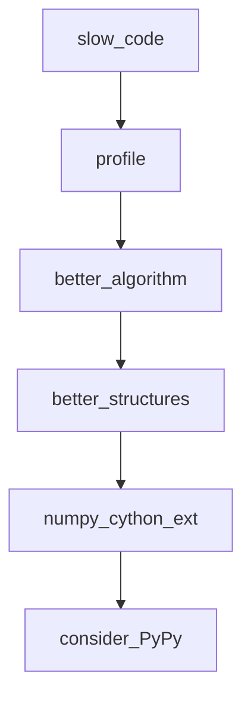

## Введение

Senior-блок про скорость и доставку: профилирование, NumPy vs list, wheels, C-API/ctypes, альтернативы CPython (PyPy, Cython). Важно говорить метриками и границами, не лозунгами.

## Раздел: Ускорение существующего кода

Порядок: измерить → найти hot path → менять алгоритм/структуры → только потом микрооптимизации/натив. Инструменты: `cProfile`, `py-spy`, `timeit`, tracemalloc.

Типичные выигрыши: меньше аллокаций, локальные переменные в горячем цикле, batch I/O, векторные операции NumPy вместо чистых Python-циклов по числам. Хвостовая рекурсия в CPython не оптимизируется — итерация/явный стек. `PYTHONOPTIMIZE`/`-O` убирает assert и часть debug — не «ускоритель алгоритма».

## Раздел: Упаковка и альтернативные рантаймы

Дистрибуция: sdist vs **wheel**, бинарные зависимости, manylinux. Упаковка проекта — `pyproject.toml`, сборка wheel, версионирование. `__pycache__` — локальный кеш bytecode, не способ поставки.

Альтернативы CPython: **PyPy** (JIT, хорошо на долгоживущих pure-Python нагрузках), **Cython** (типизированный Python→C), IronPython/иные ниши. **ctypes**/C-API — вызов нативных библиотек; цена — сложность и безопасность памяти.

Выбор: совместимость расширений часто держит на CPython; perf-критичные куски — Cython/Rust extension/NumPy; иногда отдельный сервис на другом языке.

## Лаба

**Цель.** Профиль медленной функции и сравнение list vs NumPy.

**Шаги.**
1. Напишите сумму квадратов на чистом Python и через NumPy.
2. Снимите cProfile на чистой версии.
3. Соберите тривиальный wheel (`python -m build`) или опишите шаги, если нет сети.
4. Кратко сравните: когда попробовали бы PyPy.

**В группу:** какой hot path в вашем сервисе уже выносили в native?

**Готово, если…**
- [ ] Начинаете с профиля, не с Cython
- [ ] Объясняете wheel
- [ ] Знаете нишу PyPy/Cython/ctypes

## Схема: Путь оптимизации

## Тест

### С чего начинать ускорение?

**Ответ:** с измерения профиля hot path

**Пояснение:** без цифр оптимизация — гадание.

### Чем wheel удобнее sdist?

**Ответ:** ставится быстрее, часто уже собран под платформу

**Пояснение:** не требует компиляции на машине пользователя (для бинарных пакетов).

### Когда PyPy может помочь?

**Ответ:** долгий pure-Python CPU-bound код

**Пояснение:** JIT прогревается; совместимость с C-extensions бывает хуже.

## Шпаргалка

<h3>Суть</h3>
<ul>
<li>measure → algorithm → structures → native/runtime</li>
<li>wheel для доставки; pyproject для сборки</li>
<li>Cython/ctypes/PyPy — точечно</li>
</ul>
<h3>Команды</h3>
<pre><code>python -m cProfile -s cumtime app.py
python -m build
</code></pre>

## Anki

### Front: NumPy быстрее list когда?

Back: массовые числовые операции (векторизация), не всегда на мелких данных

### Front: Что такое ctypes?

Back: вызов функций из динамических C-библиотек из Python

### Front: PYTHONOPTIMIZE что делает?

Back: включает -O: убирает assert и __debug__ ветки

## Итоги

- Perf — дисциплина измерений
- Упаковка — часть senior-ответственности
- Далее: веб-фреймворки (PY19)

## Ссылки

- [Performance tips](https://docs.python.org/3/howto/perf_profiling.html)
- [Packaging Python Projects](https://packaging.python.org/en/latest/tutorials/packaging-projects/)
- [DEBAGanov — perf / wheels / PyPy](https://github.com/DEBAGanov/interview_questions/blob/main/400%20вопросов%20с%20ответами%2C%20которые%20должен%20знать%20Python-разработчик.md)
- Learn | /game/learn
- Далее: [Flask / Django](/game/learn/py-web-flask-django)
