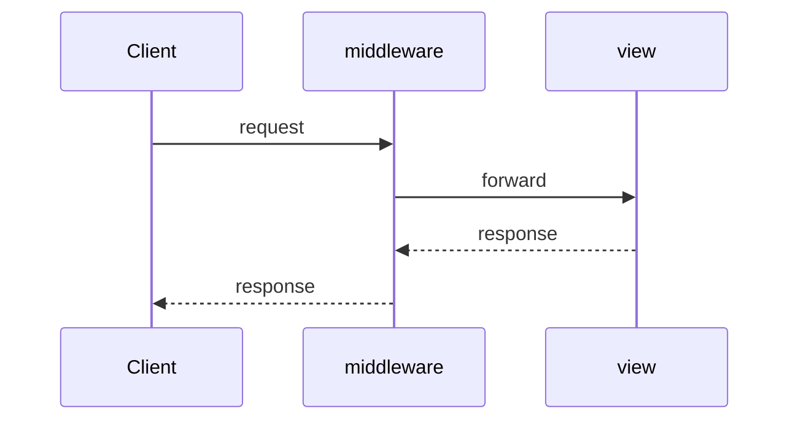

## Введение

Источник вопросов сильно про Flask/Django/Pyramid. Senior должен сравнить framework vs library, батареи Django против микро Flask, роль middleware — и упомянуть FastAPI как современный соседний стек (как в CopyParse), не уходя от темы.

## Раздел: Framework vs Flask/Django/Pyramid

**Библиотека** — вы вызываете код. **Фреймворк** — он вызывает ваш (IoC): роутинг, lifecycle запроса.

- **Django**: batteries included — ORM, admin, auth, templates; «конвенции»; хорошо для классических CRUD/CMS.
- **Flask**: микрофреймворк — ядро + расширения (Flask-WTF формы/CSRF, сессии); гибкость ценой выбора стека самому.
- **Pyramid**: явная конфигурация, гибкость от small до large.

Типичный Flask request: WSGI environ → app → view → response. Сессии — подписанные cookie / server-side store через extensions. MVC в вебе условен: model (данные), template/view (представление), controller ≈ view-функции/роуты.

## Раздел: Middleware и контекст

Middleware — слой вокруг запроса/ответа (логирование, auth, CORS, транзакции). В Django — middleware classes; во Flask — `before_request`/`after_request`/WSGI middleware. Context processors в Django добавляют переменные в шаблоны.

Подключение БД: через ORM (Django/SQLAlchemy) или драйвер; в Flask часто SQLAlchemy/extension, конфиг URI, сессия на запрос. Современный ASGI-сосед: **FastAPI** (типы, OpenAPI, async) — уместно кратко сравнить на собесе, если вакансия API-heavy.

## Лаба

**Цель.** Минимальный Flask `/health` и middleware-логер времени.

**Шаги.**
1. Flask app с `/health` → `{"status":"ok"}`.
2. `before_request`/`after_request` логируют duration.
3. Добавьте простую форму Flask-WTF (csrf) или опишите зачем CSRF.
4. Таблица сравнения Django vs Flask vs FastAPI на 5 строк.

**В группу:** какой фреймворк выберете для админки с ORM vs для публичного JSON API?

**Готово, если…**
- [ ] Отличаете framework и library
- [ ] Объясняете middleware
- [ ] Сравниваете Django/Flask без фанатизма

## Схема: Запрос через middleware

## Тест

### Чем фреймворк отличается от библиотеки?

**Ответ:** фреймворк управляет потоком и вызывает ваш код

**Пояснение:** IoC: вы пишете view/handlers под контракт фреймворка.

### Сильная сторона Django?

**Ответ:** батареи: ORM, admin, auth «из коробки»

**Пояснение:** быстрее старт монолита с админкой; цена — вес и конвенции.

### Что такое middleware?

**Ответ:** перехватчики вокруг обработки HTTP-запроса/ответа

**Пояснение:** сквозная логика без дублирования во view.

## Шпаргалка

<h3>Суть</h3>
<ul>
<li>Django = batteries; Flask = micro + extensions</li>
<li>middleware = cross-cutting на запросе</li>
<li>FastAPI — частый современный API-сосед</li>
</ul>
<h3>Ориентиры</h3>
<pre><code>Flask: route + before_request
Django: urls + middleware + ORM
FastAPI: types + OpenAPI + async
</code></pre>

## Anki

### Front: Flask-WTF зачем?

Back: формы и CSRF-защита в экосистеме Flask

### Front: Context processor в Django?

Back: добавляет переменные во все шаблоны автоматически

### Front: WSGI vs ASGI коротко?

Back: WSGI sync-модель; ASGI — async/websockets (Uvicorn/FastAPI)

## Итоги

- Выбор фреймворка — про задачу и команду, не про хайп
- Middleware и сессии — частые уточнения
- Далее: БД и кеш (PY20)

## Ссылки

- [Flask](https://flask.palletsprojects.com/)
- [Django](https://docs.djangoproject.com/)
- [DEBAGanov — Flask/Django](https://github.com/DEBAGanov/interview_questions/blob/main/400%20вопросов%20с%20ответами%2C%20которые%20должен%20знать%20Python-разработчик.md)
- Learn | /game/learn
- Далее: [БД и Memcached](/game/learn/py-db-cache-memcached)
