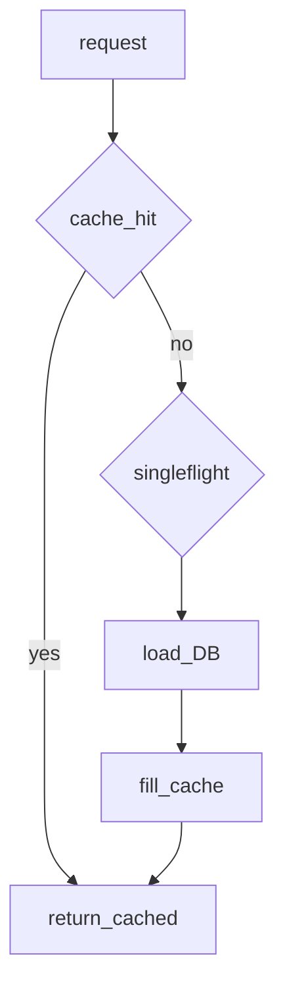

## Введение

Senior-вопросы из источника: выборка SQL/MySQL из Python, DML и особенно **Memcached** — downtime, dogpile, когда кеш вреден. Разберём безопасный доступ к БД и антипаттерны кеша.

## Раздел: БД из Python

Паттерн: драйвер (или ORM) → соединение/пул → cursor/execute → fetch → закрытие. Параметры **только** через placeholders (`%s` / `?`), никогда через f-string в SQL (SQL injection).

```python
# pseudocode
cur.execute("SELECT id, name FROM users WHERE id = %s", (user_id,))
row = cur.fetchone()
```

DML (`INSERT/UPDATE/DELETE`) — в транзакции; commit/rollback явно или через context manager. ORM ускоряет CRUD, но senior обязан читать SQL и индексы. JSON рядом: часто обмен API↔БД через сериализацию (см. PY08).

## Раздел: Memcached pitfalls

Memcached — распределённый in-memory key-value кеш. Полезен для горячих чтений; **не** source of truth и не для данных, которые нельзя потерять.

Риски на собесе:
- **Dogpile (cache stampede):** ключ истёк — толпа запросов бьёт в БД; лечится lock/soft TTL/singleflight.
- Падение ноды: клиент не должен бесконечно долбить мёртвый сервер; failover/rebalance по политике клиента; данные на упавшей ноде считайте потерянными.
- Когда не брать: крупные объекты, необходимость сложных запросов, строгая консистентность, персистентность.

Минимизация downtime: несколько нод, health checks, таймауты, graceful degradation (идти в БД при недоступности кеша).

## Лаба

**Цель.** Смоделировать stampede и простой singleflight-лок в процессе.

**Шаги.**
1. Функция `get_user(id)` с dict-кешем и TTL.
2. На истечении TTL 20 «параллельных» вызовов (threads) без защиты — посчитайте hits в «БД».
3. Добавьте lock на ключ (singleflight) — сравните число загрузок.
4. Список: 3 причины не класть сущность в Memcached.

**В группу:** Redis vs Memcached — когда что в вашем опыте?

**Готово, если…**
- [ ] Пишете параметризованный SQL
- [ ] Объясняете dogpile
- [ ] Не путаете кеш с БД

## Схема: Cache lookup



## Тест

### Как безопасно подставить id в SQL?

**Ответ:** через параметр драйвера, не конкатенацией

**Пояснение:** иначе SQL injection.

### Что такое cache dogpile?

**Ответ:** лавина запросов в БД при промахе одного популярного ключа

**Пояснение:** лечится блокировкой/ранним обновлением/stale-while-revalidate.

### Данные на упавшей ноде Memcached?

**Ответ:** считайте потерянными

**Пояснение:** кеш эфемерен; источник правды — БД.

## Шпаргалка

<h3>Суть</h3>
<ul>
<li>SQL только с placeholders + транзакции</li>
<li>Memcached = ускорение чтений, не хранилище</li>
<li>stampede / failover / timeouts</li>
</ul>
<h3>Ориентиры</h3>
<pre><code>execute(sql, (params,))
cache get → miss → lock → DB → set
</code></pre>

## Anki

### Front: DML через Python — что обязательно?

Back: транзакция и обработка ошибок/rollback

### Front: Когда Memcached вреден?

Back: нужны персистентность, сложные запросы, сильная консистентность

### Front: Singleflight в кеше зачем?

Back: один загрузчик на ключ при промахе, остальные ждут результат

## Итоги

- БД-доступ и кеш — зона senior-ответственности
- Анти-stampede важнее «просто подключил memcache»
- Далее: prod concurrency (PY21)

## Ссылки

- [DB-API 2.0](https://peps.python.org/pep-0249/)
- [DEBAGanov — SQL / Memcached](https://github.com/DEBAGanov/interview_questions/blob/main/400%20вопросов%20с%20ответами%2C%20которые%20должен%20знать%20Python-разработчик.md)
- Learn | /game/learn
- Далее: [Prod concurrency](/game/learn/py-concurrency-io-patterns)
