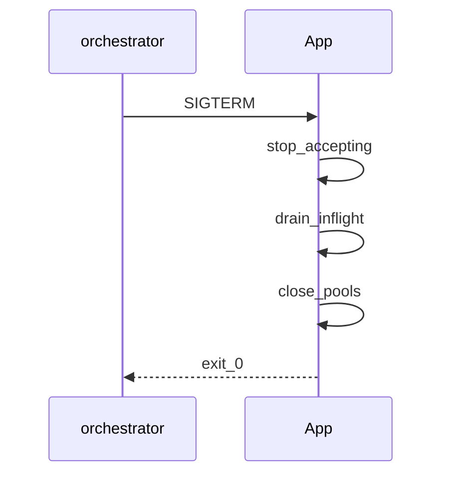

## Введение

Собес senior часто уходит в прод: «растёт RSS», «не ловятся сигналы», «как сходить на Linux-сервер». Связываем non-blocking I/O из PY14 с диагностикой утечек и операционкой.

## Раздел: Non-blocking I/O в проде

В сервисах async/evented модели держат тысячи соединений, пока ждут сеть. Блокирующий драйвер в async-воркере = деградация latency для всех. Паттерны: таймауты на клиентах, backpressure, bounded queues, circuit breaker, graceful shutdown.

Сигналы (`SIGTERM`/`SIGINT`): в многопоточности/на некоторых платформах обработчики ограничены — только main thread в CPython; в async регистрируйте через loop. Некорректные handlers — классический вопрос источника.

## Раздел: Утечки и Linux-диагностика

Чеклист роста памяти (углубление PY15): воспроизвести нагрузкой → метрики RSS/Heap → `tracemalloc`/objgraph → искать кэши без TTL, циклы, утечки в C-ext, неосвобождённые пулы соединений.

На Linux: `ps`/`top`/`pidstat` для PID и CPU/RSS; доступ к файлам на сервере — SFTP/SSH + pathlib, либо agent. Не путать «память Python» и page cache ОС.

## Лаба

**Цель.** Имитация утечки кэша и снятие tracemalloc.

**Шаги.**
1. Глобальный dict без лимита; «обработайте» 100k ключей.
2. Включите tracemalloc; сравните top аллокаций до/после фикса (TTL или LRU).
3. Напишите обработчик SIGINT, который ставит флаг shutdown.
4. Чеклист из 7 шагов «упало в проде» для вашего сервиса.

**В группу:** какой сигнал шлёт ваш оркестратор при stop?

**Готово, если…**
- [ ] Связываете async с таймаутами/backpressure
- [ ] Имеете метод поиска утечки
- [ ] Понимаете ограничения signal handlers

## Схема: Graceful shutdown

## Тест

### Почему sync HTTP в async worker вреден?

**Ответ:** блокирует event loop

**Пояснение:** другие соединения ждут, latency растёт у всех.

### С чего начать при утечке памяти?

**Ответ:** воспроизвести и измерить, затем tracemalloc/профилировщик

**Пояснение:** без воспроизведения — слепой поиск.

### Где обрабатываются сигналы в CPython?

**Ответ:** в главном потоке

**Пояснение:** ограничение интерпретатора; в workers нужна аккуратная схема.

## Шпаргалка

<h3>Суть</h3>
<ul>
<li>таймауты, backpressure, graceful shutdown</li>
<li>утечки: reproduce → measure → fix caches/pools</li>
<li>signals + Linux PID/RSS tools</li>
</ul>
<h3>Ориентиры</h3>
<pre><code>tracemalloc.start()
# pidstat -r -p PID
# handle SIGTERM → drain
</code></pre>

## Anki

### Front: Backpressure — что это?

Back: ограничение входящей нагрузки, когда система не успевает

### Front: Чем полезен pidstat?

Back: смотреть CPU/память процесса по PID на Linux

### Front: Graceful shutdown шаги?

Back: перестать принимать → дождаться inflight → закрыть пулы → выйти

## Итоги

- Prod concurrency — про устойчивость, не только про async синтаксис
- Утечки и сигналы — частые senior-уточнения
- Далее: DRY и границы языка (PY22)

## Ссылки

- [signal](https://docs.python.org/3/library/signal.html)
- [tracemalloc](https://docs.python.org/3/library/tracemalloc.html)
- [DEBAGanov — утечки / сигналы / I/O](https://github.com/DEBAGanov/interview_questions/blob/main/400%20вопросов%20с%20ответами%2C%20которые%20должен%20знать%20Python-разработчик.md)
- Learn | /game/learn
- Далее: [DRY и границы](/game/learn/py-design-dry-architecture)
