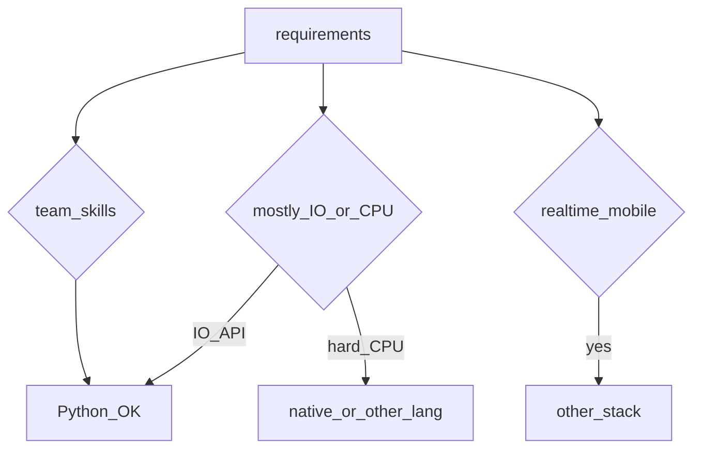

## Введение

Не все senior-вопросы — про синтаксис. «Как применяете DRY?», «когда Python не берёте?» проверяют вкус и границы. Свяжем с GIL/async/perf из прошлых выпусков.

## Раздел: DRY через OOP и FP

DRY (Don't Repeat Yourself) — устранение дублирования **знания**, не слепое схлопывание строк кода. Через OOP: базовые классы, миксины, стратегии, композиция сервисов. Через FP: чистые функции, частичное применение, пайплайны map/filter, общие декораторы (retry/auth).

Антипаттерн: преждевременная абстракция «на всякий случай» и God-object. Лучше три похожих явных места, чем неверная общая функция. Правило: дублирование копируют, пока не ясна ось изменения — потом выделяют.

## Раздел: Когда брать и не брать Python

**Брать:** API/бэкенд, автоматизация, data/ML glue, быстрые прототипы, экосистема пакетов критична, команда сильнее в Python.

**Не брать / выносить кусок:** жёсткий realtime, тяжёлый CPU без native-ускорений, мобильные клиенты, экстремальный cold-start/edge без подходящего рантайма, домен уже стандартизован на другом стеке команды.

Честный senior-ответ связывает ограничения (GIL, GC паузы, упаковка бинарных deps) с конкретной задачей — не «Python плохой/хороший».

## Лаба

**Цель.** Рефакторинг дубля к осознанному DRY.

**Шаги.**
1. Два сервиса с копипастой валидации email/phone.
2. Выделите pure-функции + один декоратор логирования ошибок.
3. Напишите ADR на полстраницы: «почему Python для этого сервиса» или «почему выносим worker на Go/Rust».
4. Список 5 признаков преждевременной абстракции.

**В группу:** пример, где DRY навредил в вашем проекте.

**Готово, если…**
- [ ] Отличаете DRY знания от «схлопнуть строки»
- [ ] Называете 3 кейса «не Python»
- [ ] Связываете выбор с GIL/операционкой

## Схема: Решение о стеке

## Тест

### DRY — про что именно?

**Ответ:** не дублировать знание/правила, а не любой похожий код

**Пояснение:** слепое схлопывание создаёт вредные связности.

### Когда Python часто плохой выбор?

**Ответ:** жёсткий realtime / mobile / чистый CPU без native

**Пояснение:** модель исполнения и экосистема заточены иначе.

### Как OOP помогает DRY?

**Ответ:** общее поведение в базе/композиции без копипасты правил

**Пояснение:** полиморфизм держит одно «знание» в одном месте.

## Шпаргалка

<h3>Суть</h3>
<ul>
<li>DRY = одно место правды для правила</li>
<li>OOP + FP — инструменты, не религия</li>
<li>выбор языка = задача × команда × ограничения рантайма</li>
</ul>

## Anki

### Front: Преждевременная абстракция — симптом?

Back: общая функция с кучей флагов «на будущие кейсы», которых нет

### Front: Почему «команда умеет X» влияет на стек?

Back: скорость поставки и поддержки часто важнее теоретического оптимума языка

### Front: Связь GIL с выбором Python?

Back: для CPU-parallel в одном процессе Python слабее — учитывайте в ADR

## Итоги

- Архитектурный ответ senior = trade-offs, не лозунги
- DRY осознанный; стек — честный
- Далее: tricky drill (PY23)

## Ссылки

- [The Zen of Python — import this](https://peps.python.org/pep-0020/)
- [DEBAGanov — когда Python / DRY](https://github.com/DEBAGanov/interview_questions/blob/main/400%20вопросов%20с%20ответами%2C%20которые%20должен%20знать%20Python-разработчик.md)
- Learn | /game/learn
- Далее: [Tricky drill](/game/learn/py-interview-tricky)
