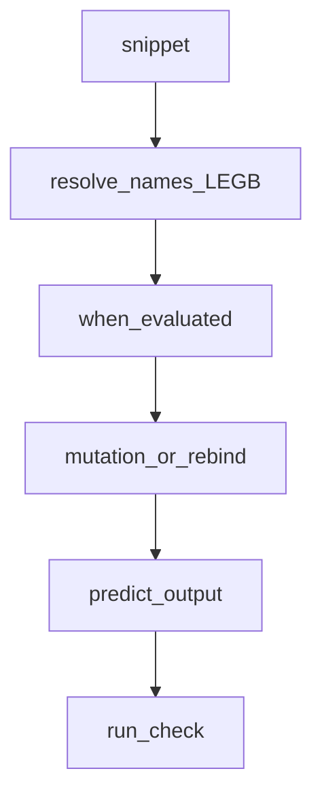

## Введение

Финишный drill: «что выведет код?» — замыкания в цикле, mutable default, `is` vs `==`, for/else, неочевидный порядок. Не заучивайте ответы источника — тренируйте чтение байт-кода смысла.

## Раздел: Классические ловушки

1. **Mutable default** — общий список между вызовами (PY04).
2. **Late binding closure** — `lambdas = [lambda: i for i in range(3)]` → все видят финальный `i`; фикс default-arg `lambda i=i: i`.
3. **is vs ==** на интернированных маленьких int/str — не полагайтесь в бизнес-логике.
4. **for/else** — else без break.
5. **Побочные эффекты в аргументах** / порядок вычислений.
6. Ошибка в `__init__` — объект может не доинициализироваться так, как ждёте.

Читайте код медленно: имена, области видимости, когда выражение вычисляется.

## Раздел: Мини-задачи «исправь»

На собесе часто просят не только сказать output, но починить. Шаблон ответа: 1) фактический результат 2) почему 3) идиоматичный фикс. Держите в голове LEGB, объектную модель и «ссылки на объекты».

Примеры для тренировки: модификация списка при итерации; `+=` у list vs tuple; сравнение set литералов; `True == 1`; цепочки `a < b < c`.

## Лаба

**Цель.** Набор из 8 карточек «output + фикс».

**Шаги.**
1. Соберите 8 сниппетов (включая late binding и mutable default).
2. Для каждого запишите предсказание **до** запуска.
3. Запустите — сверьте; где ошиблись, напишите правило одной строкой.
4. В Anki-приложении или бумаге — 8 front/back.

**В группу:** блиц на таймер 10 минут — 5 сниппетов.

**Готово, если…**
- [ ] Предсказываете late binding
- [ ] Не путаете is/==
- [ ] Чините for/else осмысленно

## Схема: Разбор сниппета

## Тест

### Почему все lambda в цикле вернули 2 для range(3)?

**Ответ:** замыкание читает i в момент вызова, не определения

**Пояснение:** late binding; фикс lambda i=i: i.

### True == 1 даст?

**Ответ:** True

**Пояснение:** bool — подкласс int; не используйте это в дизайне API.

### Как безопасно менять список при обходе?

**Ответ:** итерировать копию или собирать новый список

**Пояснение:** изменение размера во время for — источник багов.

## Шпаргалка

<h3>Суть</h3>
<ul>
<li>читайте scope и время вычисления</li>
<li>mutable default / late binding — топ ловушек</li>
<li>ответ = output + why + fix</li>
</ul>
<h3>Фикс late binding</h3>
<pre><code>fs = [lambda i=i: i for i in range(3)]
</code></pre>

## Anki

### Front: Late binding в lambda — фикс?

Back: захватить значение default-аргументом lambda i=i: ...

### Front: for/else сработает когда?

Back: цикл закончился без break

### Front: a is b для больших int?

Back: может быть False даже при равных значениях — не опирайтесь на is

## Итоги

- Tricky-вопросы тренируются повторением с проверкой
- Всегда объясняйте why, не только число на экране
- Финал трека — capstone (PY24)

## Ссылки

- [DEBAGanov — «что выведет»](https://github.com/DEBAGanov/interview_questions/blob/main/400%20вопросов%20с%20ответами%2C%20которые%20должен%20знать%20Python-разработчик.md)
- Learn | /game/learn
- Далее: [Capstone](/game/learn/py-senior-capstone)
