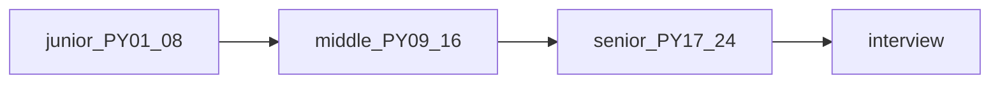

## Введение

Финальный выпуск серии PY01–PY24: чеклист по уровням, как готовиться через Anki/тест выпусков, и куда смотреть за пределами трека (appendix в SERIES.md). Полный список 1–407 — внешняя шпаргалка тем, не текст для заучивания дословно.

## Раздел: Чеклист по уровням

**Junior:** типы/коллекции, строки/файлы, функции/args, модули/venv, ООП-база, исключения, re/json/copy.

**Middle:** итераторы/генераторы, декораторы/with, FP/collections, MRO/dunder, PEP8/typing, asyncio, GIL/GC/память, тесты/pdb.

**Senior:** дескрипторы/метаклассы, perf/packaging/runtimes, веб-фреймворки, БД/кеш, prod concurrency, DRY/границы языка, tricky drill.

Перед собесом: пройдите Anki выпусков своего уровня + один уровень выше; 2–3 лабы руками, не глазами.

## Раздел: Пробелы и внешний список

Вне основной цепочки (см. SERIES appendix): TkInter, Spark/Scala, Java interop, узкий Memcached-ops уже частично в PY20, scientific stack NumPy/SciPy — отдельная ветка. Источник DEBAGanov содержит дубли — пользуйтесь индексом Q→slug в SERIES.md.

Связка с работой: перенесите примеры на ваш стек (FastAPI/Postgres/Redis вместо абстрактного Flask/Memcached), но сохраняйте канонические формулировки механизмов (GIL, MRO, descriptors).

## Лаба

**Цель.** Личный план на 7 дней до собеса.

**Шаги.**
1. Отметьте в чеклисте красным 5 слабых тем.
2. На каждую — 1 Anki-день из соответствующего PY-выпуска + 1 мини-лаба.
3. Mock-интервью 45 минут с коллегой по PY23 + системный вопрос из PY21/22.
4. Список ссылок на docs.python.org, которые откроете в перерыве (не StackOverflow-рандом).

**В группу:** обменяйтесь слабыми темами и проведите взаимный блиц.

**Готово, если…**
- [ ] Есть письменный 7-дневный план
- [ ] Закрыты дыры на уровень вакансии
- [ ] Знаете, где лежат appendix-темы

## Схема: Трек серии

## Тест

### Что закрывает junior-блок серии?

**Ответ:** язык-база: типы, функции, модули, ООП, исключения, stdlib tools

**Пояснение:** PY01–PY08 без GIL/метаклассов вглубь.

### Зачем capstone, если есть 400 вопросов?

**Ответ:** карта и приоритеты вместо хаотичного чтения дублей

**Пояснение:** серия схлопывает повторы и выстраивает уровень.

### Что делать с темами вне SERIES?

**Ответ:** appendix one-off по вакансии

**Пояснение:** Tk/Spark и т.п. не нужны всем Python-разработчикам.

## Шпаргалка

<h3>Суть</h3>
<ul>
<li>Junior → Middle → Senior по PY01–24</li>
<li>готовься Anki + лабы + mock</li>
<li>полный список вопросов — индекс тем, не копипаст ответов</li>
</ul>
<h3>Старт повторения</h3>
<pre><code>PY02 коллекции · PY10 декораторы · PY15 GIL · PY17 meta · PY23 drill
</code></pre>

## Anki

### Front: Middle must-have темы трека?

Back: generators, decorators, MRO, typing, asyncio, GIL/GC, pytest

### Front: Senior must-have темы трека?

Back: descriptors/metaclasses, perf/packaging, web frameworks, DB/cache, prod diagnostics, design trade-offs

### Front: Где индекс вопрос→выпуск?

Back: SERIES.md в каталоге python Learn

## Итоги

- Серия — учебная карта Junior→Senior, не замена практике
- Повторяйте слабости, а не только любимые темы
- Удачи на собесе — и пишите код руками

## Ссылки

- [SERIES.md — оглавление и индекс](/game/learn)
- [DEBAGanov — полный список вопросов](https://github.com/DEBAGanov/interview_questions/blob/main/400%20вопросов%20с%20ответами%2C%20которые%20должен%20знать%20Python-разработчик.md)
- [docs.python.org](https://docs.python.org/3/)
- Learn | /game/learn
- Назад: [Tricky drill](/game/learn/py-interview-tricky)
