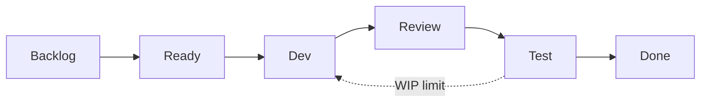

## Введение

M30–33 и S3–4: на middle ждут не лозунги Agile, а как методология меняет работу QA — ритм поставки, DoD, где тестирование в потоке и какие препятствия типичны. Ниже — рабочие формулировки для собеса и лаба на DoD команды.

## Раздел: Scrum vs Kanban, роли, ритуалы, ценности

**Scrum** — итерации фиксированной длины (sprint), backlog, цели спринта, роли Product Owner / Scrum Master / Developers (QA обычно внутри Developers). Ритуалы: planning, daily, review, retrospective; часто refinement.

**Kanban** — поток continuous delivery, WIP-лимиты, визуализация колонок, метрики lead/cycle time; роли и каденции гибче. Хорош для поддержки/потока задач разного размера без искусственных sprint-deadlines.

| | Scrum | Kanban |
|--|-------|--------|
| Ритм | спринты | непрерывный поток |
| Объём | commitment на спринт | pull по WIP |
| Изменения scope | осторожно внутри спринта | проще переприоритизировать |
| Фокус QA | успеть вложить тест в инкремент | уменьшить время в колонке Test |

**Ценности (Scrum Guide дух):** commitment, focus, openness, respect, courage — для QA это смелость поднять риск, открытость по статусу среды, фокус на инкременте, а не на «своей очереди кейсов».

**Влияние методологии на качество.** Короткий feedback loop → быстрее ловим регресс; DoD без «протестируем потом» снижает leakage; WIP-лимиты не дают завалить QA кучей Dev-Done. Антипаттерн: «Agile», но тест — отдельная фаза после «настоящей работы».

## Раздел: Sprint zero, препятствия, Definition of Done

**Sprint zero / подготовка окружения.** Не обязательно формальный спринт: поднять стенды, пайплайн, тестовые данные, доступы, мониторинг, договорённости по веткам и DoD. Без этого первый «боевой» спринт превращается в админку вместо ценности. На собесе: список concrетных артефактов (CI job, seed БД, feature flag стенд, каналы алертов).

**Препятствия Agile-тестера:**

- требования плывут до конца спринта, тест сжимается
- нет testability / id / логов
- одна среда на всех, вечные конфликты данных
- «автотесты напишем потом», регресс ручной и хрупкий
- QA как gatekeeper вместо встроенного качества
- игнор non-functional до прода

Ответы: shift-left (уточнение AC на refinement), парное тестирование с dev, контрактные проверки, DoD с автоматизацией критичного пути, отдельный quality backlog.

**Definition of Done.** Общий чеклист инкремента: код в main, ревью, unit/API/UI по политике, AC выполнены, миграции применены, документация/changelog, нет open Sev1, feature flag выключен/включён по плану. DoD ≠ DoR (ready): Ready — можно брать в работу; Done — можно считать поставленным.

Плохой DoD: «протестировано» без уточнения кто/чем. Хороший: измеримые пункты, включая «smoke CI green на стенде X».

## Лаба

**Цель.** Собрать DoD и карту потока для учебной команды из 1 PO, 3 dev, 1 QA.

**Шаги.**
1. Опишите, когда выберете Scrum, а когда Kanban (по 3 аргумента).
2. Для Scrum распишите участие QA в каждом ритуале (1–2 предложения).
3. Составьте DoD из 8 пунктов, из них ≥2 про качество/тест.
4. Составьте DoR из 5 пунктов (AC, зависимости, тестовые данные…).
5. Список sprint-zero: среда, CI, данные, доступы, мониторинг — с владельцем каждой задачи.
6. Выберите 2 препятствия из раздела и напишите конкретный эксперимент на ретро (гипотеза → метрика → срок).

**В группу:** может ли задача быть Done без UI-автотеста, если есть API-контракт и ручной AC?

**Готово, если…**
- [ ] Таблица Scrum/Kanban своими словами
- [ ] DoD проверяем, не декларативный
- [ ] Sprint zero не «купим Jira», а технические готовности

## Схема: Поток с WIP и колонкой Test

## Тест

### Чем Kanban принципиально отличается от Scrum для QA?

**Ответ:** упор на поток и WIP, без обязательных спринтов и sprint commitment

**Пояснение:** QA оптимизирует cycle time в Test и баланс колонок; в Scrum — вписывает проверки в цель итерации.

### Что должно быть в Definition of Done про тестирование?

**Ответ:** конкретные виды проверок/гейты (например CI smoke green, AC пройдены, критичные баги закрыты)

**Пояснение:** слово «протестировано» без критериев не работает как DoD.

### Зачем sprint zero тестировщику?

**Ответ:** чтобы к поставке ценности уже были среды, данные, пайплайн и доступы

**Пояснение:** иначе первый спринт сжигается на инфраструктуру, а качество страдает из-за хаоса стендов.

## Шпаргалка

<h3>Scrum</h3>
<ul>
<li>Роли: PO, SM, Developers (QA внутри)</li>
<li>Ритуалы: planning, daily, review, retro, refinement</li>
</ul>
<h3>Kanban</h3>
<ul>
<li>WIP-лимиты, lead/cycle time, continuous flow</li>
</ul>
<h3>DoD vs DoR</h3>
<pre><code>DoR = можно начинать
DoD = можно считать поставленным (вкл. качество)
</code></pre>

## Anki

### Front: Назовите пять ценностей Scrum

Back: commitment, focus, openness, respect, courage

### Front: Что такое WIP limit?

Back: ограничение числа задач в колонке/состоянии, чтобы не копить незавершёнку и не душить QA

### Front: DoD vs Acceptance Criteria?

Back: AC — условия конкретной фичи; DoD — стандарт качества любого инкремента команды

## Итоги

- Scrum и Kanban по-разному ритмируют работу QA, но оба требуют встроенного качества, не фазы «в конце»
- DoD/DoR — главные артефакты разговора о «когда достаточно протестировано»
- Sprint zero и борьба с препятствиями — практический middle, а не теория манифеста
- Смелость эскалировать риск — ценность, а не конфликтность

## Ссылки

- [QA-interview-250](https://github.com/Konstantine23/QA-interview-250)
- [Scrum Guide](https://scrumguides.org/)
- Learn | /game/learn/qa-api-contract-perf
