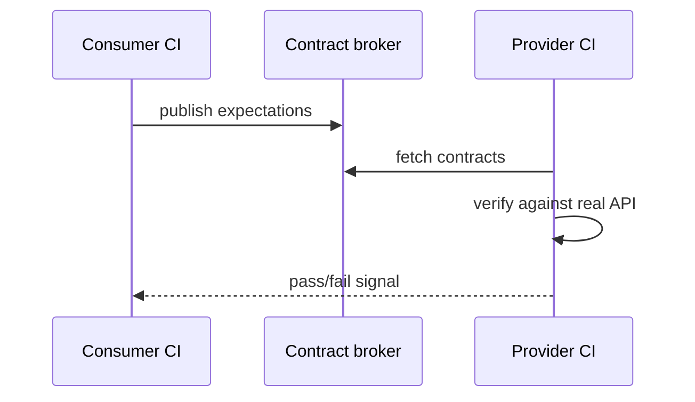

## Введение

Блок M10, M26–29, M96–97 и senior-отголоски S9, S29: как тестировать API системно, чем mock отличается от stub, зачем контракты, что смотреть в автотестах и когда load/stress. Клиентские примеры — **Python `requests`**; нагрузка — концепты JMeter/k6/Locust.

## Раздел: Моки, стабы, инструменты, контракты

**Stub** — «заглушка» с заготовленным ответом (фиксированный JSON). **Mock** — объект с ожиданиями вызовов (проверили, что клиент дернул нужный метод/URL). На практике границы размыты; на собесе: stub подменяет зависимость для изоляции, mock ещё и верифицирует взаимодействие.

**WireMock / mockserver / httpx mock / pytest responses** — внешний HTTP; unit-моки — внутри процесса. Не мокайте систему, которую доказываете: мок платёжного шлюза уместен для UI-магазина, но не заменяет сертификационные тесты самого шлюза.

**Инструменты API-тестирования:** Postman/Insomnia (ручные коллекции), REST-assured (Java), **pytest + requests/httpx**, Karate, Playwright APIRequest. Критерий выбора: язык команды, CI, переиспользование моделей данных.

**Contract testing.** Потребитель и поставщик согласуют схему (Pact, OpenAPI-валидация, JSON Schema). Consumer-driven: потребитель фиксирует ожидания, провайдер прогоняет их в CI — ловит breaking changes до интеграции. Это не полный E2E и не замена бизнес-сценариев.

```python
import jsonschema
import requests

ORDER_SCHEMA = {
    "type": "object",
    "required": ["id", "status", "total"],
    "properties": {
        "id": {"type": "string"},
        "status": {"enum": ["new", "paid", "cancelled"]},
        "total": {"type": "number", "minimum": 0},
    },
}


def test_order_contract(base_url: str, auth_headers: dict) -> None:
    response = requests.get(f"{base_url}/orders/demo", headers=auth_headers, timeout=10)
    assert response.status_code == 200
    jsonschema.validate(response.json(), ORDER_SCHEMA)
```

## Раздел: Что проверять в API auto, load и stress

**В API-автоматизации проверяйте:**

- статус-коды и идемпотентность (PUT/DELETE)
- схему/контракт тела и заголовков (`Content-Type`, pagination)
- бизнес-инварианты (баланс не отрицательный)
- авторизацию/роли (401/403)
- валидацию входа (400 + понятные ошибки)
- производительность «на уровне smoke» (p95 < порог) — опционально
- побочные эффекты в БД/очередях (если доступ есть)
- отрицательные: сломанный токен, большой payload, SQL/XSS в полях (по политике)

```python
def test_create_order_unauthorized(base_url: str) -> None:
    response = requests.post(f"{base_url}/orders", json={"sku": "A1"}, timeout=10)
    assert response.status_code == 401
```

**Performance / load / stress (инструменты):** JMeter, Gatling, k6, Locust (Python), облачные (k6 cloud, BlazeMeter). Выбирайте по скриптованию, протоколам (HTTP/gRPC), интеграциям CI.

**Load strategy.** Цель (SLA: RPS, latency p95/p99, error rate) → модель нагрузки (constant / ramp / spike) → данные и окружение, близкие к проду → наблюдаемость (APM, логи, БД) → анализ узких мест. Нагрузка на пустой БД врёт.

**Когда stress:** понять предел и поведение деградации (таймауты, очередь, circuit breaker), не «уронить прод». Soak/endurance — утечки памяти; spike — Black Friday. S29-уровень: согласовать с SRE blast radius и never на прод без явного разрешения.

## Лаба

**Цель.** Набор API-тестов на публичном или учебном API + черновик нагрузочного плана.

**Шаги.**
1. Напишите 5 pytest+requests: happy, 401, валидация 400, схема JSON, идемпотентный повтор.
2. Поднимите stub (например `responses` или WireMock) для зависимости «плата» и проверьте, что заказ создаётся при 200 от стаба.
3. Опишите consumer-contract: 3 обязательных поля ответа, которые нельзя ломать.
4. Сформулируйте load: целевой RPS, ramp 0→N за 5 мин, pass criteria error rate &lt; 1%, p95 &lt; X мс.
5. Укажите, зачем вам отдельный stress-прогон и какой сигнал «хватит».

**В группу:** почему контракт зелёный, а E2E красный — какие дыры между ними?

**Готово, если…**
- [ ] Отличаете mock/stub на своём примере
- [ ] Есть schema assert в коде
- [ ] Load plan с метриками, не «посмотрим как дышит»

## Схема: Consumer-driven contract



## Тест

### Чем mock отличается от stub на собеседовании?

**Ответ:** stub отдаёт заготовленный ответ; mock дополнительно проверяет факт и характер вызова

**Пояснение:** оба изолируют зависимость; mock про взаимодействие, stub про состояние/данные.

### Что даёт contract testing, чего не даёт Postman-smoke?

**Ответ:** автоматический сигнал о breaking changes между потребителем и провайдером в CI

**Пояснение:** коллекция Postman проверяет сценарий сейчас; контракт ловит несовместимость версий сервисов.

### Когда нужен stress, а не только load под SLA?

**Ответ:** чтобы найти точку отказа и проверить деградацию сверх ожидаемой нагрузки

**Пояснение:** load подтверждает SLA; stress исследует пределы и защитные механизмы — на изолированном контуре.

## Шпаргалка

<h3>API auto checklist</h3>
<ul>
<li>status, schema, auth, business asserts, negatives</li>
<li>requests/httpx + pytest; схема через jsonschema/OpenAPI</li>
</ul>
<h3>Mock vs stub</h3>
<pre><code>stub = готовый ответ
mock = ответ + verify вызовов
</code></pre>
<h3>Perf</h3>
<ul>
<li>Load → SLA; Stress → пределы; Soak → утечки</li>
<li>Инструменты: k6, JMeter, Locust, Gatling</li>
</ul>

## Anki

### Front: Что такое consumer-driven contract?

Back: потребитель задаёт ожидания API; провайдер проверяет их у себя в CI до интеграции

### Front: Какие метрики обычно входят в pass criteria нагрузки?

Back: RPS/throughput, latency percentiles (p95/p99), error rate, иногда CPU/RAM/DB

### Front: Что проверить в API-автотесте кроме status_code == 200?

Back: тело/схему, заголовки, бизнес-правила, права доступа, негативные коды

## Итоги

- Моки/стабы ускоряют и изолируют, но не заменяют проверку реальной интеграции там, где риск
- Контракты ловят поломку совместимости сервисов раньше E2E
- API-автоматизация сильнее UI на стабильности и скорости обратной связи
- Load доказывает SLA; stress — поведение за краем — только осознанно и безопасно

## Ссылки

- [QA-interview-250](https://github.com/Konstantine23/QA-interview-250)
- [jsonschema](https://python-jsonschema.readthedocs.io/)
- Learn | /game/learn/qa-test-design-advanced
