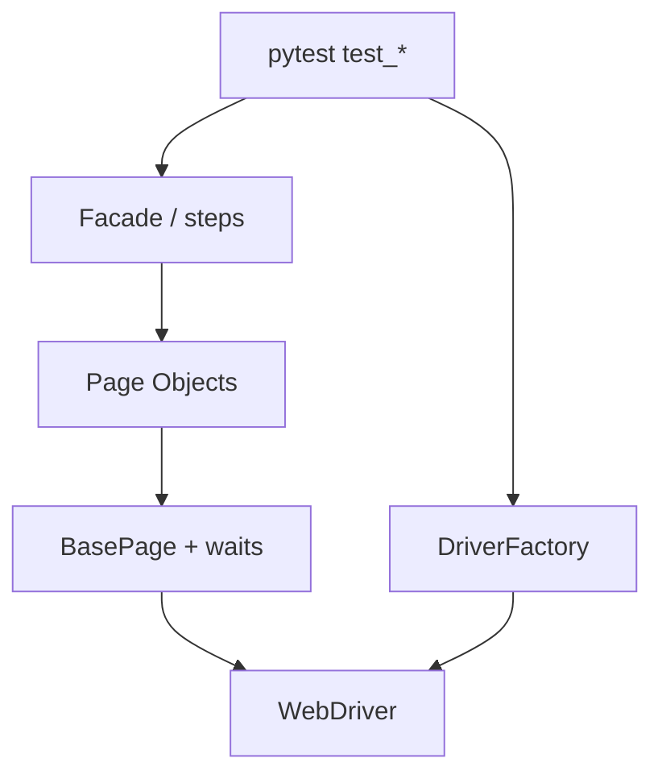

## Введение

После ручной базы на собеседовании ждут мост в AQA: ООП, SOLID, DRY/KISS/YAGNI, зачем Page Object и чем он отличается от «навалили селекторы в тест». Вопросы J36–45 часто звучат на Java, но смысл универсален — ниже ответы своими словами и лабы на **Python** (pytest + Selenium). Java — короткий блок для типовых формулировок.

## Раздел: OOP, interface vs abstract, SOLID

**Инкапсуляция** — прячем внутренности за методами/свойствами: тест говорит `login_page.submit()`, а не кликает по CSS. **Наследование** — общий `BasePage` с `find`, `wait`, `click`. **Полиморфизм** — один интерфейс `DriverFactory.create()`, разная реализация Chrome/Firefox. **Абстракция** — выделяем «страница логина», а не набор WebElement.

**Java-заметка (часто спрашивают).** `interface` — контракт без реализации (с Java 8 — и default-методы); класс может реализовать несколько. `abstract class` — частичная реализация + состояние; наследуется один раз. В Python аналог контракта — `abc.ABC` / Protocol; duck typing сильнее формальных интерфейсов.

**SOLID коротко для тестов:**

| Буква | Смысл в AQA |
|-------|-------------|
| S | Один класс страницы — одна зона UI |
| O | Новый локатор/шаг — расширение, не правка всех тестов |
| L | Подкласс драйвера/page не ломает ожидания базового API |
| I | Не тащите в Page методы чужих экранов |
| D | Тест зависит от абстракции `Browser`, не от `ChromeDriver()` напрямую |

**DRY / KISS / YAGNI.** DRY — общий wait/assert вынести, не копипастить. KISS — простой Page без «фреймворка на 20 слоёв». YAGNI — не пишите Parallel Grid и Allure-listener, пока нет задачи.

**GoF кратко.** Для AQA чаще всего: **Factory** (драйвер), **Singleton** (осторожно: shared driver в параллели — боль), **Builder** (сложные payload), **Strategy** (разные assert/отчёты), **Facade** (бизнес-шаг поверх нескольких page). Не зубрите все 23 — назовите 3–4 и где применили.

## Раздел: Page Object / PageFactory и Java-блок

**Page Object** — класс, который знает локаторы и действия экрана; тест описывает сценарий. Плюсы: смена id кнопки правится в одном месте, читаемость, меньше дублирования.

```python
# page_objects/login_page.py
from selenium.webdriver.common.by import By
from selenium.webdriver.remote.webdriver import WebDriver


class LoginPage:
    USER = (By.ID, "username")
    PASS = (By.ID, "password")
    SUBMIT = (By.CSS_SELECTOR, "button[type=submit]")

    def __init__(self, driver: WebDriver) -> None:
        self.driver = driver

    def open(self, base_url: str) -> "LoginPage":
        self.driver.get(f"{base_url}/login")
        return self

    def login(self, username: str, password: str) -> None:
        self.driver.find_element(*self.USER).send_keys(username)
        self.driver.find_element(*self.PASS).send_keys(password)
        self.driver.find_element(*self.SUBMIT).click()
```

```python
# tests/test_login.py
def test_login_ok(driver, base_url):
    LoginPage(driver).open(base_url).login("qa", "secret")
    assert "/dashboard" in driver.current_url
```

**PageFactory (Java).** Аннотации `@FindBy` + `PageFactory.initElements(driver, this)` — ленивая инициализация элементов. В Python Selenium официального PageFactory нет; близкий стиль — хранить кортежи `(By, value)` или обёртки. Не путайте PageFactory с Page Object: первое — способ инициализации, второе — паттерн.

**Короткий Java-блок собеса (J44–45 стиль).**

- **Collections:** `List`/`ArrayList`, `Set`/`HashSet`, `Map`/`HashMap`; когда порядок/уникальность/ключ-значение.
- **Thread:** поток выполнения; для Selenium Grid/параллели важно не шарить один `WebDriver` между потоками без синхронизации.
- **String:** immutable; `==` vs `equals`; пул строк — частая ловушка.
- **final:** переменная/метод/класс нельзя переопределить/переназначить (для класса — нельзя наследовать).

## Лаба

**Цель.** Собрать мини-каркас: `BasePage` + `LoginPage` + один pytest-тест без хардкода селекторов в тесте.

**Шаги.**
1. Создайте пакет `pages/`: `base_page.py` с методами `find`, `click`, `type_text` и явным wait.
2. `LoginPage` наследует `BasePage`, инкапсулирует три локатора и метод `login`.
3. Фикстура `driver` в `conftest.py` создаёт Chrome и закрывает после теста.
4. Напишите негативный кейс: неверный пароль → на странице виден текст ошибки (assert через page-метод `error_message()`).
5. Рефакторинг: вынесите URL в `pytest.ini` / env, не в тест.

**В группу:** где граница между Page Object и Helper/Facade? Когда «толстый» page становится антипаттерном?

**Готово, если…**
- [ ] Тест не содержит `By.CSS_SELECTOR`
- [ ] Объясняете S из SOLID на своём LoginPage
- [ ] Можете одной фразой сказать разницу interface vs abstract class в Java

## Схема: Слои AQA-каркаса



## Тест

### Чем Page Object отличается от PageFactory?

**Ответ:** Page Object — паттерн изоляции UI; PageFactory — механизм инициализации элементов (типично Java `@FindBy`)

**Пояснение:** можно иметь PO без PageFactory; в Python чаще кортежи локаторов, чем аннотации.

### Зачем принцип Dependency Inversion в тестах?

**Ответ:** тест зависит от абстракции браузера/API-клиента, а не от конкретной реализации

**Пояснение:** проще подменить Chrome на headless/Firefox и мокать HTTP-клиент без переписывания сценариев.

### Что нарушает YAGNI в начинающем AQA-фреймворке?

**Ответ:** заранее тащить Grid, кастомный runner и 5 слоёв абстракций «на вырост»

**Пояснение:** сначала стабильные waits + PO + отчёт; сложность — по реальной боли команды.

## Шпаргалка

<h3>Суть</h3>
<ul>
<li>ООП в тестах = читаемые модели экранов, не «классы ради классов»</li>
<li>SOLID: S и D чаще всего спасают фреймворк</li>
<li>DRY/KISS/YAGNI — противовес оверинжинирингу</li>
<li>Page Object хранит локаторы и действия; тест — сценарий</li>
</ul>
<h3>Java одной строкой</h3>
<pre><code>interface = контракт (много); abstract class = частичная реализация (один extends)
final / String immutable / не шарить WebDriver между Thread
</code></pre>
<h3>Python PO</h3>
<pre><code>class LoginPage(BasePage):
    USER = (By.ID, "username")
    def login(self, u, p): ...
</code></pre>

## Anki

### Front: Чем interface отличается от abstract class в Java?

Back: interface — контракт (можно несколько); abstract class — общая реализация и поля (одно наследование)

### Front: Что такое Page Object?

Back: класс экрана с локаторами и действиями; тест не знает селекторы

### Front: Расшифруйте DRY и YAGNI для автотестов

Back: DRY — не копировать локаторы/waits; YAGNI — не строить лишнюю инфраструктуру до потребности

## Итоги

- ООП и SOLID отвечают на вопрос «как не утонуть в селекторах», а не «как сдать теорию учебника»
- Page Object — must-have формулировка junior AQA; PageFactory — уточнение про Java
- DRY/KISS/YAGNI помогают отказать от зоопарка абстракций на первом проекте
- Краткий Java-блок (Collections/Thread/String/final) закрывает типовые J-вопросы без ухода в backend

## Ссылки

- [QA-interview-250](https://github.com/Konstantine23/QA-interview-250)
- [Selenium Page Object Models](https://www.selenium.dev/documentation/test_practices/encouraged/page_object_models/)
- Learn | /game/learn/qa-junior-practice-lab
