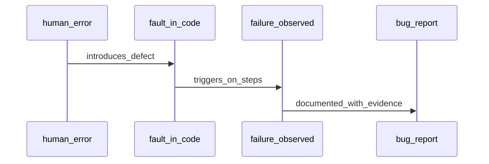

## Введение

Умение найти дефект бесполезно без умения его описать. На junior-собесе ждут точные термины error/fault/failure, структуру баг-репорта и разницу severity/priority. Этот выпуск закрывает J26–29 и J131–133 с практикой «чайник» и «username».

## Раздел: Error, fault, failure и что такое баг

Кратко по цепочке:
- **Error (ошибка человека)** — неверное действие разработчика/аналитика (неправильное понимание, опечатка в коде, дыра в требованиях).
- **Fault / defect / bug** — изъян в артефакте (код, конфиг, документ), следствие error.
- **Failure** — наблюдаемый сбой в работе: система ведёт себя не так, как ожидалось, когда дефект проявился на конкретных данных/шагах.

Баг в бытовой речи тестировщика — дефект, который воспроизводится и мешает ожидаемому поведению. Важно: не каждый странный UX — «critical bug»; формулируйте относительно требования или явного ожидания пользователя.

Хороший тон на собесе: «я фиксирую расхождение факта и ожидания, с шагами и окружением, без эмоций и без назначения виноватых».

## Раздел: Поля баг-репорта, severity и priority

Типовые поля репорта:
- **Title** — коротко «что сломано + где» (без «не работает!!!»);
- **Environment** — ОС, браузер, стенд, версия сборки;
- **Preconditions** — роль, данные, состояние;
- **Steps** — нумерованные шаги;
- **Actual / Expected** — факт vs ожидание;
- **Attachments** — скрин, видео, логи, cURL;
- **Severity / Priority** — влияние и порядок фикса;
- опционально: частота, workaround, связанные требования/кейсы.

**Severity** — насколько тяжёл дефект по влиянию на систему/данные/безопасность (blocker, critical, major, minor, trivial — шкалы отличаются, смысл один).

**Priority** — насколько срочно чинить с точки зрения бизнеса/релиза (P1…P4). Severity ставит инженерная оценка влияния; priority — продукт/менеджмент (часто совместно).

Примеры:
- Опечатка на редко посещаемой странице: severity low, priority low.
- Падение оплаты: severity critical/blocker, priority highest.
- Косметика на главной перед демо инвесторам: severity minor, priority high — бизнес срочно хочет «красиво».
- Утечка ПДн в логах: severity critical (security), priority highest.

## Раздел: Практика — чайник и username

**«Чайник» (бытовой дефект как модель репорта):**  
Title: «Чайник не отключается после закипания».  
Steps: налить воду → включить → дождаться кипения.  
Actual: продолжает греть. Expected: автоотключение.  
Severity: high (пожар/порча). Priority: high.

**Username:** поле принимает только латиницу 3–16 символов, без пробелов.  
Баг-пример: «При вводе username из 3 символов с пробелом в конце система сохраняет значение и показывает 200, хотя по ТЗ пробелы запрещены».  
В репорте: точная строка (`"ab "`), где обрезается trim (UI/API), ответ сервера, скрин валидации.

На собесе за J131–133 ждут именно структуру и ясность, а не литературный стиль.

## Лаба

**Цель.** Написать два полных баг-репорта: бытовой (чайник/утюг) и продуктовый (валидация username или логина).

**Шаги.**
1. Выберите шкалу severity (5 уровней) и priority (4 уровня) и зафиксируйте легенду.
2. Оформите репорт по чайнику со всеми обязательными полями.
3. Оформите репорт по username: steps, actual/expected, данные, окружение.
4. Для второго бага обоснуйте пару severity/priority в 2–3 предложениях.

**В группу:** обменяйтесь репортами; партнёр должен воспроизвести баг только по тексту — если не смог, доработайте steps.

**Готово, если…**
- [ ] Различаете error, fault/bug и failure
- [ ] Severity и priority не путаете и даёте контрпример «low severity / high priority»
- [ ] Репорт воспроизводим без устных пояснений

## Схема: От ошибки до репорта

## Тест

### Чем failure отличается от fault?

**Ответ:** fault — изъян в артефакте; failure — его проявление в работе

**Пояснение:** дефект может «спать» до определённых данных; failure — то, что увидел пользователь/тест.

### Кто обычно определяет priority?

**Ответ:** бизнес/продукт (часто вместе с командой), опираясь на влияние и релиз

**Пояснение:** severity описывает тяжесть; priority — очередь исправления под цели спринта/релиза.

### Какое поле репорта чаще всего ломает воспроизведение?

**Ответ:** неполные steps / нет данных и окружения

**Пояснение:** без версии, роли и точных входных строк разработчик чинит «не тот» сценарий.

## Шпаргалка

<h3>Суть</h3>
<ul>
<li>Error → Fault/Bug → Failure</li>
<li>Репорт: title, env, preconditions, steps, actual/expected, evidence</li>
<li>Severity = влияние; Priority = срочность для бизнеса</li>
</ul>
<h3>Шаблон title</h3>
<pre><code>[Area] Short fact: what breaks under which condition
</code></pre>

## Anki

### Front: Error vs bug vs failure?

Back: error — ошибка человека; bug/fault — дефект в продукте; failure — сбой при выполнении

### Front: Severity vs priority?

Back: severity — тяжесть влияния; priority — порядок/срочность исправления для бизнеса

### Front: Минимум полей хорошего баг-репорта?

Back: заголовок, окружение, шаги, фактический и ожидаемый результат, вложения/данные

## Итоги

- Термины error/fault/failure показывают зрелость ответа на собесе
- Сильный репорт экономит часы разработчику и вам на «а у меня работает»
- Severity ≠ priority — держите готовый пример расхождения

## Ссылки

- [QA-interview-250](https://github.com/Konstantine23/QA-interview-250)
- Learn | /game/learn
- Далее: [Документы, план и тест-кейсы](/game/learn/qa-docs-plan-cases)
