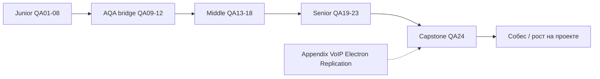

## Введение

Финальный выпуск серии: собрать траекторию Junior → Middle → Senior (+AQA), понять как пользоваться материалами 9to18 Learn и закрыть appendix-темы вне основной цепочки. Это навигатор и честный self-check перед собесом, а не новый учебник с нуля.

## Раздел: Чеклисты уровней и как читать серию

**Как пользоваться серией.**

1. Идите по `order` 401→424 или по пробелам в своём опыте (карта в таблице ниже).
2. Каждый выпуск: теория → лаба → тест → Anki; не пропускайте лабу — на собесе звучит практика.
3. Держите открытым [QA-interview-250](https://github.com/Konstantine23/QA-interview-250): статьи дают *оригинальные* ответы, репозиторий — полноту формулировок вопросов.
4. После Middle (QA18) обязательно пройдите strategy/ROI/security (QA19–21) до drill (QA23).
5. Повторяйте Anki и свой конспект багов/метрик с работы — сильнее любой зубрёжки.

**Чеклист Junior (ориентир QA01–QA08 + мост QA09–QA12).**

- [ ] Объясняет тестирование, STLC, entry/exit без воды
- [ ] Типы/уровни, smoke/sanity, позитив/негатив
- [ ] Эквивалентность, границы, простой bug report
- [ ] Тест-кейс, чеклист, базовый план
- [ ] HTTP/REST руками (DevTools, статус-коды)
- [ ] SQL: SELECT/JOIN/агрегаты на учебном уровне
- [ ] Понимает зачем автоматизация; пишет простые pytest
- [ ] Selenium/Playwright: найти элемент, assert, ожидания
- [ ] Git: branch, commit, PR; читает пайплайн
- [ ] Mobile: отличия, эмулятор vs девайс, базовый чеклист

**Чеклист Middle (QA13–QA18).**

- [ ] Процесс: coverage, leakage, риски фичи
- [ ] Продвинутый дизайн: decision table, pairwise, RBT
- [ ] API: контракты, моки, зачатки load
- [ ] Agile: Scrum/Kanban, DoD, препятствия QA
- [ ] Инфра: Docker, SSH, логи, IaaS/PaaS на уровне разговора
- [ ] AuthN/AuthZ, OWASP intro, WebSocket, SQL mid, mobile middle
- [ ] Самостоятельно ведёт тест-анализ фичи end-to-end

**Чеклист Senior + AQA (QA19–QA23 и углубление QA09–QA11).**

- [ ] Стратегия, exit criteria, метрики без vanity
- [ ] Shift-left, ROI автоматизации, пирамида, CI/CD дисциплина
- [ ] Security/perf: OWASP с защитами, stress с гипотезой
- [ ] Лидерство: конфликты, RCA, стейкхолдеры, legacy
- [ ] Drill: отладка слоями, регресс под давлением
- [ ] Проектирует automation strategy и владение suites
- [ ] Говорит с бизнесом языком риска и денег

**AQA-акцент.** Язык команды (в серии — Python), устойчивые локаторы/API-first, отчёты, параллель, данные, борьба с flaky, вклад в DoD/CI — не «запись кликов».

## Раздел: Appendix и индекс выпусков

**Appendix (вне основной нумерации собеса, знать обзорно).**

**J104–108 · NIC / RTP / SIP (телефония/сеть).** NIC — сетевой интерфейс; для QA VoIP важны задержки, packet loss, jitter. RTP — транспорт медиапотока; SIP — сигнализация сессии (приглашение, ответить, завершить). Тест: регистрация, call setup/teardown, one-way audio, NAT, кодеки. На общем web-собесе достаточно «знать, что это сигнализация vs медиа» и куда смотреть логи.

**M40 · Electron.** Десктоп на Chromium + Node: по сути web UI с доступом к ОС. Риски: XSS → RCE через Node, автообновления, нативные диалоги, разные ОС. Тест: Playwright/Spectron-подобные подходы, установка/обновление, офлайн, права файловой системы.

**M69 · SQL replication.** Primary/replica: асинхронная репликация даёт lag — тест только что записанных данных чтением с replica может «не видеть» строку. Проверяйте read-your-writes, failover, consistency expectations продукта.

**Полный список вопросов:** [github.com/Konstantine23/QA-interview-250](https://github.com/Konstantine23/QA-interview-250).

**Индекс серии QA Learn (обзор).**

| Ep | slug | Фокус |
|----|------|--------|
| QA01 | qa-intro-testing | Основы, STLC |
| QA02 | qa-types-levels | Типы и уровни |
| QA03 | qa-test-design | Дизайн junior |
| QA04 | qa-bugs-reports | Баги |
| QA05 | qa-docs-plan-cases | Документы |
| QA06 | qa-web-http-api-basics | HTTP/API |
| QA07 | qa-sql-db-basics | SQL |
| QA08 | qa-junior-practice-lab | Практика junior |
| QA09 | qa-aqa-principles | AQA принципы |
| QA10 | qa-selenium-webdriver | Selenium |
| QA11 | qa-pytest-ci-git | pytest, CI, Git |
| QA12 | qa-mobile-basics | Mobile |
| QA13 | qa-middle-process | Процесс middle |
| QA14 | qa-test-design-advanced | Дизайн middle |
| QA15 | qa-api-contract-perf | API/perf |
| QA16 | qa-agile-scrum-kanban | Agile |
| QA17 | qa-infra-linux-containers | Инфра |
| QA18 | qa-middle-web-mobile-sql | Web/mobile/SQL mid |
| QA19 | qa-strategy-metrics | Стратегия |
| QA20 | qa-shift-left-automation-roi | Shift-left/ROI |
| QA21 | qa-security-perf-senior | Security/stress |
| QA22 | qa-leadership-conflicts | Лидерство |
| QA23 | qa-senior-practice-drill | Drill |
| QA24 | qa-capstone-checklist | Capstone |

## Лаба

**Цель.** Личный gap-analysis и план на 4 недели до собеса.

**Шаги.**
1. Пройдите три чеклиста выше, отметьте ❌/⚠️/✅.
2. Выберите 5 ❌ и привяжите к выпускам серии (slug).
3. Составьте расписание: 3 выпуска/неделя или 2 лабы + Anki.
4. Напишите 60-секундный pitch: «кто я как QA и чем усиливаю команду».
5. Разберите 1 appendix-тему (VoIP / Electron / replication) на полстраницы своими словами.
6. Соберите «папку доказательств»: 3 баг-репорта, 1 тест-анализ, 1 кусок автотеста (ссылки/файлы).

```python
# Gap-analysis → план на 4 недели
series = [
    ("QA01-08", "junior", "basics"),
    ("QA09-12", "aqa", "automation bridge"),
    ("QA13-18", "middle", "process+web+sql"),
    ("QA19-23", "senior", "strategy+leadership"),
    ("QA24", "capstone", "checklist+appendix"),
]
gaps = {"QA15": "api contract", "QA21": "owasp stress", "QA22": "rca"}
for ep, level, topic in series:
    mark = "⚠️" if any(g.startswith(ep[:4]) or g in ep for g in gaps) else "✅"
    print(f"{mark} {ep:8} {level:8} {topic}")

appendix = {"SIP": "signaling", "RTP": "media", "Electron": "Chromium+Node", "replica": "lag"}
for key, value in appendix.items():
    print(f"appendix {key}: {value}")
```

**В группу:** что важнее за месяц до собеса — закрыть все Junior-дыры или один сильный Senior-рассказ про инцидент?

**Готово, если…**
- [ ] Есть письменный gap-list и план
- [ ] Pitch звучит 60 секунд без шпаргалки
- [ ] Знаете, где в серии искать каждую слабую тему

## Схема: Траектория серии



## Тест

### Зачем series Learn, если есть список из 250 вопросов?

**Ответ:** Learn даёт связные оригинальные ответы, лабы и карту роста; репозиторий — полноту формулировок вопросов

**Пояснение:** зубрёжка списка без практики и структуры уровней слабо держится на собесе.

### Что из appendix важно помнить про read replica?

**Ответ:** возможна задержка репликации — чтение сразу после записи может не увидеть данные

**Пояснение:** это влияет на тест-дизайн и на требования consistency продукта.

### Чем Electron-тестирование отличается от обычного web?

**Ответ:** есть слой Node/ОС: установка, обновления, файловая система и риски XSS→RCE

**Пояснение:** кроме UI в Chromium нужно покрывать десктопный жизненный цикл приложения.

## Шпаргалка

<h3>Рост</h3>
<ul>
<li>Junior — основы и дисциплина артефактов</li>
<li>Middle — анализ, API/инфра, осознанный риск</li>
<li>Senior — стратегия, люди, ROI, инциденты</li>
</ul>
<h3>Серия</h3>
<ul>
<li>order 401–424 · profiles tester · тег собеседование</li>
<li>Лаба + Anki обязательны</li>
</ul>
<h3>Appendix</h3>
<pre><code>SIP = сигнализация, RTP = медиа
Electron = Chromium + Node
Replica lag → не жди мгновенный read-your-writes
</code></pre>

## Anki

### Front: Порядок блоков серии QA Learn?

Back: Junior → AQA bridge → Middle → Senior → Capstone (QA01…QA24)

### Front: SIP vs RTP одной фразой

Back: SIP управляет сессией звонка; RTP несёт аудио/видео поток

### Front: Что положить в «папку доказательств» к собесу?

Back: сильные баг-репорты, пример тест-анализа и фрагмент осмысленной автоматизации

## Итоги

- Capstone сшивает Junior→Senior+AQA в проверяемые чеклисты
- Серия + QA-interview-250 = карта и полнота вопросов
- Appendix (VoIP, Electron, replication) — обзор для редких вопросов
- Дальше — практика лаб и свой опыт, а не бесконечное чтение

## Ссылки

- [QA-interview-250](https://github.com/Konstantine23/QA-interview-250)
- Learn | /game/learn
