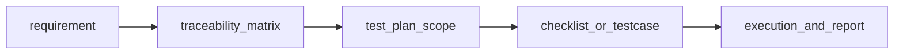

## Введение

На собесе junior-а спрашивают не только «как кликать», но и какие артефакты вы оставляете команде. Этот выпуск закрывает J18, J31–35, J119, J121: RTM, виды документов, тест-план, чеклист vs кейс и признаки сильного тест-кейса.

## Раздел: Документы и RTM

Типовые артефакты тестирования:
- **Test policy / strategy** (часто на уровне организации) — принципы, виды тестов, инструменты;
- **Test plan** — что, когда, кто, чем, критерии, риски для конкретного релиза/проекта;
- **Test cases / checklists** — конкретные проверки;
- **Bug reports / test summary report** — дефекты и итог прогона;
- **RTM (Requirements Traceability Matrix)** — матрица «требование ↔ тест(ы) ↔ статус».

Зачем RTM: видно покрытие требований тестами, пробелы («требование без кейса»), и влияние изменения требования на набор проверок. На junior уровне достаточно объяснить столбцы: ID требования, описание, ID кейсов, результат последнего прогона.

## Раздел: Тест-план, чеклист и хороший кейс

**Тест-план** обычно включает: scope / out of scope, объекты тестирования, подходы (виды/уровни), окружения, данные, роли и ответственность, расписание, риски и митигации, entry/exit, критерии приостановки, инструменты, deliverables.

**Чеклист** — короткий список проверок без детальных шагов («логин под admin», «оплата картой Visa»). Быстр в поддержке, хорош для smoke и опытной команды.

**Тест-кейс** — формализованный сценарий: ID, title, preconditions, steps, test data, expected result, иногда postconditions и приоритет. Нужен для онбординга, аудита, автоматизации и сложных потоков.

Признаки **хорошего** кейса:
- один основной смысл (не «проверить весь кабинет»);
- воспроизводим независимым человеком;
- ожидаемый результат проверяем и однозначен;
- данные конкретны;
- связан с требованием/риском;
- независим по возможности (не требует тайного предыдущего кейса без preconditions).

Плохой кейс: «проверить оплату» без шагов, карты, суммы и ожидаемого статуса заказа.

## Раздел: Практика корзины и карты оплаты

Для **корзины** чеклист-пример:
- добавить товар / несколько штук / один SKU дважды;
- изменить количество, удалить позицию, очистить корзину;
- цена и сумма сходятся; промокод; недоступный остаток;
- пустая корзина → переход к checkout заблокирован.

Для **оплаты картой** (учебно, без реальных ПДн):
- валидная тестовая карта → успех и статус заказа Paid;
- declined / insufficient funds;
- неверный CVV, истекший срок, неполный PAN;
- двойной submit кнопки «Оплатить»;
- возврат назад из платёжного виджета;
- таймаут 3-D Secure (если есть).

На собесе по J119/J121 ждут структуру мышления: сначала критичные пути, потом негатив и граничные данные.

## Лаба

**Цель.** Составить фрагмент тест-плана на checkout и набор: 8 пунктов чеклиста корзины + 3 детальных кейса оплаты.

**Шаги.**
1. Напишите scope / out of scope для тестирования корзины и оплаты (1 страница буллетов).
2. Сделайте мини-RTM: 5 требований → ID кейсов/пунктов чеклиста.
3. Оформите 3 кейса оплаты в полном формате (preconditions, steps, data, expected).
4. Отметьте, какие пункты лучше оставить чеклистом, а какие — кейсами, и почему.

**В группу:** партнёр проходит ваш кейс «вслепую» и отмечает двусмысленные шаги.

**Готово, если…**
- [ ] Объясняете RTM и зачем он менеджеру/QA
- [ ] Чётко отличаете checklist и test case
- [ ] Кейсы оплаты содержат конкретные данные и ожидаемый статус

## Схема: От требования к прогону

## Тест

### Зачем нужна RTM?

**Ответ:** связать требования с тестами и видеть покрытие/пробелы

**Пояснение:** при изменении требования сразу видно, какие проверки обновить; на статусе — что ещё не закрыто.

### Чем чеклист отличается от тест-кейса?

**Ответ:** чеклист — краткие пункты; кейс — детальные шаги, данные и ожидаемый результат

**Пояснение:** чеклист быстрее писать и держать; кейс надёжнее для сложных сценариев и передачи знаний.

### Что должно быть в тест-плане обязательно по смыслу?

**Ответ:** scope, подход, окружение, критерии входа/выхода, риски, ответственность

**Пояснение:** план отвечает «что проверяем, как, чем и когда достаточно», а не дублирует все кейсы целиком.

## Шпаргалка

<h3>Суть</h3>
<ul>
<li>RTM: requirement ↔ tests ↔ status</li>
<li>Plan = рамки и договорённости релиза</li>
<li>Checklist — быстро; Test case — подробно и однозначно</li>
<li>Хороший кейс: один фокус, данные, ожидаемый результат</li>
</ul>
<h3>Каркас кейса</h3>
<pre><code>ID | Title | Preconditions | Steps | Data | Expected
</code></pre>

## Anki

### Front: Что такое RTM?

Back: матрица трассировки требований к тест-артефактам и статусам покрытия

### Front: Когда достаточно чеклиста?

Back: для опытной команды, smoke и простых повторяемых проверок без сложной логики шагов

### Front: Признак плохого тест-кейса?

Back: размытый ожидаемый результат, нет данных, несколько несвязанных целей в одном кейсе

## Итоги

- Документы делают тестирование прозрачным для команды и релиза
- RTM — мост между «что обещали» и «что проверили»
- Умение выбрать checklist vs case — признак практического junior

## Ссылки

- [QA-interview-250](https://github.com/Konstantine23/QA-interview-250)
- Learn | /game/learn
- Далее: [Web, HTTP и API basics](/game/learn/qa-web-http-api-basics)
