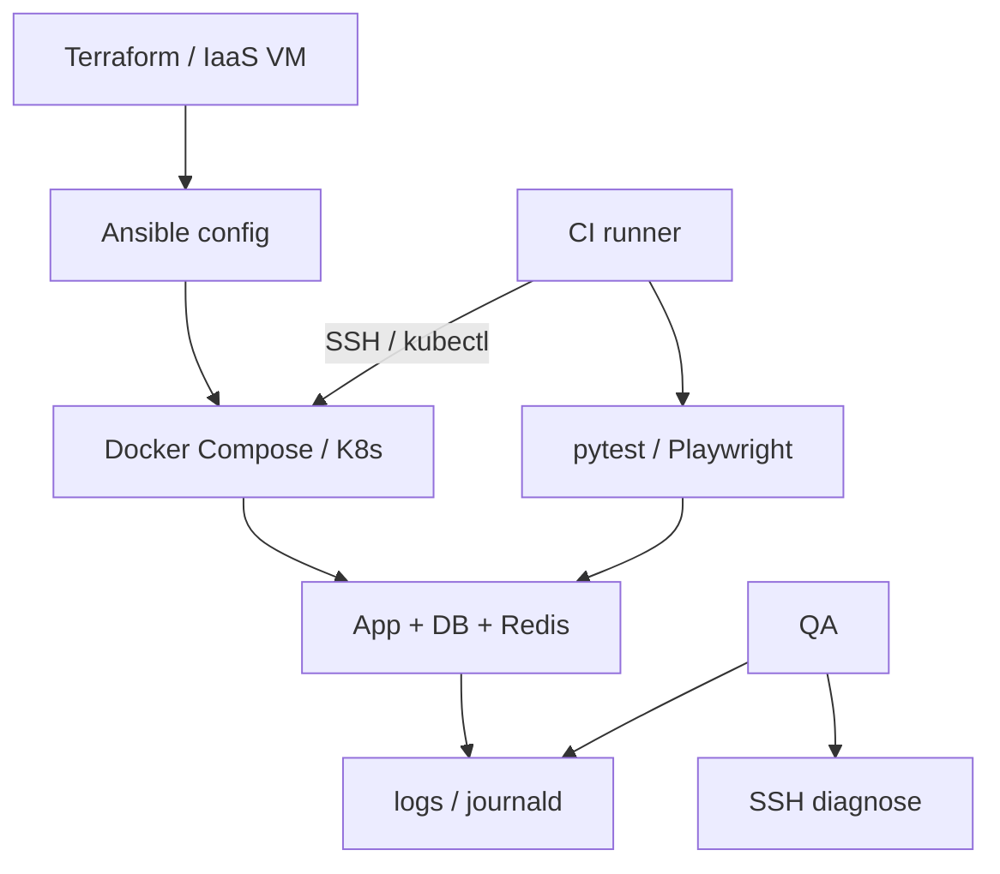

## Введение

M43–52: middle QA часто сам поднимает стенды, читает логи на Linux, ходит по SSH и отличает «упал контейнер» от «упала ВМ». Ниже — рабочие ответы для собеса: виртуализация vs эмуляция, контейнеры, облачные модели, config management и бытовой shell.

## Раздел: VM, simulator, emulator и контейнеры

**Виртуальная машина (VM)** — гостевая ОС на гипервизоре (KVM, Hyper-V, VMware). Полная изоляция ядра/драйверов, свой диск и сеть. Тяжелее по RAM/CPU, зато максимально близка к «железному» окружению.

**Simulator** — программная модель поведения системы *без* полного воспроизведения железа (iOS Simulator на Mac: API и UI близки, но CPU/GPU/сеть не как на устройстве). Быстро для функционала, слабо для перф и редких драйверных багов.

**Emulator** — имитирует другое железо/архитектуру (Android Emulator, эмулятор платежного терминала). Медленнее симулятора, полезен когда нужен «как на железе», но всё ещё не заменяет реальные девайсы для финальной приёмки.

| | VM | Simulator | Emulator | Container |
|--|----|-----------|----------|-----------|
| Изоляция | сильная (своя ОС) | слабая/средняя | средняя | процесс + namespaces |
| Вес | высокий | низкий | средний–высокий | низкий |
| Старт | минуты | секунды | секунды–минуты | секунды |
| Для QA | полные стенды, legacy | UI smoke mobile | кросс-архитектура | CI, сервисы, изоляция тестов |

**Container vs VM.** Контейнер (Docker) делит ядро хоста, упаковывает приложение + зависимости в образ. Лёгкий, воспроизводимый, идеален для CI и микросервисов. VM — когда нужна другая ОС, ядро, драйверы или жёсткая изоляция (sandbox вредоносного ПО, чужой kernel).

**Где в автоматизации:** Selenium Grid / Playwright browsers в контейнерах; тестовая БД из `docker compose`; эфемерные окружения в CI; Appium + эмулятор для mobile smoke. Правило: контейнер = одинаковый runtime; реальные устройства/ВМ — для рисков, которые контейнер не ловит.

## Раздел: IaaS, PaaS, provisioning и shell

**IaaS** (AWS EC2, Azure VM, Yandex Compute) — арендуете ВМ, сеть, диски; ОС и стек на вас. QA: полный контроль стенда, сами патчите и мониторите.

**PaaS** (Heroku-like, Cloud Run, Elastic Beanstalk) — платформа даёт runtime/деплой; вы кладёте код. QA: меньше возни с ОС, больше зависимость от лимитов платформы (логи, масштабирование, версии runtime).

**Config management** — Ansible, Puppet, Chef, Salt: декларативно/императивно приводят хосты к нужному состоянию (пакеты, пользователи, конфиги). Отличие от «один раз руками настроили»: идемпотентность и повторяемость стендов.

**Provisioning** — создание ресурсов с нуля (Terraform, CloudFormation, Pulumi): сеть, ВМ, балансировщики, DNS. Часто связка: Terraform поднимает железо → Ansible конфигурирует → Docker/K8s деплоит приложение. Для QA важно уметь *прочитать* IaC и понять, что именно отличается между `dev` и `stage`.

**Linux: найти логи.** Типичные места: `/var/log/`, journald (`journalctl -u service`), stdout контейнера (`docker logs`). Поиск:

```bash
find /var/log -name '*.log' -mtime -1
grep -R "ERROR" /var/log/app/ --include='*.log' | tail -n 50
journalctl -u nginx --since "1 hour ago"
docker logs --tail 200 my-api
```

**Windows CMD: IP.** `ipconfig` / `ipconfig /all` — адреса интерфейсов; `ping`, `tracert`, `nslookup` — сеть. В PowerShell удобнее `Get-NetIPAddress`.

**SSH.** Удалённый shell по ключу/паролю: `ssh user@host`, туннели `-L`/`-R`, копирование `scp`/`rsync`. Для автотестов: ключ в CI secrets, jump-host, не хранить пароли в репо. `StrictHostKeyChecking` и known_hosts — частая боль пайплайнов.

**Bash vs batch.** Bash (Linux/macOS CI): пайпы, `set -euo pipefail`, функции. Batch/PowerShell (Windows агенты): установка драйверов, пути с пробелами. В кроссплатформенной AQA предпочитайте Python/`make`/Docker, а shell — тонкая обёртка.

## Лаба

**Цель.** Поднять учебный стек в Docker и отработать диагностику «как на собесе».

**Шаги.**
1. Опишите таблицей, когда выберете VM, эмулятор, симулятор и контейнер для: API-стенда, Android UI smoke, изоляции вредоносного плагина.
2. Напишите `docker-compose.yml` с API + Postgres (достаточно черновика) и команды: up, logs, exec в контейнер БД.
3. Составьте Ansible-плейбук из 5 задач «заготовка» (user, packages, clone, systemd, firewall) — без обязательного запуска.
4. На Linux-стенде (или WSL) найдите свежие `.log`, отфильтруйте ERROR и сохраните 20 строк в файл.
5. Подключитесь по SSH (локальный контейнер SSH или учебный хост), выполните `uptime` и `df -h`, зафиксируйте вывод.
6. Напишите bash-скрипт smoke: curl healthcheck → exit 0/1; и batch/PowerShell-аналог идеи для Windows-агента.

**В группу:** почему «всё зелёное в Docker на ноутбуке» не доказывает прод на VM за балансировщиком?

**Готово, если…**
- [ ] Чётко отличаете VM / container / emulator / simulator
- [ ] Можете объяснить IaaS vs PaaS на примере стенда
- [ ] Есть рабочий набор команд для логов и SSH

## Схема: Стенд QA — от IaC до теста



## Тест

### Чем контейнер принципиально отличается от VM?

**Ответ:** контейнер делит ядро хоста и изолирует процесс; VM поднимает гостевую ОС со своим ядром

**Пояснение:** поэтому контейнеры легче и быстрее стартуют, но не заменяют ВМ, когда нужна другая ОС или жёсткая изоляция ядра.

### Когда QA выбирает IaaS, а не PaaS?

**Ответ:** когда нужен полный контроль ОС, сети, агентов и кастомной установки (драйверы, спецПО, зеркала)

**Пояснение:** PaaS ускоряет деплой кода, но ограничивает доступ к инфраструктуре и диагностике на уровне ОС.

### Как быстро найти ошибки в логах Linux-сервиса?

**Ответ:** `journalctl -u service --since …` и/или `grep`/`find` по `/var/log`, для Docker — `docker logs`

**Пояснение:** на собесе ждут конкретные команды и понимание, куда сервис пишет stdout vs файлы.

## Шпаргалка

<h3>Виртуализация</h3>
<ul>
<li>VM — своя ОС; container — namespaces/cgroups на ядре хоста</li>
<li>Simulator — модель API; emulator — имитация железа</li>
</ul>
<h3>Облако</h3>
<ul>
<li>IaaS = машины; PaaS = платформа под код</li>
<li>Terraform provision → Ansible config → Docker run</li>
</ul>
<h3>Диагностика</h3>
<pre><code>find /var/log -name '*.log' -mtime -1
journalctl -u nginx --since "1 hour ago"
docker logs --tail 200 api
ssh user@host
ipconfig /all
</code></pre>

## Anki

### Front: Container vs VM — одно предложение

Back: контейнер изолирует процесс на общем ядре; VM — полноценная гостевая ОС

### Front: IaaS vs PaaS для тест-стенда?

Back: IaaS — контроль ОС и сети; PaaS — быстрый деплой с ограничениями платформы

### Front: Три команды найти ERROR в логах Linux

Back: grep -R ERROR /var/log; journalctl -u svc; docker logs

## Итоги

- VM, эмулятор, симулятор и контейнер решают разные классы рисков — не взаимозаменяемы
- Контейнеры ускоряют CI и воспроизводимость; ВМ/девайсы закрывают «железные» дыры
- IaaS/PaaS и связка Terraform+Ansible — язык middle про стенды
- Shell, SSH и чтение логов — обязательный бытовой навык автоматизатора

## Ссылки

- [QA-interview-250](https://github.com/Konstantine23/QA-interview-250)
- [Docker docs](https://docs.docker.com/)
- Learn | /game/learn
