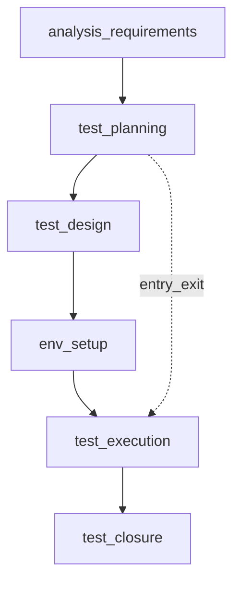

## Введение

На junior-собесе по QA почти всегда начинают с базы: что такое тестирование, зачем оно нужно и как устроен цикл работ. Этот выпуск закрывает вопросы J1–3, J25 и J30 своими формулировками — без копипаста чужих шпаргалок.

## Раздел: Что такое тестирование и зачем оно нужно

Тестирование — это процесс оценки продукта относительно ожиданий: требований, договорённостей с заказчиком, здравого смысла пользователя и рисков бизнеса. Цель не «найти все баги» (это невозможно), а снизить риск релиза: выявить критичные дефекты раньше, дать факты для решения «выпускаем / чиним / откладываем».

Зачем тестирование бизнесу:
- меньше потерь от сбоев в проде (деньги, репутация, штрафы);
- быстрее обратная связь разработчикам — дешевле чинить на ранних этапах;
- прозрачность качества: «что проверено, что осознанно не проверено»;
- обучение команды: тесты и баги уточняют требования.

На собесе полезно сказать: тестирование — это деятельность по обеспечению качества через поиск расхождений, а QA шире — процессы, метрики, предотвращение дефектов, культура качества.

## Раздел: Этапы тестирования и STLC

Жизненный цикл тестирования (STLC) описывает этапы работы тестировщика относительно жизненного цикла разработки:

1. **Анализ требований** — читаем ТЗ/user stories, ищем неясности, противоречия, пробелы; задаём вопросы.
2. **Планирование** — стратегия, объём, риски, ресурсы, критерии входа/выхода, окружения.
3. **Дизайн тестов** — чеклисты, кейсы, данные, матрица трассировки к требованиям.
4. **Подготовка окружения** — стенды, доступы, тестовые данные, инструменты.
5. **Выполнение** — прогон, логирование результатов, заведение дефектов.
6. **Закрытие цикла** — отчёт, метрики, уроки, архив артефактов.

Entry criteria (критерии входа) — условия, без которых этап не стартуем: стабильная сборка, доступный стенд, согласованные требования, готовые кейсы для текущего scope.

Exit criteria (критерии выхода) — когда можно остановиться: критичные баги закрыты/приняты, запланированные кейсы пройдены (или осознанно отложены), покрытие рисков достаточное, отчёт согласован.

## Раздел: Verification vs Validation

**Verification** («делаем ли продукт правильно?») — проверка артефактов и соответствия спецификации: ревью требований, статический анализ, сверка реализации с дизайн-доком без обязательного запуска «как пользователь».

**Validation** («делаем ли правильный продукт?») — проверка, что продукт решает задачу пользователя/бизнеса: функциональные прогоны, UAT, сценарии реального использования.

На практике оба нужны: можно идеально пройти verification по неверной спецификации и провалить validation. Хороший ответ на собесе: verification чаще статичен и про соответствие артефактам; validation — динамичен и про ценность для пользователя.

## Лаба

**Цель.** Сформулировать устный ответ на 90 секунд: «Что такое тестирование, STLC и чем verification отличается от validation?»

**Шаги.**
1. Выпишите 5 буллетов: цель тестирования, 3 риска без тестов, отличие QA и тестирования.
2. Нарисуйте STLC в 6 блоков и подпишите по одному артефакту на этап (план, кейсы, отчёт…).
3. Для вымышленного релиза логина задайте 3 entry и 3 exit criteria.
4. Приведите по одному примеру verification и validation для той же фичи.

**В группу:** зачитайте ответ на таймер; коллега спрашивает «а если требований нет?» и «когда выходить из теста раньше плана».

**Готово, если…**
- [ ] Объясняете цель тестирования без фразы «найти все баги»
- [ ] Называете этапы STLC и смысл entry/exit
- [ ] Чётко различаете verification и validation на примере

## Схема: STLC и критерии

## Тест

### Зачем бизнесу тестирование, если «разработчики и так проверяют»?

**Ответ:** снизить риск релиза и дать независимую оценку качества

**Пояснение:** разработчик проверяет «как задумал»; тестировщик — «как пойдёт у пользователя и что ломается на стыках»; бизнесу нужны факты до прода.

### Что такое entry criteria?

**Ответ:** условия старта этапа тестирования

**Пояснение:** без стабильной сборки, стенда и понятного scope прогон будет хаотичным и даст ложные выводы.

### Чем validation отличается от verification?

**Ответ:** validation — правильный продукт для пользователя; verification — соответствие спецификации/артефактам

**Пояснение:** можно «верно» реализовать неверные требования (verification ок, validation нет).

## Шпаргалка

<h3>Суть</h3>
<ul>
<li>Тестирование снижает риск, а не гарантирует ноль дефектов</li>
<li>STLC: анализ → план → дизайн → окружение → прогон → закрытие</li>
<li>Entry/Exit — договорённости «когда начинаем» и «когда достаточно»</li>
<li>Verification = правильно ли сделано; Validation = то ли сделано</li>
</ul>
<h3>Фразы на собесе</h3>
<pre><code>не «все баги», а риск и информация
STLC параллелен SDLC, не вместо него
exit criteria согласуем до горящего дедлайна
</code></pre>

## Anki

### Front: Что такое тестирование одной фразой?

Back: оценка продукта относительно ожиданий с целью снизить риск релиза и дать факты для решения

### Front: Назовите этапы STLC

Back: анализ требований, планирование, дизайн тестов, подготовка окружения, выполнение, закрытие

### Front: Verification vs Validation?

Back: verification — соответствие спецификации/артефактам; validation — ценность и корректность для пользователя/бизнеса

## Итоги

- Тестирование — про риск и информацию, не про миф «100% багов»
- STLC даёт структуру работы; entry/exit делают остановку осознанной
- Verification и validation — разные вопросы; на собесе ждут пример

## Ссылки

- [QA-interview-250](https://github.com/Konstantine23/QA-interview-250)
- Learn | /game/learn
- Далее: [Типы и уровни тестирования](/game/learn/qa-types-levels)
