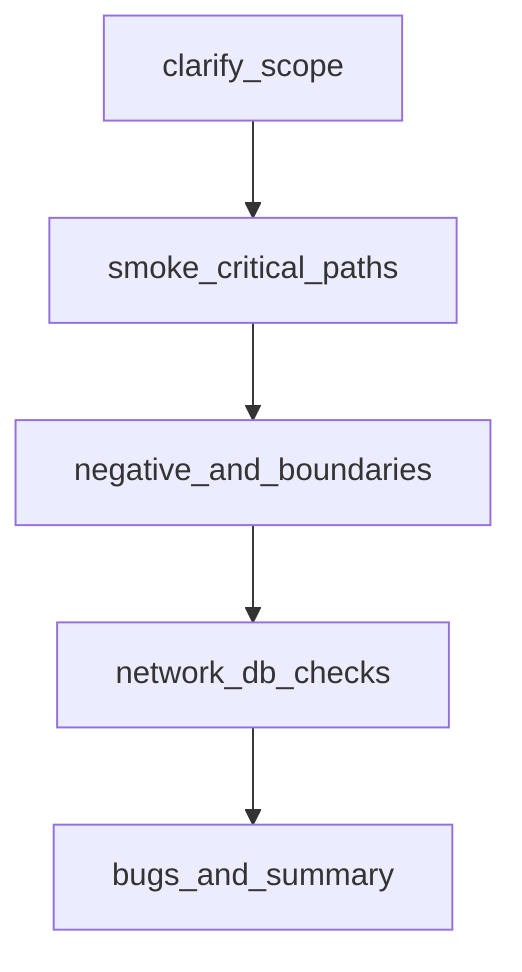

## Введение

Теория без прогона на собесе «сыплется». Вопросы J119–130, J132 и J135 — это умение быстро собрать чеклист, негативные кейсы и smoke. Этот выпуск собирает навыки QA01–QA07 в одну практическую сессию.

## Раздел: Корзина, логин и поле возраста

**Чеклист корзины (минимум):**
1. Добавление одного товара и проверка имени/цены.
2. Увеличение qty и пересчёт суммы.
3. Два разных товара — итоговая сумма.
4. Удаление позиции / очистка.
5. Max qty / qty = 0 / дробное qty (если UI даёт ввести).
6. Товар с нулевым остатком.
7. Переход к checkout только с непустой корзиной.
8. Обновление цены товара на витрине vs сумма в корзине (рассинхрон).

**Негативный логин:**
- пустые поля; только email; только пароль;
- неверный пароль; несуществующий пользователь;
- SQL-подобные строки в полях (наблюдаем обработку, не «ломаем прод»);
- очень длинная строка; пробелы по краям;
- регистр email; повторный submit;
- ожидаемые сообщения и отсутствие 500; в Network — 401/400, а не утечка стека.

**Возраст 18–99 (сводка EP/BVA):** 17, 18, 99, 100, `""`, `"abc"`, `18 `, `018` — плюс серверная проверка, если UI режет ввод. Оформите 1 баг-репорт на любое реальное расхождение UI vs API.

## Раздел: Smoke «Telegram-like» и калькулятор MVP

**Smoke для мессенджера-подобного приложения (идея J-блока практики):**
- установка/открытие / загрузка главной;
- регистрация или логин тестовым пользователем;
- список чатов отображается;
- открыть чат, отправить текстовое сообщение, увидеть его у себя;
- поиск контакта/чата (если есть);
- логаут / повторный вход без потери критичных данных сессии стенда;
- при падении любого пункта — стоп, сборка не для глубокого теста.

Это именно smoke: широта важнее глубины. Регресс пересылки файлов, звонков и уведомлений — отдельно.

**Калькулятор MVP — подход к тестированию:**
1. Уточнить операции (+ − × ÷), точность, унарный минус, порядок операций.
2. Позитив: 2+2, 10−3, 3×4, 8÷2.
3. Границы и нули: ÷0, очень большие числа, много знаков после запятой.
4. UX: очистка C/AC, цепочки операций, двойная точка, ведущие нули.
5. Нефункциональное на junior уровне: не падает на мусоре ввода, сообщения об ошибках понятны.
6. Стратегия: чеклист + таблица вход→ожидание; автоматизация позже (pytest), сначала ручной каркас.

На собесе важно проговорить **порядок**: риски → smoke → детальные негативы → отчёт.

## Раздел: Как упаковать ответ интервьюеру

Шаблон устного ответа на «протестируйте X за 10 минут»:
1. Уточняющие вопросы (платформа, роли, что out of scope).
2. Критичные пользовательские пути.
3. Негативы и границы данных.
4. Состояния и права (гость/юзер).
5. Что проверю в Network/БД.
6. Что осознанно не успею и какой риск.

Так вы показываете зрелость сильнее, чем бесконечный список кликов.

## Лаба

**Цель.** За 60–90 минут собрать пакет артефактов junior-уровня на одном учебном приложении (магазин или калькулятор + отдельный лист для messenger-smoke).

**Шаги.**
1. Напишите чеклист корзины ≥8 пунктов с ожидаемым результатом в одной фразе.
2. Оформите 5 негативных кейсов логина в формате test case.
3. Таблица EP/BVA для возраста (или другого числового поля).
4. Smoke-лист из 6 шагов для Telegram-like и отметьте entry/exit.
5. Для калькулятора — таблица из ≥12 строк вход→ожидание, включая ÷0.
6. Один полный баг-репорт по любому найденному (или смоделированному) дефекту.

**В группу:** проведите peer-review пакета; партнёр вычёркивает пункты без проверяемого expected result.

**Готово, если…**
- [ ] Есть воспроизводимые артефакты, а не «мысль в голове»
- [ ] Smoke отделён от глубокого регресса
- [ ] Можете за 2 минуты объяснить стратегию тестирования калькулятора

## Схема: Сессия практики junior

## Тест

### Что должно войти в smoke мессенджера в первую очередь?

**Ответ:** вход, список чатов, отправка/отображение сообщения

**Пояснение:** без базового обмена сообщениями углублённые фичи тестировать бессмысленно.

### Почему ÷0 обязателен в тестах калькулятора?

**Ответ:** граничный/негативный случай с высоким риском падения или неясного UX

**Пояснение:** системы по-разному обрабатывают деление на ноль; нужно явное ожидаемое поведение из требований.

### Чем негативный логин отличается от просто «неверный пароль»?

**Ответ:** это набор классов невалидного ввода и состояний, не один кейс

**Пояснение:** пустые поля, длина, спецсимволы, двойной submit, коды ответа — разные риски.

## Шпаргалка

<h3>Суть</h3>
<ul>
<li>Сначала уточнить scope и риски</li>
<li>Smoke → негатив/границы → доказательства → отчёт</li>
<li>Чеклист корзины и кейсы логина — must-have в портфолио</li>
<li>Калькулятор: таблица вход→ожидание важнее «потыкать»</li>
</ul>
<h3>Устный каркас</h3>
<pre><code>questions → critical paths → negatives → data/state → tools → risks skipped
</code></pre>

## Anki

### Front: С чего начать ответ «протестируйте форму логина»?

Back: уточнить требования и окружение, затем позитив, классы негатива, сообщения об ошибках и Network-статусы

### Front: Что такое smoke на практике?

Back: короткий набор критичных проверок жизнеспособности сборки перед глубоким тестированием

### Front: Какой артефакт приложить к практике корзины?

Back: чеклист с ожидаемыми результатами и хотя бы один детальный кейс на сумму/qty

## Итоги

- Junior силён не списком терминов, а собранным пакетом проверок
- Корзина, логин, возраст, smoke и калькулятор — частые живые задания на собесе
- Отделяйте smoke от глубины и всегда фиксируйте ожидаемый результат

## Ссылки

- [QA-interview-250](https://github.com/Konstantine23/QA-interview-250)
- Learn | /game/learn
- Ранее: [SQL и базы для QA](/game/learn/qa-sql-db-basics)
