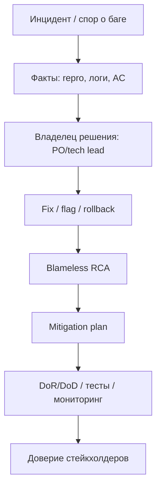

## Введение

M85–87, S6, S8, S31–33: на senior собесе проверяют зрелость коммуникации. Баг «не баг», релизы без QA, выгоревшая команда без документов — нужны рабочие протоколы, а не лозунги «качество важно».

## Раздел: Конфликты, дедлайны и поздний вход

**Конфликт с разработчиком о баге.** Разделяйте факты и интерпретации. Протокол:

1. Воспроизведение, окружение, ожидаемое vs фактическое, логи/скрины.
2. Ссылка на требование/AC/контракт или явную дыру в спецификации.
3. Severity/priority по договорённой шкале, не по эмоциям.
4. Если спор о «так задумано» — эскалация к PO/аналитику с вариантами риска.
5. Тон: «давайте снимем неопределённость», не «вы сломали».

Антипаттерн: война в треде на 40 комментариев. Паттерн: короткий sync + решение владельца продукта.

**Deadline crunch.** Честно сужайте scope тестирования по риску: must-have smoke и деньги/безопасность; остальное — explicit skip с подписью PO. Усильте парное тестирование, feature flags, canary. Не обещайте «успеем всё» — предложите меню: дата / объём / риск. Документируйте принятый residual risk.

**Позднее вовлечение QA.** Симптом: «вот билд, завтра релиз». Ответ senior:

- Немедленно: exploratory критического пути + чеклист рисков.
- Фиксация: без тестability и времени — качество не гарантируем (письменно).
- Системно: DoR включает QA на refinement; DoD — проверки; метрика escaped defects как аргумент.
- Параллельно: шаблоны smoke, контрактные тесты, чтобы следующий раз не начинать с нуля.

Цель — встроить качество в поток, а не стать героем ночного прогона.

## Раздел: RCA, mitigation, продажа тестирования, legacy без документов

**RCA (root cause analysis).** После инцидента: что случилось → timeline → contributing factors (не только «человеческий фактор») → root cause(s) → corrective + preventive actions → владельцы и сроки → проверка эффективности. Инструменты: 5 Whys, fishbone, fault tree — выбирайте по сложности. Важно: blameless culture; иначе правду скроют.

**Mitigation plan.** Набор действий, снижающих вероятность/удар: hotfix, rollback, feature flag off, мониторинг, доп. тесты, процессные изменения (чек-листы релиза, парное ревью schema). План = конкретные задачи с датами, не «будем внимательнее».

**Как «продать» тестирование клиенту/заказчику.** Говорите на языке бизнеса: стоимость простоя, штрафы, репутация, скорость безопасных релизов, прозрачный риск. Покажите до/после (escaped defects, время отката). Предложите MVP качества: smoke + мониторинг + критический регресс за понятную цену. Избегайте страшилок без цифр и «нам нужны ещё 10 QA».

**Год проекту, нет документов, команда выгорела.**

1. Признать долг: не обвинять, а инвентаризировать.
2. Быстрая карта системы (C4 L1/L2), критические потоки, владельцы.
3. Собрать «живой» smoke и runbook инцидентов — ценность за неделю.
4. Выборочная документация только hot paths; остальное — по мере изменения.
5. Снизить WIP и героизм: устойчивый ритм, парные сессии знаний.
6. Малые победы и публичное признание — против выгорания.
7. Автоматизировать самый болезненный ручной регресс точечно.
8. Договорённость со стейкхолдерами: качество улучшаем итерациями, не big bang docs.

## Лаба

**Цель.** Разобрать учебный инцидент «оплата прошла дважды» как lead QA.

**Шаги.**
1. Напишите баг-репорт и «скрипт» 3-минутного разговора с dev, который говорит «не баг».
2. Для релиза завтра составьте risk-based scope: in / out / accepted risk (таблица).
3. Timeline RCA на одну страницу + 3 preventive actions.
4. Mitigation plan на 14 дней с владельцами.
5. Письмо заказчику (10–12 предложений): зачем платить за тест-анализ в следующем квартале.
6. 30-дневный план спасения legacy-команды без документов (недельные вехи).

```python
# Risk-based scope под дедлайн: in / out / accepted
items = [
    ("pay_happy_path", "in", 5),
    ("pay_idempotency", "in", 5),
    ("admin_reports_ui", "out", 2),
    ("dark_theme", "accepted", 1),
]
for name, bucket, severity in sorted(items, key=lambda row: -row[2]):
    print(f"[{bucket:8}] Sev{severity} {name}")

timeline = ["detect", "contain", "fix", "rca", "prevent"]
for step, label in enumerate(timeline, start=1):
    print(f"RCA step {step}: {label}")
```

**В группу:** PO давит «подпишите, что протестировано» при срезанном scope — что делаете?

**Готово, если…**
- [ ] Конфликт переведён в факты и владельца решения
- [ ] RCA без blame, с preventive actions
- [ ] Есть язык ценности для заказчика

## Схема: От инцидента к улучшению



## Тест

### Как вести спор «баг / не баг» со senior-разработчиком?

**Ответ:** через воспроизведение, ожидаемое по AC/контракту и эскалацию неопределённости к PO, без перехода на личности

**Пояснение:** цель — снять риск для пользователя; решение о приоритете продукта принадлежит владельцу продукта.

### Что должно быть в mitigation plan после инцидента?

**Ответ:** конкретные действия с владельцами и сроками, снижающие вероятность повтора и удар при повторе

**Пояснение:** фразы «улучшим процесс» без задач не являются планом.

### Как убедить клиента в ценности тестирования?

**Ответ:** связать практики QA с деньгами, риском простоя и скоростью безопасных поставок, показав измеримый MVP качества

**Пояснение:** бизнес слышит риск и ROI, а не список тест-кейсов.

## Шпаргалка

<h3>Конфликт и crunch</h3>
<ul>
<li>Факты → AC → severity → PO</li>
<li>Scope / дата / риск — меню, не героизм</li>
</ul>
<h3>RCA</h3>
<ul>
<li>Blameless timeline → root cause → corrective + preventive</li>
<li>Mitigation = задачи с датами</li>
</ul>
<h3>Legacy</h3>
<pre><code>карта системы → smoke → hot-path docs
снизить WIP → парные знания → точечная автоматизация
</code></pre>

## Anki

### Front: Что сказать вместо «успеем протестировать всё»?

Back: предложить варианты scope с явным residual risk и решением PO

### Front: Blameless RCA — зачем?

Back: чтобы люди говорили правду о системных причинах, а не защищали себя

### Front: Первый шаг на проекте без документов?

Back: карта критических потоков и рабочий smoke, а не год писать wiki

## Итоги

- Конфликты закрывают фактами и владельцем продукта, не давлением
- Дедлайн — честный trade-off scope/риска
- RCA и mitigation превращают инцидент в системное улучшение
- Ценность QA объясняется языком бизнеса; legacy лечат маленькими победами

## Ссылки

- [QA-interview-250](https://github.com/Konstantine23/QA-interview-250)
- Learn | /game/learn
