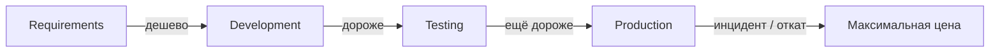

## Введение

Middle-уровень (M1, M4, M14, M17–22) проверяет не знание терминов, а зрелость процесса: что делает QA в команде, когда начинать и останавливать тест, как говорить о риске релиза и когда кейсы вредят. Ответы — практические, без копипаста учебника.

## Раздел: Обязанности QA, entry/exit, цена дефекта

**Обязанности QA (шире, чем «кликать по билду»):** анализ требований и рисков, стратегия и план, проектирование проверок, выполнение, отчётность, коммуникация блокеров, улучшение качества процесса (ретро, flaky, тестовые данные), иногда поддержка AQA и production-мониторинг сигналов.

Не обязанность QA — единолично «разрешить релиз» без критериев продукта/бизнеса; решение — совместное, QA даёт **информацию о рисках**.

**Entry criteria (вход в тестирование):** сборка установлена на стенд, smoke предыдущего слоя зелёный, есть тестовые данные/учётки, известен scope (что вошло в билд), доступны зависимости (API/mock), понятны критерии приёмки.

**Exit criteria (выход):** запланированный scope пройден или явно срезан, критичные/блокеры закрыты или приняты бизнесом, метрики согласованы (например нет open Sev1), отчёт отдан, известны остаточные риски.

**Цена дефекта.** Чем позже найден — тем дороже: требования → код → тест → прод (инцидент, репутация, хотфикс, откат). На собесе связывайте с shift-left: дешёвые находки на ревью требований и API-контракте, дорогие — в проде у платежного сценария.

## Раздел: Pos/neg, пререлиз, leakage, кейсы и трудное

**Позитив / негатив.** Позитив — штатный путь и валидные данные; негатив — невалидный ввод, отказы зависимостей, права, лимиты. «Правильное» соотношение не 50/50 и не догма 1:3: зависит от риска. Для платежей и auth негатива больше; для внутреннего read-only отчёта — упор на позитив и границы данных. Называйте **риск**, а не магическую цифру.

**Пререлизное тестирование.** Freeze scope → regression критичных journey → sanity на release-candidate → проверка миграций/конфигов → мониторинг чеклист после выкладки. Не путать с бесконечным «ещё часик покликаем» без плана.

**Bug leakage vs решение релизить.** Leakage — дефекты, ушедшие в прод (или найденные клиентом), которые могли/должны были быть пойманы на вашем уровне. Анализ leakage ≠ «QA виноват»: смотрите пробелы покрытия, среды, флаки, сжатые сроки, неясные требования. Релиз с известными багами возможен, если риск принят (workaround, feature flag, мониторинг) и задокументирован — это не то же самое, что утечка сюрпризом.

**Когда не писать подробные тест-кейсы:**

- исследование/новый UI без стабильных требований (сначала чеклист/сессия)
- одноразовая проверка на выброшенном прототипе
- полностью покрыто надёжными автотестами с читаемыми сценариями
- время уходит в документацию вместо риска (согласовать с тимлидом)

**Труднотестируемые фичи:** случайность (рандом, ML), внешние провайдеры без sandbox, timing/race, аппаратные датчики, закрытые SDK, «красивый» UI без id. Стратегии: testability (логи, хуки, seed), контрактные моки, телеметрия, feature flags, исследовательские сессии, усиленный мониторинг вместо ложной уверенности.

## Лаба

**Цель.** Для учебного продукта (интернет-магазин или ваш стенд) оформить one-pager процесса релиза.

**Шаги.**
1. Выпишите 5 обязанностей QA на спринт и 2 зоны, где QA только консультирует.
2. Сформулируйте entry/exit для regression перед релизом (измеримые пункты).
3. Оцените 3 бага на разных стадиях: «цена» в условных единицах усилий + риск для бизнеса.
4. Предложите pos:neg акцент для модуля оплаты vs модуля «о компании».
5. Опишите 1 фичу, которую невыгодно покрывать детальными кейсами, и альтернативу (чеклист/авто/мониторинг).

**В группу:** кто подписывает релиз при открытом Sev2 с workaround — продукт, tech lead или QA?

**Готово, если…**
- [ ] Entry/exit без воды («всё готово»)
- [ ] Объясняете leakage vs accepted risk
- [ ] Есть пример труднотестируемого и testability-запрос к разработке

## Схема: Стоимость дефекта по стадиям

## Тест

### Чем entry criteria отличаются от exit criteria?

**Ответ:** entry — готовность начать тест; exit — условия закончить этап и передать дальше/релизить

**Пояснение:** без entry тестирование превращается в отладку среды; без exit — бесконечный цикл без решения о качестве.

### Почему нельзя назвать универсальную долю негативных кейсов?

**Ответ:** доля зависит от риска домена и стоимости ошибки, а не от формулы

**Пояснение:** auth/платежи требуют больше негатива; простой контентный экран — иначе перерасход времени.

### Когда осознанный релиз с багом — не bug leakage?

**Ответ:** когда дефект известен, риск принят стейкхолдерами и есть mitigation

**Пояснение:** leakage — сюрприз в проде из-за пробела процесса; accepted debt — управляемое решение.

## Шпаргалка

<h3>Роль</h3>
<ul>
<li>QA информирует о рисках; релиз — командное/продуктовое решение</li>
<li>Обязанности: анализ, дизайн, выполнение, отчёт, улучшение процесса</li>
</ul>
<h3>Критерии</h3>
<ul>
<li>Entry: билд, данные, scope, зависимости</li>
<li>Exit: scope, блокеры, отчёт, остаточный риск</li>
</ul>
<h3>Кейсы</h3>
<ul>
<li>Не писать: нестабильный research, дубль авто, разовый прототип</li>
<li>Трудно: nondeterminism, внешние системы → testability + моки</li>
</ul>

## Anki

### Front: Что такое bug leakage?

Back: дефекты, дошедшие до продакшена (или клиента), которые целевой уровень тестирования должен был поймать

### Front: Почему дефект в проде дороже найденного на code review?

Back: затрагивает пользователей, требует хотфикса/отката, репутационные и операционные издержки

### Front: Когда подробные тест-кейсы вредят?

Back: когда требования плывут или время на документ съедает исследование риска — лучше чеклист/сессия

## Итоги

- Middle QA говорит языком критериев, риска и стоимости, а не только «прошёл/не прошёл»
- Pos/neg и объём кейсов подчиняются риску домена
- Leakage анализируют системно; релиз с known issues возможен при принятии риска
- Testability — часть диалога с разработкой по «неудобным» фичам

## Ссылки

- [QA-interview-250](https://github.com/Konstantine23/QA-interview-250)
- Learn | /game/learn/qa-mobile-basics
