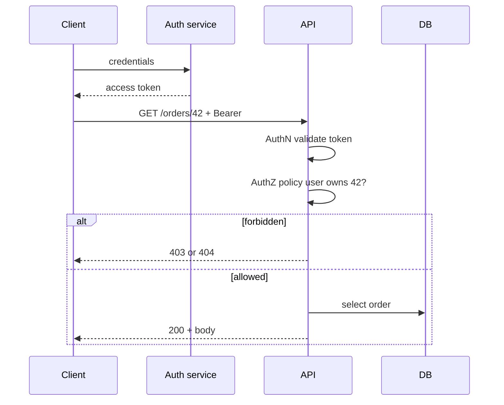

## Введение

M53–71 и M72–84: плотный middle-блок про веб-безопасность на уровне осознанности, HTTP-семантику, SQL чуть глубже junior и мобильную диагностику. Цель — связный рассказ на собесе, а не список терминов.

## Раздел: Auth, HTTP, OWASP, perf и sniffers

**Authentication vs authorization.** AuthN — «кто ты» (логин, SSO, токен, сертификат). AuthZ — «что тебе можно» (роли, scopes, ACL, политики). Баг «залогинен, но видит чужие заказы» — почти всегда authZ (IDOR), не «сломался пароль».

**Статус-коды (ориентиры для QA):**

| Код | Смысл для теста |
|-----|-----------------|
| 200/201/204 | успех / создано / пустое тело |
| 301/302/307 | редиректы — проверить Location и метод |
| 400 | клиентская ошибка валидации |
| 401 | не аутентифицирован |
| 403 | аутентифицирован, но запрещено |
| 404 | нет ресурса (или «скрыли» 403) |
| 409 | конфликт состояния |
| 429 | rate limit |
| 500/502/503 | сервер/шлюз/недоступность |

**Responsive.** Одна вёрстка под ширины viewport: breakpoints, touch targets, ориентация. Проверки: DevTools device mode + реальные телефоны; не путать с отдельным mobile-приложением.

**WebSocket.** Долгоживущее двустороннее соединение поверх HTTP upgrade. Тест: connect/auth, heartbeat, reconnect, порядок сообщений, нагрузка на число сокетов, поведение при обрыве сети. Инструменты: браузер, Postman, k6 ws, собственные клиенты.

**OWASP intro (для middle).** Знать Top risks как карту атак: injection, broken auth, XSS, CSRF, insecure design, misconfig, vulnerable components, integrity failures, logging/monitoring gaps, SSRF. Защиты на уровне QA: негативные кейсы ввода, проверка заголовков (`CSP`, `HttpOnly`, `SameSite`), роли, отсутствие секретов в URL/логах, обновление зависимостей. Детали Top и обороны — в QA21.

**Клиентские инструменты perf:** Lighthouse, WebPageTest, DevTools Performance/Network (waterfall, TTFB, LCP/CLS/INP). Это *фронтовые* метрики; серверный load — отдельно (k6/JMeter).

**Sniffers / прокси:** Charles, Fiddler, mitmproxy, Wireshark. Перехват HTTPS — с установкой MITM-сертификата (только на своих стендах). Смотрим утечки токенов, лишние PII, неожиданные third-party вызовы.

**GET / POST / PUT / PATCH.** GET — чтение, идемпотентен, без тела-эффектов (в идеале). POST — создание/действие, не идемпотентен. PUT — полная замена ресурса, идемпотентен. PATCH — частичное обновление. На тесте ловите «GET меняет баланс» и «повтор POST создаёт дубликаты».

## Раздел: SQL mid, GraphQL, OLTP/OLAP и mobile middle

**DROP vs TRUNCATE vs DELETE.** `DELETE` — построчно, с WHERE, триггеры, можно rollback в транзакции. `TRUNCATE` — быстрая очистка таблицы, сброс identity (зависит от СУБД), обычно DDL-семантика, осторожно с FK. `DROP` — уничтожает объект целиком. На проде/стейдже без бэкапа — катастрофа; в тестах используйте транзакции и фикстуры.

**GraphQL schema.** Типы, Query/Mutation/Subscription, аргументы, nullability. Тест: introspection (если открыта — риск), глубину запросов, N+1, авторизацию на поле, валидацию ошибок в `errors[]`, лимиты complexity. Схема — контракт, как OpenAPI для REST.

**OLTP vs OLAP.** OLTP — много коротких транзакций (заказы, оплаты). OLAP — аналитика, агрегаты, витрины. Для QA: разные SLA, индексы, допустимость блокировок; тяжёлый отчёт не должен валить checkout.

**Self join.** Таблица соединяется сама с собой (иерархия сотрудников, «товар похож на товар»). В тесте проверяйте корректность связей и отсутствие дублей от неверного JOIN.

**Cursor.** (1) UI/DB курсор пагинации; (2) серверный cursor в процедурах/результатах. Важно: стабильная сортировка, поведение при удалении строк «посередине», сравнение offset vs keyset pagination.

**Mobile middle:**

- **Manifest** (Android `AndroidManifest.xml` / iOS Info.plist): permissions, deep links, cleartext traffic, orientation — сверяйте с требованиями и threat model.
- **Traffic capture:** proxy на устройстве + cert; certificate pinning ломает MITM — нужен debug-build или Frida (только на тестовых билдах).
- **Local storage:** SharedPreferences/DataStore, Keychain/Keystore, SQLite/Room, файлы кэша — не хранить токены в plaintext.
- **Activity lifecycle (Android):** create/start/resume/pause/stop/destroy; тест поворот экрана, уход в фон, low memory kill, restore state.
- **TestFlight / внутренний deploy:** iOS TestFlight, Android Internal/Closed testing; версии build number, expiry TestFlight, чеклист «что в этом билде».
- **Deploy:** каналы, staged rollout, feature flags, откат; QA смотрит smoke после выкладки и мониторинг крэшей.

## Лаба

**Цель.** Сквозная проверка web API + SQL + «мобильный» чеклист на учебном приложении.

**Шаги.**
1. Для эндпоинта заказов распишите матрицу: без токена → 401; чужой id → 403/404; своя роль → 200.
2. В DevTools снимите waterfall логина; отметьте TTFB и самый тяжёлый ресурс.
3. Через mitmproxy/Charles (учебный стенд) найдите, уходит ли access-токен в query string.
4. Напишите SQL: self join «сотрудник → менеджер»; отдельно объясните, когда TRUNCATE опаснее DELETE.
5. Опишите GraphQL-запрос с 3 полями и негатив: запрос чужого `user { email }` без прав.
6. Mobile-чеклист из 10 пунктов: manifest permissions, lifecycle rotate, offline, storage, TestFlight/Internal build.

```python
# Pyodide-friendly: матрица ожидаемых кодов AuthN/AuthZ
cases = [
    ("no_token", "GET", "/orders/42", 401),
    ("other_user", "GET", "/orders/42", 403),  # или 404 по threat model
    ("owner", "GET", "/orders/42", 200),
    ("owner", "PATCH", "/orders/42", 200),
]
for who, method, path, expected in cases:
    print(f"{who:12} {method:6} {path} → expect {expected}")

sql_payloads = ["' OR '1'='1", "1; DROP TABLE users--", "x" * 80]
for payload in sql_payloads:
    # на стенде: requests.get(..., params={"q": payload}) — никогда в прод
    print("sql probe:", repr(payload)[:50])
```

**В группу:** почему 404 вместо 403 на чужом ресурсе иногда считают фичей безопасности?

**Готово, если…**
- [ ] AuthN/AuthZ разделены на примерах
- [ ] Знаете семантику GET/POST/PUT/PATCH и DROP/TRUNCATE
- [ ] Есть осмысленный mobile middle-чеклист

## Схема: AuthN → AuthZ → ресурс



## Тест

### Чем authentication отличается от authorization?

**Ответ:** authentication устанавливает личность; authorization проверяет права на действие/ресурс

**Пояснение:** можно пройти AuthN и получить 403 — это ожидаемо при недостаточных правах.

### Когда использовать PUT, а когда PATCH?

**Ответ:** PUT — полная замена ресурса; PATCH — частичное обновление полей

**Пояснение:** идемпотентность PUT важна для ретраев; PATCH тестируют на «незатронутые поля не обнулились».

### DROP vs TRUNCATE — что опаснее для схемы?

**Ответ:** DROP удаляет таблицу/объект целиком; TRUNCATE очищает данные, сохраняя структуру

**Пояснение:** оба разрушительны для данных; DROP ломает ещё и зависимости/код, ожидающий таблицу.

## Шпаргалка

<h3>HTTP и безопасность</h3>
<ul>
<li>401 = кто ты?; 403 = тебе нельзя</li>
<li>GET без сайд-эффектов; POST осторожен к дублям</li>
<li>OWASP Top — карта рисков, не чеклист «прогнали раз»</li>
</ul>
<h3>SQL / GraphQL</h3>
<ul>
<li>DELETE ≠ TRUNCATE ≠ DROP</li>
<li>OLTP — транзакции; OLAP — аналитика</li>
<li>GraphQL: схема + auth на поля + лимит глубины</li>
</ul>
<h3>Mobile</h3>
<pre><code>manifest permissions
proxy + cert (debug)
lifecycle: rotate / background
TestFlight / Internal testing
</code></pre>

## Anki

### Front: 401 vs 403

Back: 401 — не аутентифицирован; 403 — аутентифицирован, но нет прав

### Front: Зачем WebSocket тестировать reconnect?

Back: мобильные сети рвутся; без reconnect и идемпотентности сообщений теряются события

### Front: Self join — зачем?

Back: связать строки одной таблицы (иерархии, пары «похожих» сущностей)

## Итоги

- AuthN/AuthZ и коды ответа — база middle web
- OWASP и sniffers дают язык рисков до senior security-глубокого погружения
- SQL mid и GraphQL schema — про контракты данных, не только SELECT *
- Mobile middle: manifest, трафик, storage, lifecycle, каналы поставки

## Ссылки

- [QA-interview-250](https://github.com/Konstantine23/QA-interview-250)
- [OWASP Top 10](https://owasp.org/www-project-top-ten/)
- Learn | /game/learn
