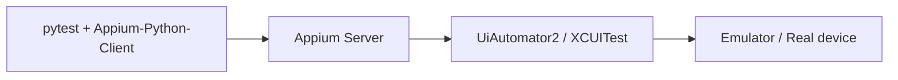

## Введение

Мобильный блок J109–118 и обзор M72–84: не «умею Appium на проде», а понимание платформ, сборок, логов, жестов и чем мобильный тест отличается от веба. Автоматизация — концепт Appium + пример Desired Capabilities; лаба — ручной чеклист + ADB.

## Раздел: Платформы, типы приложений, сборки

**Платформы.** Android (Google Play / APK/AAB, фрагментация устройств и API levels) и iOS (App Store / TestFlight, IPA, жёстче экосистема и подписи). На собесе уточняйте: real device vs emulator/simulator.

**Типы приложений:**

| Тип | Суть | Что тестировать особо |
|-----|------|------------------------|
| Native | UIKit/Swift / Kotlin/Java | Жесты, системные диалоги, permissions |
| Web | мобильный браузер | Viewport, touch, сеть |
| Hybrid | WebView внутри оболочки | Переключение native ↔ web context |
| Cross-platform | Flutter/RN и т.п. | Свои иерархии элементов, иногда другие инспекторы |

**APK / IPA.** APK — пакет Android; IPA — iOS-архив (нужна подпись/провижн). Для теста: debug vs release, flavor/стенд, deep links, версии OS.

**Отличия от web-QA:** прерывания (звонок, push), фон/убитый процесс, ориентация, offline, батарея/thermal throttling, permissions, магазинные политики, разные размеры экранов и notch.

## Раздел: ADB, логи, биометрия, Appium

**ADB (Android Debug Bridge).** Установка/удаление, логи, скриншоты, ввод текста, clear data.

```bash
adb devices
adb install -r app-debug.apk
adb logcat | grep -i "MyApp\|FATAL"
adb shell pm clear com.example.app
adb shell input tap 200 400
```

**Логи.** Android — logcat; iOS — Console / device logs через Xcode. В баг-репорт: модель, OS, версия приложения, шаги, скрин/видео, релевантный stacktrace, сеть (proxy).

**Биометрия.** Face ID / Touch ID / fingerprint: системные диалоги, fallback на PIN, отмена, негатив «не распознано». На эмуляторе — симуляция биометрии; на CI часто мок/флаг test-build. Проверяйте privacy prompts и повторный запрос permissions.

**Appium (концепт).** Клиент-сервер: ваши тесты (Python client) → Appium Server → UiAutomator2 / XCUITest → устройство. Локаторы: accessibility id, xpath, id; контексты `NATIVE_APP` / `WEBVIEW_...`.

```python
from appium import webdriver
from appium.options.android import UiAutomator2Options

options = UiAutomator2Options()
options.platform_name = "Android"
options.device_name = "Pixel_7"
options.app = "/path/to/app-debug.apk"
options.automation_name = "UiAutomator2"

driver = webdriver.Remote("http://127.0.0.1:4723", options=options)
driver.find_element("accessibility id", "login_button").click()
driver.quit()
```

**Middle-обзор (M72–84 идеи):** жесты (swipe/pinch), background/foreground, install/upgrade/reinstall, interrupt calls, battery saver, локаль/timezone, soft keyboard, notifications, deep link cold/warm start. Автоматизировать — после стабилизации ручного чеклиста критичных сценариев.

## Лаба

**Цель.** Прогнать мобильный smoke-чеклист на эмуляторе или реальном Android и собрать артефакты для баг-репорта.

**Шаги.**
1. Установите APK через `adb install`; зафиксируйте versionName/versionCode.
2. Пройдите: первый запуск (permissions) → логин → уход в background → возврат → logout.
3. Поверните экран на двух ключевых экранах; проверьте обрезку UI.
4. Включите авиарежим на запросе списка; оцените сообщение об ошибке и ретрай.
5. Снимите `adb logcat` вокруг краша/бага; приложите к черновику бага.
6. (Опционально) Поднимите Appium Inspector, найдите accessibility id кнопки входа.

**В группу:** что важнее на релизе — матрица 20 дешёвых Android или 3 топ-устройства + актуальный iPhone?

**Готово, если…**
- [ ] Называете разницу native / hybrid / web
- [ ] Умеете adb install + logcat
- [ ] Описываете биометрию: success / fail / fallback

## Схема: Appium-стек



## Тест

### Чем hybrid-приложение отличается от native для тестировщика?

**Ответ:** есть WebView и смена контекста; часть UI — DOM, часть — native-дерево

**Пояснение:** баги часто на границе: клавиатура, скролл, локаторы «пропали» после switch context.

### Зачем ADB тестировщику Android?

**Ответ:** ставить сборки, чистить данные, снимать логи и воспроизводить жесты/интенты без магазина

**Пояснение:** ускоряет цикл баг → фикс → проверка и даёт артефакты разработчику.

### Что такое accessibility id в Appium?

**Ответ:** стабильный локатор, завязанный на accessibility-метку элемента

**Пояснение:** предпочтительнее хрупкого XPath; требует договорённости с разработкой о test id.

## Шпаргалка

<h3>Типы</h3>
<ul>
<li>Native / Web / Hybrid / Cross-platform</li>
<li>APK (Android), IPA (iOS + подпись)</li>
</ul>
<h3>ADB</h3>
<pre><code>adb devices
adb install -r app.apk
adb logcat
adb shell pm clear &lt;package&gt;
</code></pre>
<h3>Appium</h3>
<ul>
<li>Client → Server → UiAutomator2/XCUITest → device</li>
<li>Capabilities: platform, device, app, automationName</li>
</ul>

## Anki

### Front: APK vs IPA?

Back: APK — пакет Android; IPA — пакет iOS, обычно требует подписи и провижна

### Front: Какие контексты бывают в hybrid Appium?

Back: NATIVE_APP и WEBVIEW_*; нужно переключаться для поиска элементов

### Front: Что проверить в биометрии кроме успешного входа?

Back: отказ/cancel, fallback PIN, повтор permissions, поведение при блокировке ОС

## Итоги

- Мобильный QA = платформа + тип приложения + прерывания и permissions, не только «те же кейсы что в вебе»
- ADB и логи — must-have junior Android
- Appium — WebDriver-подобная модель с mobile capabilities и жестами
- Чеклист smoke на устройстве важнее преждевременной автоматизации всех экранов

## Ссылки

- [QA-interview-250](https://github.com/Konstantine23/QA-interview-250)
- [Appium documentation](https://appium.io/docs/en/latest/)
- Learn | /game/learn/qa-pytest-ci-git
