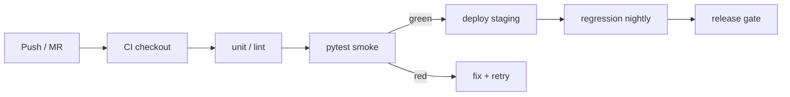

## Введение

Написать тест мало — его нужно запускать одинаково у всех и в пайплайне. J63–75 и M16: зачем runner, чем pytest отличается от TestNG/JUnit, как параллелить, что коммитить в Git и что должно быть в отчёте (Allure). Примеры — **pytest** + кратко про Java-раннеры.

## Раздел: Runners, pytest, assertions, parallel

**Зачем test runner.** Открывает discovery тестов, setup/teardown, ретраи, маркеры, отчёты, код возврата для CI. Без runner — «скрипт, который кто-то запускает руками».

**pytest (Python)** — discovery `test_*.py`, фикстуры вместо классического класса-setup, плагины, простой assert с интроспекцией.

**TestNG / JUnit (Java, кратко).** JUnit 5 — стандарт unit; TestNG — удобные suite/groups/dependencies, часто в Selenium-Java проектах. На собесе: «у нас Python → pytest; в Java-мире чаще JUnit5 или TestNG».

```python
import pytest
import requests


@pytest.fixture
def api_base() -> str:
    return "https://httpbin.org"


def test_status_ok(api_base: str) -> None:
    response = requests.get(f"{api_base}/status/200", timeout=10)
    assert response.status_code == 200


@pytest.mark.parametrize("code", [200, 201, 204])
def test_accepts_codes(api_base: str, code: int) -> None:
    assert requests.get(f"{api_base}/status/{code}", timeout=10).status_code == code
```

**Assertions.** В pytest — обычный `assert`; для коллекций — `pytest.approx`, сравнение наборов. В UI — assert текста/URL через page. Мягкие assert (несколько проверок подряд) — плагины или ручной сбор ошибок; не путайте с «проглотили exception».

**Параллель.** `pytest-xdist` (`-n auto`): изолированные процессы. Правила: нет shared WebDriver, уникальные тестовые данные, независимый порядок. На Grid — каждая сессия свой браузер.

```bash
pytest -n 4 -m smoke --alluredir=allure-results
```

## Раздел: Git, CI, Allure, CI/CD sequence

**Git для QA.** `clone` → ветка `feature/qa-...` → `add` / `commit` / `push` → Merge Request. Смотрите `diff`, не коммитьте секреты, `__pycache__`, локальные отчёты. Конфликты в локаторах — норма; решайте с автором UI.

Минимум команд: `status`, `diff`, `branch`, `checkout -b`, `pull`, `log`, `stash` (временно убрать локальные правки).

**CI integration.** Job: checkout → Python + deps → сервисы (БД/mock) → `pytest` → публикация отчёта → артефакты скриншотов при fail. Падение тестов валит пайплайн (или отдельный quality-gate nightly).

**Что в Allure / отчёте ждут (M16):**

- название и статус кейса, время
- шаги (steps), параметры
- вложения: скриншот, page source, request/response
- история flaky, категории ошибок, environment (браузер, стенд, commit SHA)

**CI/CD sequence overview.** Commit → CI build → unit → API/UI smoke → deploy to staging → regression → (manual/explore) → prod + мониторинг. Автотесты — ворота, не замена релизного решения.

```yaml
# .gitlab-ci.yml (фрагмент-идея)
test_smoke:
  image: python:3.12
  script:
    - pip install -r requirements.txt
    - pytest -m smoke --alluredir=allure-results
  artifacts:
    when: always
    paths: [allure-results, screenshots]
```

## Лаба

**Цель.** Репозиторий с pytest, маркерами smoke/regression, xdist на API-тестах и выгрузкой Allure-результатов.

**Шаги.**
1. `conftest.py` с фикстурой session-scoped `base_url` из env.
2. Два модуля: `test_api_health.py`, `test_api_crud.py`; пометьте `@pytest.mark.smoke` критичное.
3. Запустите `pytest -m smoke` и полный suite; сравните время с `pytest -n 2`.
4. Добавьте allure step/attach на fail (текст response body).
5. Опишите в README job CI: какие стадии, что артефакты, кого пинговать при красном smoke.

**В группу:** когда красный UI-регресс не должен блокировать merge библиотечного hotfix?

**Готово, если…**
- [ ] Объясняете роль runner одной фразой
- [ ] Параллель без шаринга состояния
- [ ] Называете 5 артефактов хорошего отчёта

## Схема: CI с автотестами



## Тест

### Зачем нужен test runner, если можно вызвать python file.py?

**Ответ:** discovery, фикстуры, маркеры, отчёты и exit code для CI

**Пояснение:** единый способ запуска у разработчика и пайплайна; иначе «у меня работало» без стандарта.

### Чем pytest assert удобнее assertEquals из старых фреймворков?

**Ответ:** обычный Python assert + детальный diff при падении

**Пояснение:** меньше API для заучивания; интроспекция показывает значения выражений.

### Что обязательно приложить к упавшему UI-тесту в Allure?

**Ответ:** скриншот, URL/environment, шаги до падения; желательно HTML/source и логи

**Пояснение:** без вложений отчёт — список красных имён, а не инструмент разбора.

## Шпаргалка

<h3>pytest</h3>
<pre><code>pytest -m smoke -n auto --alluredir=allure-results
@pytest.fixture / @pytest.mark.parametrize
assert response.status_code == 200
</code></pre>
<h3>Git</h3>
<ul>
<li>branch → commit → push → MR</li>
<li>не коммитить .env, отчёты, драйверы</li>
</ul>
<h3>CI/CD</h3>
<ul>
<li>smoke на MR; полный регресс на nightly/релизе</li>
<li>артефакты: allure-results, screenshots, logs</li>
</ul>

## Anki

### Front: Зачем pytest-xdist?

Back: параллельный прогон в нескольких процессах; нужна изоляция данных и драйверов

### Front: pytest vs TestNG одной фразой

Back: pytest — экосистема Python; TestNG — популярный runner в Java Selenium-проектах с suites/groups

### Front: Где в CI/CD стоят smoke-автотесты?

Back: после сборки/unit, до или сразу после выкладки на staging — как quality gate

## Итоги

- Runner = стандарт запуска и контракт с CI
- pytest закрывает junior Python AQA; JUnit/TestNG — для Java-вакансий
- Параллель ускоряет, но требует изоляции
- Git + Allure превращают «красные тесты» в воспроизводимый сигнал для команды

## Ссылки

- [QA-interview-250](https://github.com/Konstantine23/QA-interview-250)
- [pytest documentation](https://docs.pytest.org/)
- Learn | /game/learn/qa-selenium-webdriver
