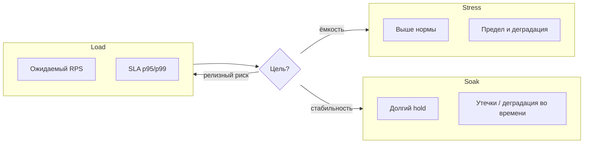

## Введение

S26, S28–29: senior-уровень безопасности и перформанса. Не «слышали про XSS», а как защищаться и как доказывать устойчивость под нагрузкой и на сокетах — руками и в автоматизации.

## Раздел: OWASP Top и линии защиты

Ориентир — актуальный [OWASP Top 10](https://owasp.org/www-project-top-ten/). Ниже — рабочие формулировки «риск → как ловим → как закрывают».

| Риск (обобщённо) | Как тестировать | Защита / контроль |
|------------------|-----------------|-------------------|
| Injection (SQLi, cmd) | спецсимволы, OR 1=1, параметризация в коде | prepared statements, ORM, валидация, least privilege БД |
| Broken auth | credential stuffing, session fixation, слабый reset | MFA, lockout, secure cookies, short-lived tokens |
| Broken access (IDOR) | смена id/ролей, горизонтальный доступ | authZ на объект, ACL, тесты матрицы ролей |
| XSS | script в полях, DOM sinks | encoding, CSP, HttpOnly где уместно |
| CSRF | поддельный запрос со сторонней формы | SameSite, CSRF-token, не менять state через GET |
| Security misconfig | default creds, open S3, stack traces | hardening, секреты вне образа, security headers |
| Vulnerable components | SCA (Dependabot, Trivy) | патч-процесс, SBOM |
| Integrity / CI supply chain | подмена артефакта | подписи, pinned deps, protected branches |
| Logging & monitoring gaps | атака без следа | аудит authZ fail, алерты |
| SSRF | URL на metadata/internal | allowlist, block link-local |

**Практика senior QA:** threat model на фичу; негативные наборы в API-сьютах; периодические сканы (DAST) на стейдже; bug bounty / pen-test не заменяют встроенные проверки. Никогда не гоняйте деструктивные сканы на прод без явного разрешения.

**Минимальный security-чеклист релиза:** нет секретов в клиенте; HTTPS везде; cookies флаги; IDOR-кейсы на критических сущностях; зависимость без известных Critical; логин/bruteforce политика.

## Раздел: Сокеты и stress: когда, чем, как проектировать

**Сокеты (WebSocket / TCP raw) — ручное тестирование.**

- Установка соединения, handshake, заголовки auth.
- Подписка/комнаты: видит ли чужие события.
- Heartbeat / ping-pong, idle timeout.
- Обрыв сети, reconnect, дубликаты сообщений.
- Порядок и потеря пакетов (симулировать throttle в прокси).
- Нагрузка числом соединений с одного клиента.
- Закрытие: коды close, утечки на сервере (дескрипторы).

Инструменты руками: браузер DevTools, `wscat`, Postman WS, mitmproxy.

**Автоматизация сокетов.** Клиенты на Python (`websockets`, `socket`), k6 `ws`, Gatling. В pytest: фикстура соединения, assert на JSON-события, таймауты, негатив «без токена». Для TCP-протоколов — свои фреймы; фиксируйте байтовый контракт в фикстурах. Флаки лечат идемпотентными id сообщений и ожиданием по event, не по sleep.

```python
import asyncio
import json
import websockets

async def test_ws_echo_auth(token: str, url: str) -> None:
    headers = {"Authorization": f"Bearer {token}"}
    async with websockets.connect(url, additional_headers=headers) as ws:
        await ws.send(json.dumps({"type": "ping"}))
        raw = await asyncio.wait_for(ws.recv(), timeout=5)
        payload = json.loads(raw)
        assert payload.get("type") == "pong"
```

**Когда нужен stress.** Узнать предел и характер деградации (латентность, ошибки, recovery), проверить автоскейл/circuit breaker, подготовиться к пику (релиз, маркетинг). Не путать со load (ожидаемая нагрузка) и soak (длительная утечка). Stress — контролируемый выход за норму на *тестовом* контуре с мониторингом и stop-условием.

**Выбор инструмента.**

| Инструмент | Сильные стороны |
|------------|-----------------|
| k6 | скрипты JS, CI-friendly, WS |
| JMeter | GUI, много протоколов, плагины |
| Gatling | код, высокая производительность |
| Locust | Python, гибкая логика пользователей |
| облака | масштаб агентов без своего железа |

Критерии: протокол (HTTP/gRPC/WS), язык команды, отчёты, стоимость агентов.

**Дизайн stress-сценария.**

1. Цель и гипотеза («при 5× RPS p99 < 2с или включается degrade mode»).
2. Критические user journeys с весами.

3. Модель: ramp → hold → spike → cool-down.
4. Данные: прогретые кэши vs cold start — оба прогона.
5. Наблюдаемость: RPS, error %, latency, CPU/RAM, DB locks, queue depth.
6. Abort criteria (error storm, диск full).
7. Отчёт: узкое место и рекомендация, не только график.

## Лаба

**Цель.** Security+perf пакет для API чата с WebSocket.

**Шаги.**
1. Threat model: 5 активов, 5 угроз, 5 тестов.
2. Набор из 8 негативных HTTP-кейсов по OWASP (IDOR, XSS в профиле, SQLi в search…).
3. Ручной протокол проверки WS: connect → auth fail → auth ok → message → kill network → reconnect.
4. Черновик k6/Locust: ramp 0→N, hold 10 мин, spike 2× на 2 мин.
5. Abort criteria и список метрик дашборда.
6. Короткий отчёт-шаблон: hypothesis / result / bottleneck / next step.

```python
# Модель ramp → hold → spike (условные RPS по секундам)
def ramp_profile(duration_s: int, target_rps: int) -> list[int]:
    return [int(target_rps * (i + 1) / duration_s) for i in range(duration_s)]

ramp = ramp_profile(10, 50)
hold = [50] * 10
spike = [100] * 5
cool = list(reversed(ramp_profile(5, 50)))
profile = ramp + hold + spike + cool
print("points:", len(profile), "peak:", max(profile), "avg:", sum(profile) // len(profile))

xss_probes = ["<script>alert(1)</script>", '">', "{{7*7}}"]
for probe in xss_probes:
    print("xss probe len:", len(probe), "sample:", probe[:24])
```

**В группу:** заказчик просит «stress на прод ночью» — ваш ответ и альтернатива?

**Готово, если…**
- [ ] OWASP риски связаны с конкретными тестами и защитами
- [ ] WS покрыты ручным чеклистом и ideей авто
- [ ] Stress-план с гипотезой и abort, не «жмём до падения»

## Схема: Load vs stress vs soak



## Тест

### Чем broken authentication отличается от broken access control?

**Ответ:** auth — дыры в проверке личности/сессии; access control — дыры в правах на объекты после входа

**Пояснение:** украсть сессию и открыть чужой `/orders/{id}` — разные классы; оба в OWASP, разные тесты.

### Когда оправдан stress, а не обычный load?

**Ответ:** когда нужно понять предел системы и поведение за пределами SLA, а не подтвердить целевую нагрузку

**Пояснение:** load проверяет норму; stress исследует край и recovery на безопасном контуре.

### Что обязательно в автотесте WebSocket кроме happy-path?

**Ответ:** отказ в auth, таймауты, корректный close/reconnect и проверка, что нет утечки чужих событий

**Пояснение:** сокеты живут долго — ошибки состояния и авторизации комнат критичнее одноразового echo.

## Шпаргалка

<h3>OWASP</h3>
<ul>
<li>Injection → параметризация; IDOR → object-level authZ</li>
<li>XSS → encode + CSP; CSRF → SameSite + token</li>
<li>Misconfig / deps → hardening + SCA</li>
</ul>
<h3>Sockets</h3>
<ul>
<li>Auth handshake, rooms, heartbeat, reconnect</li>
<li>Авто: assert по событиям, не sleep</li>
</ul>
<h3>Stress</h3>
<pre><code>hypothesis → ramp/spike → metrics → abort → bottleneck report
load ≠ stress ≠ soak
</code></pre>

## Anki

### Front: Назовите 4 пункта защиты от XSS

Back: output encoding, CSP, валидация ввода, отказ от опасного innerHTML/eval

### Front: Abort criteria в stress — зачем?

Back: остановить прогон до разрушения стенда и сохранить интерпретируемые данные

### Front: SSRF — что проверяет QA?

Back: что сервер не ходит по произвольным URL на internal/metadata по вводу пользователя

## Итоги

- OWASP Top — карта рисков с тестами и контролями, не заучивание названий
- Сокеты требуют сценариев состояния, auth и восстановления сети
- Stress проектируют вокруг гипотезы, метрик и abort criteria
- Senior связывает security и perf с мониторингом и безопасным контуром

## Ссылки

- [QA-interview-250](https://github.com/Konstantine23/QA-interview-250)
- [OWASP Top 10](https://owasp.org/www-project-top-ten/)
- Learn | /game/learn
