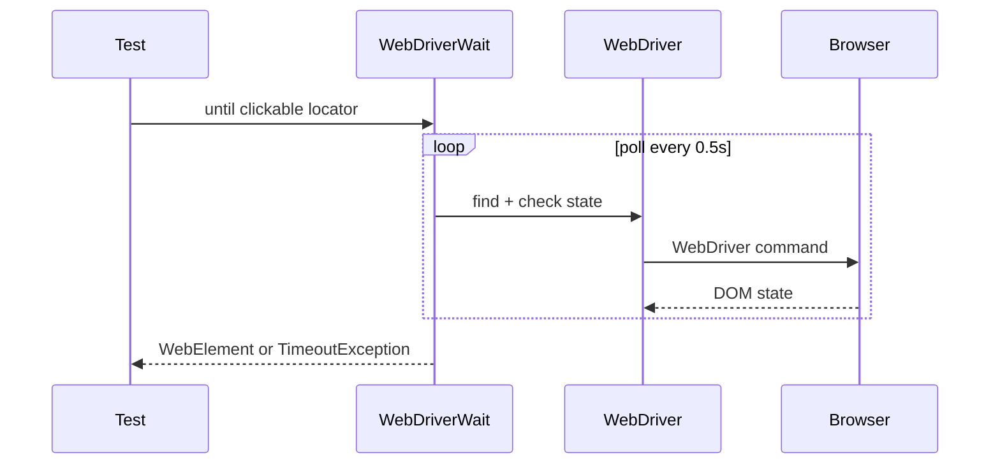

## Введение

Selenium WebDriver — классика UI-автоматизации и блок J46–62 / M35–38, M41–42. На собесе ждут: чем драйвер отличается от IDE, какие локаторы стабильнее, почему `time.sleep` — запах, что такое Grid и как кликнуть в iframe. Ниже — ответы и код на **Python Selenium 4**.

## Раздел: Драйверы, локаторы, waits, исключения

**WebDriver** — API управления браузером через протокол (W3C WebDriver). **Драйвер** (chromedriver и т.п.) — бинарник-мост; в Selenium 4 часто `Selenium Manager` подтягивает его сам. **Selenium IDE** — запись/playback, не замена фреймворку.

**Локаторы (от более хрупких к устойчивым по смыслу):** id → name → CSS → XPath. Избегайте абсолютного XPath и индексов `tr[3]`. Предпочитайте data-testid, если фронт даёт.

```python
from selenium.webdriver.common.by import By
from selenium.webdriver.support.ui import WebDriverWait
from selenium.webdriver.support import expected_conditions as EC

driver.find_element(By.CSS_SELECTOR, "[data-testid=login]")
driver.find_elements(By.XPATH, "//table[@id='orders']//tr")
```

**Waits.** Implicit — глобальный timeout на find (смешивать с explicit опасно). Explicit — `WebDriverWait` + `expected_conditions`. Fluent — polling с ignored exceptions. **Никогда** не заменяйте стабильный wait слепым `sleep`, кроме отладки.

```python
wait = WebDriverWait(driver, 10)
btn = wait.until(EC.element_to_be_clickable((By.ID, "submit")))
btn.click()
```

**Типичные исключения:** `NoSuchElementException`, `TimeoutException`, `StaleElementReferenceException` (DOM перерисовался — перенайдите элемент), `ElementClickInterceptedException`, `NoSuchFrameException`, `UnhandledAlertException`.

**JavaScriptExecutor** — когда нативный клик не проходит (оверлей) или нужно читать/писать storage:

```python
driver.execute_script("arguments[0].scrollIntoView(true);", el)
driver.execute_script("arguments[0].click();", el)
value = driver.execute_script("return localStorage.getItem('token');")
```

## Раздел: Actions, таблицы, frames, cookies, Grid, capabilities

**Actions (ActionChains):** hover, drag-and-drop, chord клавиш.

```python
from selenium.webdriver.common.action_chains import ActionChains
from selenium.webdriver.common.keys import Keys

ActionChains(driver).move_to_element(menu).pause(0.2).click(item).perform()
ActionChains(driver).key_down(Keys.CONTROL).send_keys("a").key_up(Keys.CONTROL).perform()
```

**Таблицы.** Найти строку по тексту ячейки, кликнуть кнопку в той же `tr` — через XPath `ancestor::tr` или обход `find_elements`.

**Frames / iframes.** `driver.switch_to.frame(el_or_index_or_name)` → работа → `switch_to.default_content()`. Вложенные — по цепочке. **Windows/tabs:** `window_handles`, `switch_to.window`.

**Cookies / storage.** `add_cookie` / `get_cookies` после открытия домена; для localStorage/sessionStorage — JSExecutor. Полезно для «залогиненного» состояния без UI-логина (осторожно с CSRF/expiry).

**Capabilities / Options.** `ChromeOptions`: headless, window-size, prefs загрузок, disable-gpu, args `--incognito`. В Selenium 4 — W3C capabilities через Options, не устаревший DesiredCapabilities как основной путь.

**Selenium Grid.** Hub/Router раздаёт сессии Node'ам: параллель, разные ОС/браузеры. Локально: Remote WebDriver на URL Grid.

```python
from selenium import webdriver
from selenium.webdriver.chrome.options import Options

options = Options()
options.add_argument("--headless=new")
driver = webdriver.Remote(
    command_executor="http://localhost:4444/wd/hub",
    options=options,
)
```

**Когда UI-автоматизация уместна (M):** критичные user journeys, регрессия после релиза, кроссбраузер smoke. Не автоматизировать всё подряд: нестабильный UI, одноразовые проверки, чисто визуальные мелочи без контракта.

## Лаба

**Цель.** Стабильный сценарий: логин → таблица заказов → фильтр → assert строки; плюс работа с iframe и cookie.

**Шаги.**
1. Explicit wait до кликабельности кнопки входа; запретите `time.sleep` в финальном коде.
2. Переключитесь в iframe help-виджета, прочитайте заголовок, вернитесь в default_content.
3. Сохраните session cookie после логина, перезапустите браузер, подставьте cookie, откройте /orders без формы логина.
4. Наведите меню Actions → откройте пункт; обработайте `StaleElementReferenceException` повторным поиском.
5. (Опционально) Поднимите Selenium Grid в Docker и прогоните тот же тест через `Remote`.

**В группу:** почему смесь implicit 10s + explicit 10s даёт «странные» таймауты?

**Готово, если…**
- [ ] Нет sleep в коммите
- [ ] Умеете объяснить stale element
- [ ] Показываете switch_to.frame и cookie inject

## Схема: Explicit wait



## Тест

### Чем explicit wait лучше time.sleep(5)?

**Ответ:** ждёт условие до N секунд и идёт дальше сразу; sleep всегда блокирует фиксированно

**Пояснение:** sleep замедляет suite и всё равно флакает на медленных стендах; EC привязан к готовности UI.

### Что делать со StaleElementReferenceException?

**Ответ:** заново найти элемент в DOM и повторить действие; не хранить WebElement через перерисовку

**Пояснение:** ссылка на узел протухла после AJAX/React reconcile — Page Object метод должен искать элемент в момент действия.

### Зачем Selenium Grid?

**Ответ:** параллельный прогон и/или матрица браузеров/ОС на удалённых node

**Пояснение:** экономит время CI и ловит кроссбраузерные дефекты; локальный Chrome не заменяет матрицу.

## Шпаргалка

<h3>Локаторы</h3>
<ul>
<li>By.ID / NAME / CSS_SELECTOR / XPATH</li>
<li>data-testid &gt; хрупкий абсолютный XPath</li>
</ul>
<h3>Wait</h3>
<pre><code>WebDriverWait(driver, 10).until(
    EC.element_to_be_clickable((By.ID, "go"))
)
</code></pre>
<h3>Frames / cookies</h3>
<pre><code>driver.switch_to.frame(frame_el)
driver.switch_to.default_content()
driver.add_cookie({"name": "session", "value": "..."})
</code></pre>
<h3>Исключения</h3>
<ul>
<li>Timeout / NoSuchElement / Stale / ClickIntercepted / NoSuchFrame</li>
</ul>

## Anki

### Front: Implicit vs explicit wait?

Back: implicit — глобально на find; explicit — ждать конкретное условие через WebDriverWait

### Front: Как работать с iframe в Selenium?

Back: switch_to.frame(...), затем switch_to.default_content()

### Front: Как выполнить JS в контексте страницы?

Back: driver.execute_script("...", element) — JSExecutor

## Итоги

- Стабильность UI-тестов = правильные локаторы + explicit waits, не sleep
- Frames, alerts, windows и cookies — обязательный junior/middle блок
- Actions и JSExecutor — инструменты обхода, не замена нормальным кликам
- Grid и capabilities выводят прогон за пределы «у меня на ноутбуке зелёный»

## Ссылки

- [QA-interview-250](https://github.com/Konstantine23/QA-interview-250)
- [Selenium Python documentation](https://www.selenium.dev/documentation/webdriver/)
- Learn | /game/learn/qa-aqa-principles
