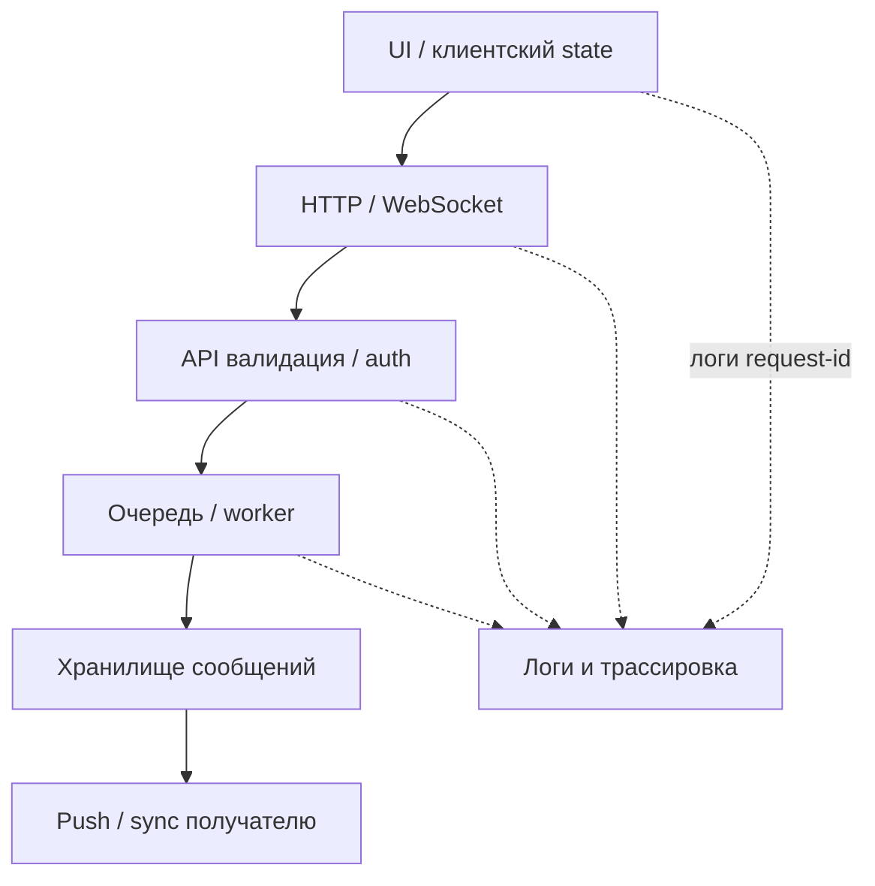

## Введение

S30, S34–38, M88–90, M98–100, M102–103: собес любит «разберите ситуацию». Ниже — оригинальные разборы с порядком действий, которые звучат как опыт lead/senior, а не список теорий.

## Раздел: Негативы API, отладка логики, HTTP-ловушки

**Негативный POST создания пользователя.** Проверяйте системно, не одним «пустым телом»:

- обязательные поля отсутствуют / `null` / `""`
- типы: строка вместо числа, слишком длинный email
- дубликат уникального поля → 409/400 по контракту
- XSS/SQL в имени (если политика безопасности)
- без токена → 401; с ролью без права → 403
- лишние поля (mass assignment: `role=admin`)
- unicode, пробелы, email в разном регистре
- идемпотентность: повтор того же запроса
- Content-Type неверный; огромный payload
- ожидание: стабильный код + схема ошибки, без стека и утечки PII

**Отладка «1+1=3».** Симптом: расчёт/сумма неверны. Порядок:

1. Зафиксировать вход, окружение, точный actual.
2. Воспроизвести минимальным кейсом; отделить UI от API от БД.
3. Проверить округление, типы (float vs decimal), таймзоны, валюты.
4. Гонки: два параллельных обновления баланса.
5. Кэш / read replica lag.
6. Неверный JOIN или двойной подсчёт в отчёте.
7. Логи и трейс одного `request-id`.
8. Гипотеза → эксперимент → фикс/баг с доказательствами.

На собесе важно показать *метод*, а не угадать «виноват float».

**Архитектурные HTTP-вопросы.**

- **Auth на GET?** Да, если ресурс не публичный: токен/cookie нужны и для чтения. «GET безопасный» ≠ «GET публичный».
- **401 vs 500.** 401 — клиент не аутентифицирован (или токен протух). 500 — сервер упал; для клиента это не «попробуй залогиниться», а инцидент. Путать их — ломать клиентов и мониторинг.
- **SSL/TLS.** Шифрование канала; проверяйте сертификат, смешанный контент, редирект HTTP→HTTPS, HSTS на проде. QA: expired cert на стейдже ломает автотесты — это тоже сигнал процесса.

## Раздел: Без бэкенда, мёртвый логин, регресс за 2 дня, мессенджер, кроссбраузер

**Проверка формы и БД без доступа к бэкенд-коду.** Есть UI и БД (или только API+БД): создать запись через UI → SELECT по уникальному ключу; проверить тримминг, кодировку, default-значения, мягкое удаление; негатив UI и отсутствие строки; транзакционность (обрыв сети посередине). Контракт поля: маска телефона на UI vs как лежит в БД.

**Кнопка «Войти» ничего не делает.** Чеклист:

1. Консоль браузера: JS exceptions.
2. Network: уходит ли запрос; CORS; 4xx/5xx.
3. Disabled из-за валидации (пустые поля, невидимая ошибка).
4. Перекрытие элемента (z-index, cookie-banner).
5. Неверный type кнопки / preventDefault.
6. Adblock / privacy extension.
7. Staging feature flag / wrong environment.
8. Воспроизведение в чистом профиле.

**Регресс 1000 кейсов за 2 дня.** Невозможно качественно вручную. Стратегия:

- риск-сегментация: money, auth, core journeys first;
- автоматический smoke/API уже в CI — опереться на него;
- выкинуть устаревшие и дубли;
- исследовательские сессии по зонам изменений (diff/релиз-ноты);
- парный прогон критичного;
- явный out-of-scope с подписью PO;
- после релиза — мониторинг и hotfix-окно.

**Мессенджер: сообщение не отправилось.** Слои: UI optimistic update → API/WS → очередь → доставка → статус «доставлено». Проверки: сеть, токен, размер вложения, rate limit, состояние сокета, серверные логи по message id, поведение при офлайне, дубликаты при retry. Сравнить отправителя и получателя (fan-out).

**Кроссбраузер при нехватке времени.** Матрица по аналитике: топ браузеров/ОС клиентов. Обязательно: последний Chrome + Safari iOS (часто болевой) + один Firefox/Edge. Остальное — на критических визуальных страницах или canary. Используйте Playwright multi-project точечно; не обещайте «все версии IE».

## Лаба

**Цель.** Пройти drill как на собесе: таймер и артефакты.

**Шаги.**
1. За 15 минут составьте чеклист негативного POST `/users` (≥12 пунктов) и ожидаемые коды.
2. Напишите план отладки «сумма заказа = 3 при товарах 1+1» из 8 шагов.
3. Таблица: ситуация → 401 или 500 (5 примеров).
4. Сценарий проверки регистрации при доступе только к UI и SQL.
5. Для «1000 кейсов / 2 дня» — one-pager для PO: in/out/risk.
6. Матрица кроссбраузера на 1 спринт при 8 часах бюджета.

```python
# Негативы POST /users → ожидаемый код
negatives = [
    ({}, 400),
    ({"email": "bad", "password": "x"}, 400),
    ({"email": "a@b.c", "password": "ok", "role": "admin"}, 400),  # mass assignment
    ({"email": "a@b.c", "password": "ok"}, 201),
]
for body, code in negatives:
    print(f"body={body!s:55} → {code}")

# 1+1=3: гипотезы слоёв
layers = ["UI state", "promo calc", "API total", "DB line items", "rounding"]
for idx, layer in enumerate(layers, start=1):
    print(f"{idx}. check {layer}")
```

**В группу:** автотесты зелёные, кнопка логина мёртвая у половины пользователей — какие дыры в пирамиде?

**Готово, если…**
- [ ] Негативы API системные, не случайные
- [ ] Отладка гипотезами, не гаданием
- [ ] Регресс под давлением — risk-based с residual risk

## Схема: Слои отладки «не отправилось»



## Тест

### Почему GET защищённого ресурса всё равно требует auth?

**Ответ:** чтение чужих данных — тоже нарушение конфиденциальности; идемпотентность метода не означает публичность

**Пояснение:** authorization проверяется на любом методе, включая GET/HEAD.

### Что делать с регрессом из 1000 кейсов за 2 дня?

**Ответ:** приоритизировать по риску и изменениям, опереться на авто-smoke, согласовать out-of-scope с PO

**Пояснение:** обещание «прогоним всё руками» создаёт ложную уверенность и выгорание.

### С чего начать, если кнопка логина не реагирует?

**Ответ:** консоль JS и вкладка Network — понять, есть ли ошибка скрипта или запрос/ответ

**Пояснение:** дальше валидация, перекрытия, окружение; без Network легко лечить не ту причину.

## Шпаргалка

<h3>API негатив</h3>
<ul>
<li>поля, типы, дубли, authZ, mass assignment, payload size</li>
<li>стабильная схема ошибок без утечек</li>
</ul>
<h3>HTTP</h3>
<ul>
<li>401 ≠ 500; GET может требовать auth</li>
<li>TLS: cert, redirect, mixed content</li>
</ul>
<h3>Давление по срокам</h3>
<pre><code>risk → smoke/API → exploratory на diff
explicit residual risk + мониторинг после релиза
</code></pre>

## Anki

### Front: Mass assignment в POST /users — что проверить?

Back: нельзя выставить привилегированные поля (role=admin) через тело запроса

### Front: 401 vs 500 для клиента логина

Back: 401 — повторить аутентификацию; 500 — серверная ошибка, нужен инцидент/ретраи с осторожностью

### Front: Кроссбраузер при малом бюджете

Back: топ по аналитике + мобильный Safari + точечно остальное на критических экранах

## Итоги

- Практические кейсы решаются методом слоёв и доказательств
- HTTP-семантика и негативы API — частый фильтр senior
- Под давлением сроков работает risk-based прозрачность, не героизм
- Мессенджеры и формы требуют трассировки end-to-end, не только клика UI

## Ссылки

- [QA-interview-250](https://github.com/Konstantine23/QA-interview-250)
- Learn | /game/learn
