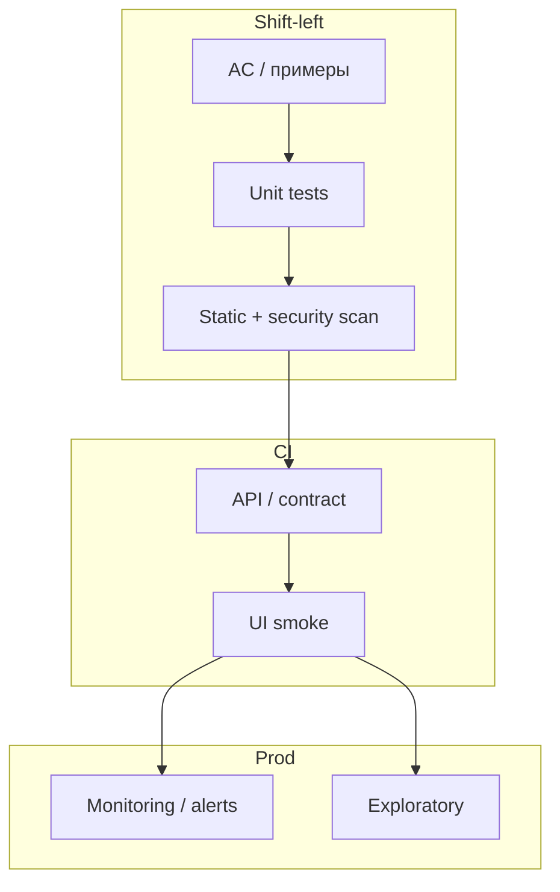

## Введение

S19–25, S27 и M34: senior ждут стратегию автоматизации, а не список фреймворков. Как не копить регресс, что даёт shift-left, зачем unit-уровень, где ROI отрицательный, и когда BDD помогает или мешает.

## Раздел: Регресс, shift-left, unit и цена «всё автоматизировать»

**Как избегать дефектов регрессии.**

- Держать быстрый сигнал на критическом пути (unit + API smoke в CI).
- Контрактные тесты на границах сервисов.
- Feature flags и постепенный rollout.
- Регресс по риску, не «все 5000 кейсов руками».
- Стабильные тестовые данные и идемпотентные сценарии.
- Definition of Done с обязательными автопроверками.
- Ревью диффов с чеклистом impact (схема БД, auth, деньги).
- Мониторинг и алерты как продолжение теста на проде.

**Shift-left.** Сдвиг проверок и качества *раньше*: уточнение AC на refinement, тест-дизайн до кодирования, TDD/unit, статическая аналитика, контракты, security в пайплайне, парное тестирование с dev. Не «QA пишет кейсы за спринт до релиза», а «дефекты дешевле, потому что найдены у истока».

**Смысл unit-тестов.** Фиксируют поведение единиц (функции/классы) быстро и локально; дают рефакторинг без страха; ловят логические ошибки до интеграции. Для QA/AQA: понимать пирамиду — unit не заменяет бизнес-E2E, но без них UI-автотест становится дорогим «unit на стероидах».

**Минусы полной автоматизации всего.**

- Высокая стоимость поддержки UI и флаки.
- Ложное чувство безопасности («зелёный пайплайн»).
- Плохо автоматизируется UX, usability, exploratory, часть accessibility.
- Медленный feedback, если всё тащить в E2E.
- ROI отрицательный на редко меняющихся низкорисковых экранах.
- Нужны инженеры, среды, данные — не «магия кнопки Record».

Автоматизируйте стабильное, часто гоняемое, высокорисковое и хорошо специфицированное. Остальное — ручной/исследовательский фокус.

## Раздел: ROI, CI/CD, BDD и дизайн стратегии

**ROI автоматизации (упрощённо).**  
Выгода ≈ (ручные часы на прогон × частота × горизонт) + ценность раньше найденных багов − (стоимость написания + поддержки + инфраструктуры + флакотушения). Считайте в сценариях: «логин гоняем 20 раз/день» vs «отчёт раз в квартал». Показывайте стейкхолдерам payback period, не только «% automation».

**CI/CD: плюсы.** Быстрый feedback, воспроизводимые сборки, гейты качества, меньше «у меня работает», частые безопасные поставки, артефакты и трассы падений.

**CI/CD: минусы/риски.** Флаки блокируют main; долгие пайплайны → обход гейтов; секреты в CI; «деплой зелёный, прод красный» без мониторинга; культура «почините тест, а не продукт». Senior чинит сигнал (карантин, ретраи с лимитом, владельцы suites).

**BDD — когда да.** Общий язык Given/When/Then полезен, если бизнес реально читает и уточняет сценарии; сложный домен; нужна живая документация поведения. Лучше начинать с API/доменного слоя, где шаги стабильны.

**BDD — когда нет.** Команда пишет «BDD» как обёртку над UI-селекторами; сценарии пишет только QA; фичи меняются каждый день; нет фасилитации с PO. Тогда Cucumber становится дорогим дублем page objects.

**BDD UI vs API.** UI-BDD хрупкий (локаторы, анимации). API/domain-BDD стабильнее и быстрее — предпочтительнее для контракта поведения. UI оставьте тонким слоем smoke поверх.

**Дизайн automation strategy.**

1. Цели (скорость релиза, снижение leakage, поддержка рефакторинга).
2. Пирамида: unit (dev) → API/contract (AQA+dev) → UI smoke.
3. Критерии отбора кейсов в авто.
4. Стек = язык команды + CI + отчёты.
5. Владельцы, SLA на починку красных тестов.
6. Среды и данные.
7. Метрики: время пайплайна, flaky %, escaped defects на покрытых зонах.
8. Roadmap 1–2 квартала, не «автоматизируем всё».

## Лаба

**Цель.** Стратегия автоматизации модуля «корзина + оплата» на квартал.

**Шаги.**
1. Список из 10 регрессионных проверок; отметьте unit / API / UI / manual.
2. Посчитайте грубый ROI для 3 API-тестов (частота прогона, часы ручные, оценка поддержки).
3. Опишите shift-left практики на refinement и в PR (чеклист).
4. CI pipeline: стадии и гейты (lint, unit, API, UI smoke, deploy-to-stage).
5. Аргументы «за» и «против» BDD для этой команды (по 4).
6. Политика flaky: когда quarantine, кто чинит, срок.

```python
# Грубый ROI: сэкономленные ручные часы минус поддержка
runs_per_month = 20
manual_minutes = 15
create_hours = 8
maintain_hours_per_month = 1.5
hourly_cost = 1.0  # условные единицы

saved = runs_per_month * (manual_minutes / 60) * hourly_cost
cost = create_hours * hourly_cost / 6 + maintain_hours_per_month * hourly_cost  # amortize 6 мес
print(f"saved/month={saved:.1f}, cost/month≈{cost:.1f}, ROI≈{saved - cost:.1f}")

pyramid = {"unit": 70, "api": 20, "ui": 10}
assert sum(pyramid.values()) == 100
print("pyramid %:", pyramid)
```

**В группу:** бизнес хочет «100% UI automation за месяц» — как переубедить без слова «нет»?

**Готово, если…**
- [ ] Пирамида с владельцами уровней
- [ ] ROI хотя бы на пальцах, с допущениями
- [ ] BDD решение осознанное, не модное

## Схема: Пирамида и shift-left



## Тест

### Что означает shift-left на практике для QA?

**Ответ:** участие в требованиях, ранние проверки и тестопригодность до поздней UI-фазы

**Пояснение:** цель — дешевле находить дефекты и влиять на дизайн, а не только принимать готовое в конце.

### Почему тотальная UI-автоматизация часто проигрывает?

**Ответ:** высокая стоимость поддержки, флаки и медленный feedback при низком ROI на редких сценариях

**Пояснение:** UI оставляют для критического пути; массу правил переносят на unit/API.

### Когда BDD оправдан?

**Ответ:** когда бизнес использует сценарии как общий язык и документацию поведения, а шаги не привязаны к хрупкому UI

**Пояснение:** иначе Cucumber — лишний слой абстракции без выгоды коммуникации.

## Шпаргалка

<h3>Регресс и shift-left</h3>
<ul>
<li>Быстрый сигнал на критическом пути + контракты</li>
<li>AC и тест-дизайн до «готового UI»</li>
</ul>
<h3>ROI</h3>
<ul>
<li>Частота × ручные часы − поддержка − инфра</li>
<li>Автоматизировать стабильное и рисковое</li>
</ul>
<h3>CI/CD и BDD</h3>
<pre><code>unit → API → UI smoke → deploy
BDD: да для домена/API; осторожно для UI
Flaky: quarantine + owner + SLA
</code></pre>

## Anki

### Front: Назовите 3 способа снизить регресс

Back: CI на критическом пути, контрактные тесты, risk-based регресс + DoD с автогейтами

### Front: Формула ROI автотестов (идея)

Back: сэкономленные ручные прогоны и ранние баги минус стоимость создания, поддержки и инфраструктуры

### Front: Минус CI/CD без дисциплины

Back: флаки и долгие пайплайны провоцируют обход гейтов и потерю доверия к сигналу

## Итоги

- Регресс бьют архитектурой сигнала, а не количеством UI-кейсов
- Shift-left и unit — фундамент дешёвой обратной связи
- ROI честно отсекает «автоматизировать всё»
- CI/CD и BDD полезны при ясных правилах владения и уровне абстракции

## Ссылки

- [QA-interview-250](https://github.com/Konstantine23/QA-interview-250)
- [Martin Fowler — Test Pyramid](https://martinfowler.com/articles/practical-test-pyramid.html)
- Learn | /game/learn
