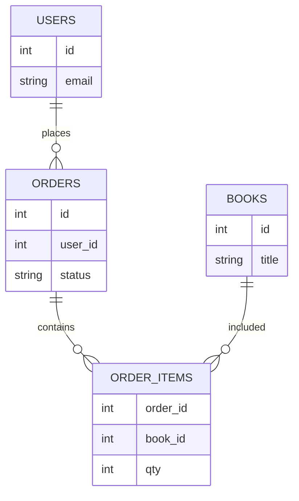

## Введение

Проверка UI без взгляда в данные часто врёт: заказ «оплачен» на экране и `pending` в таблице — классика. Вопросы J87 и J134–136 проверяют типы БД, базовый SELECT и понимание JOIN. В выпуске — теория и лаба на sqlite3 через Python.

## Раздел: Типы баз и зачем они QA

**Реляционные (SQL):** PostgreSQL, MySQL, SQLite — таблицы, строки, связи через ключи, транзакции, схемы. Удобны для бизнес-данных заказов, пользователей, платежей.

**Нереляционные (NoSQL) — обзор:**
- документные (MongoDB) — JSON-подобные документы;
- key-value (Redis) — кэш, сессии;
- колоночные / поисковые / графовые — под свои нагрузки.

QA чаще всего: проверить, что после действия в UI/API строка появилась/обновилась; найти «хвосты» после бага; подготовить тестовые данные; оценить cascade delete и уникальность.

На собесе: «я не DBA, но умею читать данные и строить простые выборки для проверки инвариантов».

## Раздел: SELECT, WHERE и JOIN концептуально

Базовый каркас:
```sql
SELECT columns
FROM table
WHERE condition
ORDER BY column
LIMIT n;
```

Операторы WHERE: `=`, `<>`, `>`, `<`, `IN`, `LIKE`, `IS NULL`, `AND`/`OR`. Осторожно с NULL: сравнения ведут себя не как с обычными значениями.

**JOIN (идея):** связать строки двух таблиц по ключу.
- **INNER JOIN** — только совпавшие пары;
- **LEFT JOIN** — все слева + совпадения справа (справа может быть NULL);
- **RIGHT / FULL** — зеркально / объединение (зависит от СУБД).

Пример мысли: `orders` + `users` по `user_id` — увидеть email владельца заказа; `orders` + `books` через `order_items` — состав заказа.

Для QA JOIN нужен, чтобы ответить: «какие заказы без пользователя?», «сколько позиций в заказе 42?», «есть ли книги без заказов?».

## Раздел: Практика books / users / orders

Учебная модель:
- `users(id, email, name)`
- `books(id, title, price)`
- `orders(id, user_id, status, created_at)`
- `order_items(order_id, book_id, qty)`

Проверки после «покупки»:
1. есть строка в `orders` со статусом `paid`;
2. есть `order_items` с ожидаемым `book_id` и `qty`;
3. email в JOIN совпадает с пользователем из UI;
4. нет «осиротевших» items без order.

Инструмент лабы — **sqlite3** в стандартной библиотеке Python: быстро поднять файл БД без сервера, прогнать скрипт, показать на собесе ход мысли.

## Лаба

**Цель.** Создать SQLite-схему users/books/orders/order_items и выполнить 4 проверочных запроса.

**Шаги.**
1. Создайте файл `qa07_shop.py` и через `sqlite3` создайте таблицы и 2–3 пользователя, 3 книги, 2 заказа с позициями.
2. Напишите SELECT всех paid-заказов с email пользователя (JOIN).
3. Напишите запрос суммы qty по `order_id`.
4. Напишите LEFT JOIN книг к order_items и найдите книгу без продаж (или объясните, как бы искали).
5. Сформулируйте 3 инварианта, которые бы проверяли SQL-ом после UI-покупки.

**В группу:** обменяйтесь схемами; партнер ломает данные (удаляет user, оставляет order) — вы находите аномалию запросом.

**Готово, если…**
- [ ] Отличаете реляционную БД от key-value/документа на уровне идеи
- [ ] Пишете SELECT … WHERE без шпаргалки
- [ ] Объясняете INNER vs LEFT JOIN на примере users/orders

## Схема: Заказ и связанные таблицы



## Тест

### Зачем тестировщику SQL, если есть UI?

**Ответ:** проверить фактическое состояние данных и ловить расхождения UI/API/БД

**Пояснение:** интерфейс кэширует и упрощает; БД — источник правды для многих бизнес-инвариантов.

### Чем INNER JOIN отличается от LEFT JOIN?

**Ответ:** INNER — только совпадения; LEFT — все строки левой таблицы, даже без пары справа

**Пояснение:** LEFT удобен для поиска «заказов без пользователя» или «пользователей без заказов» (меняя сторону).

### Что вернёт WHERE col = NULL?

**Ответ:** обычно ничего; для пустых значений нужен IS NULL

**Пояснение:** в SQL сравнение с NULL даёт UNKNOWN, строка не проходит WHERE.

## Шпаргалка

<h3>Суть</h3>
<ul>
<li>SQL-БД: таблицы + ключи + транзакции</li>
<li>SELECT/WHERE — база проверок данных</li>
<li>JOIN связывает сущности для сквозной проверки</li>
<li>sqlite3 удобен для учебной лабы без сервера</li>
</ul>
<h3>Мини-запросы</h3>
<pre><code>SELECT o.id, u.email
FROM orders o
INNER JOIN users u ON u.id = o.user_id
WHERE o.status = 'paid';

SELECT * FROM books WHERE id NOT IN (
  SELECT book_id FROM order_items
);
</code></pre>

## Anki

### Front: Что такое первичный ключ?

Back: уникальный идентификатор строки таблицы; на него ссылаются внешние ключи

### Front: Зачем QA LEFT JOIN users ← orders?

Back: найти пользователей без заказов или заказы с «дырами» в связанных данных — зависит от стороны

### Front: Чем SQLite удобен в лабе?

Back: файловая БД без установки сервера, доступна из Python модулем sqlite3

## Итоги

- Данные — третий столп проверки рядом с UI и API
- SELECT + JOIN закрывают большинство junior SQL-вопросов
- Лаба с shop-схемой даёт историю для рассказа на собесе

## Ссылки

- [QA-interview-250](https://github.com/Konstantine23/QA-interview-250)
- Learn | /game/learn
- Далее: [Сводная junior-практика](/game/learn/qa-junior-practice-lab)
