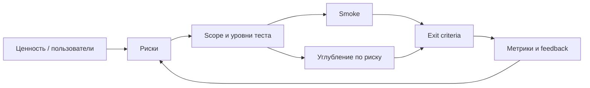

## Введение

S1–2, S5–13, S15–18: senior-вопросы про «как выстроить работу», а не «что такое boundary». Здесь — подход без ТЗ, критерии готовности, риски, метрики и оценка; формулировки, которые звучат как опыт, а не учебник.

## Раздел: Старт без документов, «когда достаточно», review и риски

**Старт QA без документации.** Не ждать идеальное ТЗ. Источники правды: работающий прод/стейдж, код и OpenAPI, тикеты/AC, аналитик/PO, поддержка и жалобы клиентов, логи/метрики, конкуренты, старые баг-репорты. Первые шаги: карта модулей и интеграций, критические пользовательские пути, список неизвестных, smoke «как есть», договорённость о канале уточнений.

**Подход к старту тестирования (новый проект/модуль):**

1. Понять ценность и пользователей (кто пострадает от бага).
2. Нарисовать границы системы и зависимости.
3. Выделить риски (данные, деньги, безопасность, репутация).
4. Согласовать уровни: unit/API/UI/exploratory и владельцев.
5. Поднять тестопригодность: стенды, данные, логи, id в UI.
6. Собрать минимальный smoke + план углубления по риску.
7. Встроить качество в DoD и CI, а не в «фазу в конце».

**Когда тестирование «закончено»?** Никогда в абсолюте. Практический exit: выполнены согласованные scope и exit criteria; критические риски закрыты или приняты PO; Sev1/Sev2 по политике закрыты; smoke/регресс по плану зелёный; остаточный риск явно зафиксирован. «Багов нет» — плохой критерий.

**Review тест-кейсов.** Смотрят: трассировку на требования, ясность шагов и ожидаемого результата, данные/преусловия, независимость кейсов, дубли, устаревание, автоматизуемость, покрытие негатива и границ. Формат: peer review + выборочный walkthrough с аналитиком на критичных сценариях.

**Типы рисков и mitigation.**

| Риск | Пример | Mitigation |
|------|--------|------------|
| Продуктовый | неверная тарификация | контрактные тесты, сверка с биллингом |
| Технический | гонки в API | нагрузка, идемпотентность, логи |
| Процессный | поздний QA | shift-left, DoD |
| Среды | флаки из-за данных | изоляция, фикстуры |
| Людской | один носитель знаний | парное ревью, runbooks |
| Безопасность | IDOR | негативные authZ-кейсы |

**Основа load-стратегии.** Бизнес-цель и SLA → профиль пользователей (пики, гео) → критические сценарии → модель нагрузки → данные/стенд ≈ прод → наблюдаемость → критерии pass/fail → план эскалации. Без цели «покрутить JMeter» — не стратегия.

## Раздел: Документы, smoke, команда, анализ, метрики, estimate, coverage

**Как часто ревьюить тест-документы?** Ритм под изменения продукта: при каждом крупном релизе/эпике — точечно; раз в спринт — устаревшие кейсы в зоне изменений; раз в квартал — аудит регресса (мертвые кейсы, дыры). Триггеры вне расписания: инцидент на проде, смена архитектуры, провал релиза.

**Отбор smoke.** Короткие проверки «система жива и основной бизнес возможен»: логин, ключевой create-read, платёж/заказ (если core), health зависимостей. Не более того, что команда готова гонять на каждый билд. Smoke ≠ полный регресс.

**Планирование нагрузки на команду.** Учитывать: входящий поток задач, % на регресс/автоматизацию/поддержку стендов, отпуска, on-call, буфер на инциденты (часто 20–30%). Визуализировать WIP; не планировать 100% capacity. Senior защищает фокус: «три фичи без теста = риск релиза».

**Ценность тест-анализа.** Раннее выявление дыр в требованиях, согласование приоритетов, уменьшение лишних кейсов, общая картина рисков для стейкхолдеров. Анализ экономит дорогой поздний баг-фиксинг.

**Метрики (с осторожностью):** escaped defects, defect density, pass rate, flaky rate, automation %, cycle time в Test, MTTR, coverage требований (RTM), не «количество кейсов». Метрика без решения — vanity.

**Техники оценки:** аналогия с прошлыми фичами; WBS (разбить → оценить части); three-point (opt/likely/pessim); planning poker; буфер на неопределённость. Озвучивайте допущения («нет API-доков → +X»).

**Покрытие.** Требований, рисков, кода (unit), сценариев. 100% code coverage ≠ качество. Senior говорит: «покрыли риск платежей и authZ; UI-регресс — критический путь».

**Оптимальное число шагов в сценарии.** Достаточно для воспроизводимости, без романа: обычно 5–12 атомарных шагов; длинные E2E дробить. Один кейс — одна цель проверки; иначе падения нечитаемы.

## Лаба

**Цель.** Стратегия на 2 недели для модуля «оплата» без полного ТЗ.

**Шаги.**
1. Список источников информации вместо ТЗ (8 пунктов) и первые 5 вопросов PO.
2. Risk register: 6 рисков с probability/impact и mitigation.
3. Exit criteria релиза (не менее 6 пунктов).
4. Smoke из ≤10 проверок и обоснование, почему не 30.
5. Оценка трудозатрат: three-point на API-регресс и на exploratory (в человеко-днях).
6. Дашборд метрик: 5 метрик и по одной «ложная интерпретация» каждой.

```python
# Three-point estimate → expected effort (PERT)
optimistic, most_likely, pessimistic = 2.0, 5.0, 12.0  # person-days
expected = (optimistic + 4 * most_likely + pessimistic) / 6
sigma = (pessimistic - optimistic) / 6
print(f"E = {expected:.1f} d, σ ≈ {sigma:.1f} d")

risks = [
    ("payment_double_charge", 0.2, 5),
    ("auth_idor", 0.3, 4),
    ("report_timeout", 0.4, 2),
]
for name, prob, impact in risks:
    score = prob * impact
    print(f"{name:24} score={score:.1f}")
```

**В группу:** заказчик просит «100% покрытие» — что отвечаете за 90 секунд?

**Готово, если…**
- [ ] Есть exit criteria и risk register
- [ ] Smoke отделён от полного регресса
- [ ] Оценка с допущениями, не «сделаем»

## Схема: От риска к объёму теста



## Тест

### Когда тестирование можно считать завершённым для релиза?

**Ответ:** когда выполнены согласованные exit criteria и остаточный риск явно принят стейкхолдерами

**Пояснение:** отсутствие известных багов — недостаточный критерий; важны scope, severity policy и прозрачный residual risk.

### Что кладут в основу стратегии нагрузки?

**Ответ:** бизнес-SLA и профиль реальной нагрузки на критических сценариях, а не «максимальный RPS инструмента»

**Пояснение:** без цели и модели пользователей результаты load не интерпретируемы.

### Зачем нужны метрики flaky rate и escaped defects?

**Ответ:** flaky rate показывает доверие к автотестам; escaped defects — эффективность процесса до прода

**Пояснение:** растущий flaky убивает сигнал CI; escaped defects направляют, куда сдвигать усилия (shift-left, контракты, мониторинг).

## Шпаргалка

<h3>Старт без ТЗ</h3>
<ul>
<li>Прод, API, тикеты, PO, поддержка, логи</li>
<li>Карта модулей → риски → smoke → углубление</li>
</ul>
<h3>Риски и smoke</h3>
<ul>
<li>Риск = вероятность × влияние; mitigation явный</li>
<li>Smoke = «бизнес дышит», короткий, на каждый билд</li>
</ul>
<h3>Оценка</h3>
<pre><code>WBS + three-point + допущения
Exit = scope + severity + residual risk accepted
</code></pre>

## Anki

### Front: Exit criteria — что это?

Back: заранее согласованные условия, при которых тестирование scope считается достаточным для релиза/этапа

### Front: Чем опасна метрика «число тест-кейсов»?

Back: стимулирует раздувание документации без связи с риском и качеством сигнала

### Front: Оптимальные шаги в кейсе?

Back: столько, сколько нужно для одной цели и воспроизводимости; длинные сценарии дробить

## Итоги

- Senior начинает с ценности и рисков, даже без документов
- «Готово» = exit criteria + принятый остаточный риск
- Load, smoke, capacity команды и метрики — управленческие рычаги, не ритуалы
- Оценка честна, когда видны допущения и неопределённость

## Ссылки

- [QA-interview-250](https://github.com/Konstantine23/QA-interview-250)
- [ISTQB Foundation — testing principles](https://www.istqb.org/)
- Learn | /game/learn
