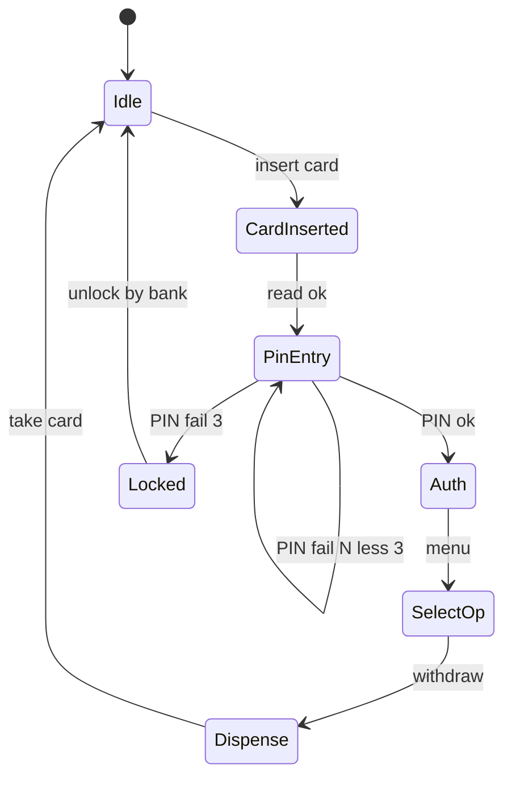

## Введение

Углубление тест-дизайна (M3, M11, M23–25, M93, M101 + J138–140): когда комбинаторика взрывается, как режут pairwise, чем полезны state-машины и как метрики DDP/DRE и risk-based связывают тестирование с бизнесом. Лаба — тарифы карандашей (ценовые тиры).

## Раздел: Decision table, pairwise, ATM states

**Decision table.** Строки — условия и действия; столбцы — правила. Удобно для бизнес-логики с несколькими if/else (скидки, роли, флаги). Сначала компактная таблица → вычёркивание невозможных комбинаций → кейсы из оставшихся столбцов.

Пример (логин):

| Условие | R1 | R2 | R3 | R4 |
|---------|----|----|----|-----|
| Логин валиден | T | T | F | F |
| Пароль валиден | T | F | T | F |
| Вход разрешён | Y | N | N | N |

**Pairwise (попарное).** Предпосылка: большинство дефектов — от взаимодействия **двух** параметров, не всех сразу. Инструменты (PICT и аналоги) строят набор, где каждая пара значений параметров встречается ≥1 раз. Не замена риск-анализу: критичные тройки/бизнес-сценарии добавляйте вручную.

Параметры: браузер × ОС × язык × роль — полный перебор огромен; pairwise даёт обозримый smoke матрицы.

**State transition (ATM-пример).** Состояния: Idle → CardInserted → PinEntry → Auth → SelectOp → Dispense → Idle; плюс Locked после N неверных PIN. Кейсы: валидные переходы, невалидные (событие в неверном состоянии), граничные (3-й неверный PIN), восстановление. Диаграмма состояний ловит дыры, которые «список кейсов» пропускает.

## Раздел: Цикломатика, DDP/DRE, risk-based

**Цикломатическая сложность (McCabe).** Приблизительно: число независимых путей ≈ `E - N + 2P` или «количество решений + 1». Для QA: высокая сложность модуля → больше basises / внимательнее к ветвлениям; аргумент для рефакторинга и unit-тестов разработчика, не только UI-регресса.

**DDP / DRE.**

- **DRE (Defect Removal Efficiency)** ≈ дефекты найдённые до релиза / (до + после). Чем выше — тем лучше «сетка» до прода.
- **DDP (Defect Detection Percentage)** в ряде компаний синонимичен или считается по фазам (доля, пойманная на этапе). Уточняйте формулу работодателя. Смысл на собесе: связать leakage с измеримой эффективностью, не с эмоцией.

**Risk-based testing (RBT).** Риск ≈ вероятность × влияние. Модели: матрица 3×3, риск-каталог фич, Failure Mode мысли по сценариям. Приоритет тестов: сначала высокий риск (платежи, PII, миграции), низкий — сэмпл/мониторинг. Пересматривайте после инцидентов и изменений архитектуры.

Углубление границ/эквивалентности (J138–140): классы + границы на стыке тиров цен, округлений, timezone, валют — типичные mid-уровень ловушки.

## Лаба

**Цель.** Прайс карандашей: тиры `1–9 шт → 10₽`, `10–49 → 8₽`, `50+ → 6₽`, опция «подарочная коробка +50₽», роль опт/розница (опт даёт ещё −1₽ за штуку только от 50).

**Шаги.**
1. Постройте decision table: тир количества × коробка × роль → итог/ошибка.
2. Выпишите границы: 0, 1, 9, 10, 49, 50, отрицательные, нечисло.
3. Сожмите комбинации pairwise по параметрам (кол-во-класс, коробка, роль) и сравните с полным перебором.
4. Нарисуйте state machine оформления заказа: Cart → Address → Pay → Done / FailedPay → retry.
5. Оцените риск: ошибка цены для опта 10k штук vs косметика UI коробки — куда больше кейсов.

**В группу:** когда pairwise опасен (маскирует обязательную тройную комбинацию)?

**Готово, если…**
- [ ] Таблица без противоречивых правил
- [ ] Границы тиров покрыты
- [ ] Есть формула DRE своими словами на примере цифр

## Схема: ATM state transition

## Тест

### Зачем decision table, если есть if в голове аналитика?

**Ответ:** явно показывает комбинации условий и дыры/противоречия правил

**Пояснение:** таблица — артефакт согласования с бизнесом и источник кейсов без пропущенных столбцов.

### Что гарантирует pairwise, а что — нет?

**Ответ:** покрытие всех пар значений параметров; не гарантирует все тройные и бизнес-критичные полные сценарии

**Пояснение:** добавляйте обязательные комбинации вручную поверх генератора.

### Как интерпретировать рост leakage при том же DRE?

**Ответ:** уточнить знаменатель/учёт прод-дефектов и сравнимость периодов; возможно вырос объём/сложность продукта

**Пояснение:** метрики без контекста релизного объёма вводят в заблуждение — всегда нормализуйте обсуждение.

## Шпаргалка

<h3>Техники</h3>
<ul>
<li>Decision table — правила бизнес-логики</li>
<li>Pairwise — сжатие комбинаторики пар</li>
<li>State transition — события и запрещённые переходы</li>
</ul>
<h3>Метрики</h3>
<pre><code>DRE ≈ found_before / (found_before + found_after)
Risk ≈ probability × impact
Cyclomatic ≈ decisions + 1
</code></pre>
<h3>RBT</h3>
<ul>
<li>Сначала high impact × high likelihood</li>
<li>Низкий риск — сэмпл, не игнор навсегда</li>
</ul>

## Anki

### Front: Что такое pairwise testing?

Back: набор тестов, где каждая пара значений параметров встречается минимум один раз

### Front: Зачем state transition для ATM?

Back: ловит неверные переходы (операция без PIN, блокировка после N ошибок) лучше плоского списка кейсов

### Front: Defect Removal Efficiency?

Back: доля дефектов, устранённых/найденных до релиза относительно всех учтённых (до+после)

## Итоги

- Таблицы решений и состояния закрывают «логику», pairwise — взрыв параметров
- Цикломатика — мост к разговору с разработкой о сложности
- DDP/DRE и RBT переводят тестирование в язык менеджмента риска
- Лаба с тарифами тренирует границы + комбинаторику на одной задаче

## Ссылки

- [QA-interview-250](https://github.com/Konstantine23/QA-interview-250)
- Learn | /game/learn/qa-middle-process
