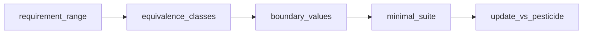

## Введение

Хороший junior не только «кликает по кнопкам», а умеет сокращать бесконечные входы до разумного набора. Этот выпуск закрывает J6–8, J24, J123, J137–140: эквивалентность, границы, pesticide paradox и практика на поле возраста и страховых классах.

## Раздел: Equivalence Partitioning и Boundary Value Analysis

**Equivalence Partitioning (EP)** — деление входов на классы, где поведение системы считается одинаковым. Достаточно одного-двух представителей из класса вместо перебора всех значений.

Пример: возраст для регистрации 18–99.
- невалидный низкий: &lt; 18 (например 0, 17);
- валидный: 18–99;
- невалидный высокий: &gt; 99;
- отдельно: пусто, буквы, спецсимволы, пробелы, отрицательные, дробные — если поле это допускает на уровне UI/API.

**Boundary Value Analysis (BVA)** — ошибки чаще у границ, поэтому проверяем края классов: 17, 18, 19, 98, 99, 100 (и иногда «чуть за» / типовые off-by-one).

Связка EP+BVA: сначала классы, затем усиление границами. На собесе покажите таблицу: класс → представители → ожидаемый результат.

**White-box complexity (intro):** цикломатическая сложность растёт с числом независимых путей (ветвления if/else, циклы). Чем выше сложность, тем больше путей для покрытия — поэтому unit/white-box и рефакторинг важны. Junior должен понимать идею: «много ветвлений → больше риск пропущенного пути», без обязательного расчёта метрики на доске.

## Раздел: Парадокс пестицида и практика классов

**Pesticide paradox:** если гонять одни и те же тесты, они перестают находить новые дефекты — продукт и команда «привыкают» к набору. Лечение: обновлять кейсы, менять данные, добавлять exploratory, пересматривать риски, ротировать сценарии.

Практика «страховка / тариф» (упрощённо):
- классы по возрасту или стажу (например 18–25, 26–40, 41–65, 66+);
- внутри класса — один расчёт премии; на границах — смена тарифа;
- негатив: возраст вне правил, пустые поля, несогласованные даты полиса.

Хороший ответ на J137–140: не перечислять 80 чисел, а показать 3–5 классов + границы + 1–2 специальных кейса (пустая строка, leading zero, Unicode).

## Раздел: Как отвечать на собесе с полем 18–99

Структура ответа:
1. Назвать валидный диапазон и источник (требование).
2. Построить EP-классы (valid / invalid low / invalid high / invalid format).
3. Усилить BVA: 17, 18, 99, 100.
4. Добавить «грязные» данные: `18 `, `018`, `18.0`, `восемнадцать`, SQL/XSS-строка — если контекст веб.
5. Сказать, что на API и UI проверки могут отличаться (клиентская валидация vs серверная).

Фраза для собеса: «Я уменьшаю пространство входов классами и бью по границам, потому что там статистически больше дефектов».

## Лаба

**Цель.** Спроектировать минимальный набор тестов для поля «Возраст: целое 18–99» и для тарифа из 4 возрастных классов.

**Шаги.**
1. Нарисуйте таблицу EP для возраста: класс, пример, ожидаемый результат.
2. Добавьте BVA-набор (не меньше 6 значений вокруг границ).
3. Для страховки опишите 4 класса тарифа и тесты на стыках классов.
4. Запишите 3 способа победить pesticide paradox на своём проекте.

**В группу:** обменяйтесь таблицами; найдите пропущенный негативный класс у партнёра.

**Готово, если…**
- [ ] EP и BVA объясняете на одном примере без путаницы терминов
- [ ] Для 18–99 называете границы и форматные негативы
- [ ] Можете одной фразой объяснить pesticide paradox и лечение

## Схема: От требования к набору тестов

## Тест

### Зачем equivalence partitioning?

**Ответ:** сократить бесконечные входы до представителей классов с одинаковым поведением

**Пояснение:** экономит время при сохранении покрытия типов ситуаций, а не всех чисел подряд.

### Какие значения взять для возраста 18–99 по BVA?

**Ответ:** как минимум 17, 18, 99, 100 (часто ещё 19 и 98)

**Пояснение:** границы и соседние значения ловят off-by-one и ошибки условий `&lt;=` / `&lt;`.

### Что такое pesticide paradox?

**Ответ:** одни и те же тесты со временем перестают находить новые баги

**Пояснение:** нужно обновлять сценарии, данные и подходы, иначе набор «вырождается».

## Шпаргалка

<h3>Суть</h3>
<ul>
<li>EP — классы эквивалентного поведения</li>
<li>BVA — края классов (там чаще ломается)</li>
<li>Pesticide — ротация и обновление тестов</li>
<li>Сложность кода ↑ → путей для white-box больше</li>
</ul>
<h3>Возраст 18–99</h3>
<pre><code>invalid: 17, 100, "", "abc", -1
valid edges: 18, 99
near: 19, 98
format: "18 ", "018", "18.5"
</code></pre>

## Anki

### Front: Что такое класс эквивалентности?

Back: множество входных значений, для которых ожидается одинаковая реакция системы

### Front: Почему проверяют границы?

Back: дефекты условий часто сидят на краях диапазонов и в off-by-one ошибках

### Front: Как лечить pesticide paradox?

Back: обновлять кейсы и данные, добавлять exploratory, пересматривать риски, не полагаться только на старый набор

## Итоги

- EP+BVA — базовый язык тест-дизайна на junior-собесе
- Возраст 18–99 отрабатывайте таблицей, не списком из 50 чисел
- Парадокс пестицида напоминает: тесты — живой актив, не музей

## Ссылки

- [QA-interview-250](https://github.com/Konstantine23/QA-interview-250)
- Learn | /game/learn
- Далее: [Баги и баг-репорты](/game/learn/qa-bugs-reports)
