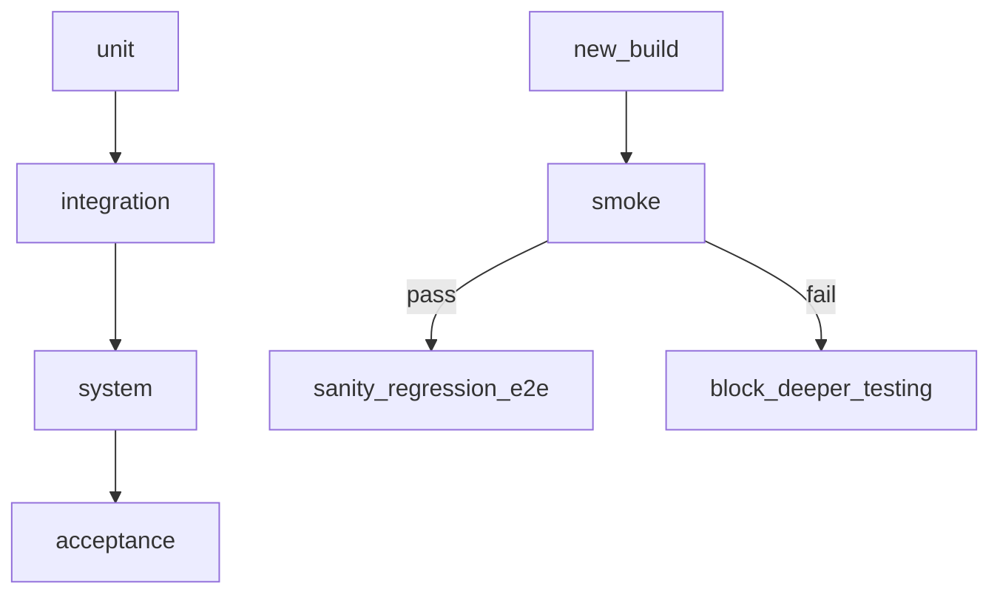

## Введение

После «что такое тестирование» на junior-собесе ждут карту видов и уровней: unit → system, smoke vs sanity, regression vs confirmation, black/grey/white box. Этот выпуск закрывает J4–5, J9–10, J12–13, J15–17, J19–23 и J100 оригинальными ответами.

## Раздел: Уровни и основные типы

**Уровни (по «высоте» системы):**
- **Unit** — модуль/функция изолированно (часто разработчики, с моками).
- **Integration** — стыки модулей, API, БД, очереди.
- **System** — система целиком по требованиям.
- **Acceptance (UAT)** — приёмка бизнесом/пользователем.

**По объекту и цели (часто спрашивают «виды»):**
- функциональное — «делает ли то, что обещано»;
- нефункциональное — perf, security, usability, compatibility, reliability;
- позитивное / негативное — валидные и невалидные данные и сценарии;
- статическое (ревью, анализ без запуска) / динамическое (с запуском).

**Smoke** — быстрая проверка «сборка жива»: ключевые пути (логин, главная, критичный CRUD). Если smoke падает — глубже не идём.

**Sanity** — узкая проверка после небольшого фикса/патча: «эта конкретная область ведёт себя разумно», без полного регресса.

**Regression** — повторная проверка уже работавшего функционала после изменений (не «только новый код»).

**Confirmation (re-test)** — повторный прогон именно тех кейсов, что ловили баг, после фикса — убедиться, что дефект закрыт.

**E2E** — сквозной сценарий пользователя через несколько слоёв (UI → API → БД → уведомление). Дорог и хрупок; берут критичные бизнес-потоки.

## Раздел: Black / Grey / White box и подходы

**Black box** — без знания внутренней реализации: входы/выходы, UI, API-контракт. Типично для system/acceptance.

**White box** — с кодом: ветки, условия, покрытие путей, unit/integration у разработчиков и AQA.

**Grey box** — частичное знание: схема БД, логи, архитектура, но без построчного чтения всего кода. Удобно для интеграции и поиска «дыр» на стыках.

**Exploratory** — одновременное изучение, дизайн и выполнение; опирается на эвристики и заметки (session-based). Не «рандомный клик», а осознанный поиск при неясных требованиях или сжатых сроках.

**Risk-based** — приоритет по вероятности × ущерб: сначала то, что чаще ломается или дороже стоит бизнесу.

**Security (intro)** — проверка на несанкционированный доступ, инъекции, утечки данных, слабые сессии; на junior уровне — понимание угроз и базовые проверки (роли, прямые URL, чувствительные поля).

**Performance (intro)** — как система ведёт себя под нагрузкой: время ответа, пропускная способность, стабильность. Junior должен отличать load/stress/spike на уровне определений и знать, что нужны метрики и инструмент (JMeter/k6 и т.п.), а не «я кликал и было медленно».

## Раздел: Веб-специфика и «только для веба»

Для веб часто отдельно называют:
- UI / UX — интерфейс и удобство;
- compatibility — браузеры, разрешения, ОС;
- cross-browser / responsive;
- accessibility (a11y) — доступность;
- localization / internationalization;
- cookie/session/cache-поведение (глубже в QA06).

На собесе полезно связать тип теста с риском: «для платёжного флоу — e2e + security + regression критичных путей; для текста на кнопке — точечный confirmation».

## Лаба

**Цель.** Для учебного интернет-магазина составить матрицу: уровень × тип × 1 пример кейса.

**Шаги.**
1. Выберите 5 фич: каталог, корзина, оплата, личный кабинет, поиск.
2. Для каждой укажите smoke-проверку и один regression-кандидат.
3. Опишите один exploratory-сеанс на 30 минут (чартер + что будете исследовать).
4. Отметьте 3 риска и какой тип теста их закрывает (security / perf / e2e).

**В группу:** сравните матрицы; найдите, где коллега перепутал sanity и regression.

**Готово, если…**
- [ ] Чётко отличаете smoke, sanity, regression, confirmation
- [ ] Приводите примеры black/grey/white box
- [ ] Объясняете risk-based приоритезацию на примере магазина

## Схема: Уровни и быстрые фильтры

## Тест

### Чем smoke отличается от sanity?

**Ответ:** smoke — широкая «сборка жива»; sanity — узкая проверка области после мелкого изменения

**Пояснение:** smoke решает «можно ли тестировать дальше»; sanity — «эта правка выглядит ок».

### Regression и confirmation — это одно и то же?

**Ответ:** нет: confirmation — ретест бага; regression — проверка соседнего/старого функционала

**Пояснение:** после фикса логина confirmation — снова логин; regression — корзина, платежи, сессия и т.д.

### Что такое grey box?

**Ответ:** тестирование с частичным знанием внутренностей (БД, логи, архитектура)

**Пояснение:** середина между black и white: можно проверять стыки осознаннее, не читая весь код.

## Шпаргалка

<h3>Суть</h3>
<ul>
<li>Уровни: unit → integration → system → acceptance</li>
<li>Smoke / sanity / regression / confirmation — разные цели</li>
<li>Box: black (снаружи), white (код), grey (частично)</li>
<li>Exploratory и risk-based — про мышление, не про «отсутствие плана»</li>
</ul>
<h3>Фразы на собесе</h3>
<pre><code>smoke fail → не углубляемся
re-test ≠ full regression
e2e только на критичных потоках
security/perf: угроза и метрика, не ощущения
</code></pre>

## Anki

### Front: Что проверяет smoke?

Back: минимальный набор критичных путей — жива ли сборка для дальнейшего тестирования

### Front: Black box vs white box?

Back: black — без знания кода, по входам/выходам; white — с анализом структуры и путей кода

### Front: Зачем risk-based testing?

Back: сначала закрывать сценарии с высоким ущербом и/или вероятностью сбоя при ограниченных ресурсах

## Итоги

- Виды и уровни — язык, на котором договариваются о scope
- Smoke/sanity/regression/confirmation часто путают — держите чёткие определения
- Exploratory и риск — способ думать, когда чеклиста мало

## Ссылки

- [QA-interview-250](https://github.com/Konstantine23/QA-interview-250)
- Learn | /game/learn
- Далее: [Техники тест-дизайна](/game/learn/qa-test-design)
