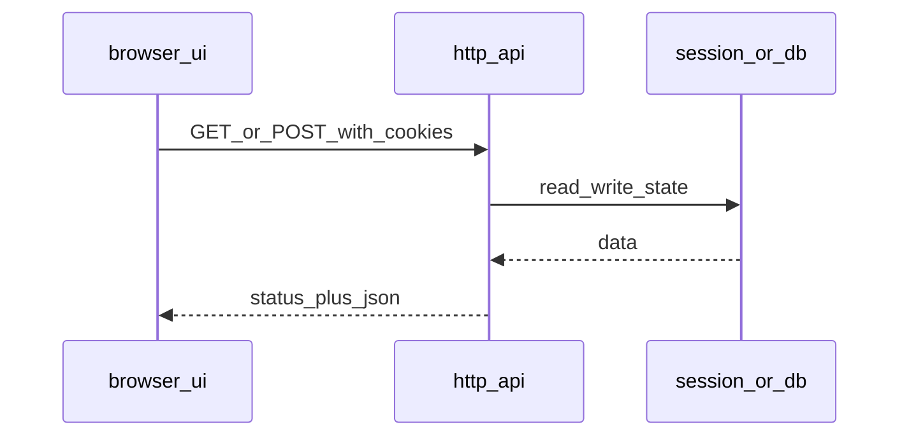

## Введение

Большинство продуктов для junior QA — веб и API. Вопросы J76–103 проверяют, понимаете ли вы клиент-сервер, HTTP, REST, статусы, cookies и как смотреть сеть в DevTools. Этот выпуск даёт рабочие формулировки для собеса и повседневной отладки.

## Раздел: Клиент-сервер, REST/SOAP, CRUD и методы

**Клиент-сервер:** браузер/приложение (клиент) запрашивает ресурс; сервер отвечает данными и статусом. Тестировщик смотрит оба конца: UI мог соврать, а API вернуть правду (и наоборот).

**HTTP-методы (часто):**
- **GET** — получить ресурс, без тела запроса в классике, идемпотентен, не должен менять состояние;
- **POST** — создать/инициировать действие, не идемпотентен;
- **PUT** — заменить ресурс целиком (идемпотентен в идеале);
- **PATCH** — частичное обновление;
- **DELETE** — удаление.

**CRUD:** Create → POST (иногда PUT), Read → GET, Update → PUT/PATCH, Delete → DELETE.

**GET vs POST на собесе:** GET для чтения и параметров в URL (осторожно с секретами); POST для тел, файлов, операций с побочным эффектом. Кэш и логи прокси по-разному относятся к методам.

**REST** — стиль: ресурсы и URI, стандартные методы, без состояния сервера между запросами (состояние — в токене/БД), обычно JSON.  
**SOAP** — протокол на XML, контракт WSDL, строже по схеме, часто в enterprise/банках; транспорт обычно HTTP, но модель другая.

**JSON** — лёгкий текстовый формат объектов/массивов. **XML** — теги, атрибуты, схемы; тяжелее, но привычен в SOAP и старых интеграциях.

## Раздел: Статус-коды, cookies, session, cache

Группы кодов:
- **1xx** — информационные;
- **2xx** — успех (`200 OK`, `201 Created`, `204 No Content`);
- **3xx** — перенаправление (`301`, `302`, `304`);
- **4xx** — ошибка клиента (`400`, `401`, `403`, `404`, `409`, `422`, `429`);
- **5xx** — ошибка сервера (`500`, `502`, `503`, `504`).

На собесе отличайте **401 Unauthorized** (нет/невалидна аутентификация) и **403 Forbidden** (аутентифицирован, но нет прав).

**Cookie** — пара имя=значение, которую сервер просит хранить и присылать обратно (часто с флагами HttpOnly, Secure, SameSite).  
**Session** — серверное (или token-based) состояние пользователя между запросами; идентификатор сессии может жить в cookie.  
**Cache** — хранение ответа ближе к клиенту/прокси, чтобы не ходить на origin; заголовки `Cache-Control`, `ETag`, `304`.

Для QA: после логаута cookie/session должны инвалидироваться; чувствительные ответы — без агрессивного публичного кэша.

## Раздел: DevTools, HTML/CSS/JS, frames и AJAX

В Chrome DevTools тестировщику esp. полезны:
- **Network** — метод, URL, статус, timing, request/response headers и body;
- **Application** — cookies, localStorage, sessionStorage;
- **Console** — JS-ошибки;
- **Elements** — DOM и быстрая проверка атрибутов.

**HTML** — структура страницы; **CSS** — оформление; **JavaScript** — поведение на клиенте. Junior не обязан верстать, но должен понимать, что UI-баг может быть в разметке, стилях или скрипте.

**iframe / frames** — вложенный документ; локаторы и безопасность (same-origin) усложняются.  
**AJAX** (и fetch/XHR) — асинхронные запросы без полной перезагрузки страницы: UI обновляется после ответа API. Баг «кнопка крутится вечно» часто виден в Network как pending/failed.

Практика отладки: воспроизвели → Network → статус и тело → сверили с UI-сообщением → Application (сессия) → при необходимости повторили запрос через Postman/Insomnia.

## Лаба

**Цель.** Разобрать один пользовательский сценарий логина через DevTools и описать API-вызовы своими словами.

**Шаги.**
1. Откройте учебный сайт, включите Network → Preserve log, выполните логин.
2. Найдите запрос аутентификации: метод, URL, статус, есть ли Set-Cookie.
3. Запишите 5 статус-кодов с примером, когда QA их увидит.
4. Сравните GET списка сущностей и POST создания: что в URL, что в body, какой ожидаемый код.

**В группу:** покажите запись Network коллеге и объясните, почему 401, а не 403, в вашем примере.

**Готово, если…**
- [ ] Объясняете REST vs SOAP без воды
- [ ] Называете методы CRUD и отличие GET/POST
- [ ] Умеете найти проблемный XHR в DevTools и прочитать статус/тело

## Схема: Запрос браузера

## Тест

### Чем REST отличается от SOAP на уровне идеи?

**Ответ:** REST — стиль вокруг ресурсов и HTTP; SOAP — XML-протокол с контрактом WSDL

**Пояснение:** REST обычно JSON и проще для веба; SOAP строже по схеме и чаще в тяжёлых интеграциях.

### Когда уместен 401, а когда 403?

**Ответ:** 401 — не аутентифицирован; 403 — аутентифицирован, но запрещено

**Пояснение:** пустой/битый токен → 401; валидный user без роли admin на admin-URL → 403.

### Зачем QA смотреть Network, а не только UI?

**Ответ:** UI может скрыть реальный статус, тело ошибки и лишние запросы

**Пояснение:** расхождение «тост успеха» при 500 в Network — классика; Network даёт факты для баг-репорта.

## Шпаргалка

<h3>Суть</h3>
<ul>
<li>Клиент ↔ HTTP ↔ сервер; состояние в токене/БД, не «магия UI»</li>
<li>CRUD ↔ POST/GET/PUT|PATCH/DELETE</li>
<li>2xx успех, 4xx клиент, 5xx сервер</li>
<li>Cookie/session/cache влияют на безопасность и флаки</li>
</ul>
<h3>DevTools</h3>
<pre><code>Network: method status timing payload
Application: cookies storage
Console: js errors
</code></pre>

## Anki

### Front: Идемпотентен ли GET?

Back: да — повторный GET не должен менять состояние ресурса (в корректном API)

### Front: Что такое AJAX для тестировщика?

Back: асинхронные запросы из страницы без полной перезагрузки; проверяем Network и итоговый UI

### Front: JSON vs XML?

Back: JSON компактнее для REST; XML типичен для SOAP и схемных интеграций

## Итоги

- HTTP-грамотность отделяет «кликера» от тестировщика веб/API
- Статусы, методы и DevTools — база баг-репортов с доказательствами
- Cookies/session/cache — частый источник «у меня воспроизводится через раз»

## Ссылки

- [QA-interview-250](https://github.com/Konstantine23/QA-interview-250)
- Learn | /game/learn
- Далее: [SQL и базы для QA](/game/learn/qa-sql-db-basics)
