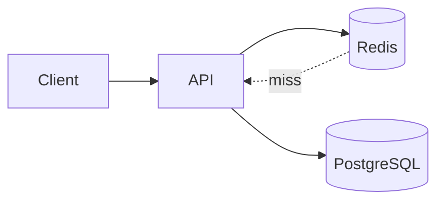

## Введение

Redis часто звучит на собесе как «кэш» — и этого мало. Junior должен объяснить модель ключ–значение, отличие от реляционной таблицы и риск хранить единственную правду в памяти.

## Раздел: Что такое Redis

Redis — in-memory хранилище структур данных с сетевым протоколом. Типичные роли: кэш ответов API, сессии, rate limit, лёгкие счётчики и pub/sub-сигналы.

Сильные стороны: низкая задержка чтения/записи, богатые типы (не только string), TTL. Слабые: данные живут в RAM (если нет persistence / реплики), операционная цена памяти, сложность инвалидации кэша.

## Раздел: KV vs таблица

В PostgreSQL вы думаете строками, связями и JOIN. В Redis — **ключом** и значением (или структурой вокруг ключа). Нет нормализации «из коробки»: вы сами проектируете пространство имён (`user:42:profile`).

См. также: [SQL DDL/DML и виды СУБД](/game/learn/sql-ddl-dml-dcl) — где Redis упомянут как key-value рядом с RDBMS.

## Раздел: Не source of truth

Если Redis — единственное место заказа/баланса без записи в БД, рестарт или eviction могут стереть бизнес-факт. Правило собеса: **система записи** (часто PostgreSQL) + кэш/ускоритель (Redis). Persistence (RDB/AOF) снижает риск, но не делает Redis полноценной транзакционной СУБД для сложной аналитики.

## Лаба

**Цель.** Спроектировать ключи для кэша профиля пользователя без дублирования «правды» только в Redis.

**Шаги.**
1. Опишите сущность `User(id, email, name)` в PostgreSQL одной фразой.
2. Придумайте ключ Redis для кэша профиля (например `user:{id}:profile`).
3. Запишите сценарий miss: нет ключа → SELECT из БД → SET с TTL.
4. Назовите 2 причины не хранить баланс счёта только в Redis.
5. Сверьте ответ с формулировкой «кэш vs source of truth».

**В группу:** партнёр предлагает хранить заказы только в Redis — вы аргументируете против.

**Готово, если…**
- [ ] Отличаете KV от таблицы
- [ ] Называете 2 типичных сценария Redis
- [ ] Объясняете, почему Redis не единственная правда

## Схема: Кэш поверх БД

## Тест

### Чем Redis принципиально отличается от PostgreSQL?

**Ответ:** in-memory KV/структуры vs реляционные таблицы и SQL

**Пояснение:** Разный класс задач: ускорение lookup vs схема, JOIN, ACID-отчёты.

### Почему Redis обычно не source of truth?

**Ответ:** данные в памяти могут пропасть при рестарте/eviction без надёжной записи в БД

**Пояснение:** Persistence помогает, но не заменяет модель бизнес-транзакций в СУБД.

### Назовите два типичных сценария Redis

**Ответ:** кэш API и сессии (или rate limit / счётчики)

**Пояснение:** Любые два из: cache, session, rate limit, pub/sub, leaderboard.

## Шпаргалка

<h3>Суть</h3>
<ul>
<li>Redis = in-memory структуры + сеть</li>
<li>Ключ → значение / структура</li>
<li>Кэш ускоряет, БД хранит правду</li>
</ul>
<h3>Антипаттерн</h3>
<pre><code>единственный source of truth в Redis без БД</code></pre>

## Anki

### Front: Что такое Redis одной фразой?

Back: In-memory хранилище структур данных с сетевым доступом

### Front: Почему не класть единственную правду в Redis?

Back: Рестарт/eviction могут стереть данные; нет зрелой реляционной модели

### Front: Типичный ключ кэша профиля?

Back: user:{id}:profile или hash запроса

## Итоги

- KV ≠ таблица: проектируете ключи сами
- Redis ускоряет, PostgreSQL часто пишет правду
- На собесе отделяйте кэш от системы записи

## Ссылки

- [Redis docs — Data types](https://redis.io/docs/data-types/)
- Learn | [SQL DDL / NoSQL обзор](/game/learn/sql-ddl-dml-dcl)
- Learn | [Python БД и кеш](/game/learn/py-db-cache-memcached)
- Далее: [Типы данных Redis](/game/learn/rd-data-types)
