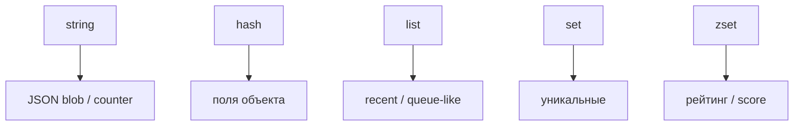

## Введение

После модели KV спрашивают: «какие типы знаете?». Нужно не перечисление, а выбор типа под задачу.

## Раздел: string и hash

**string** — байтовая строка: JSON-blob, счётчик (`INCR`), битовые флаги. Просто и универсально.

**hash** — поле→значение внутри ключа: удобно для объекта профиля (`HSET user:1 name …`). Частичное обновление полей без перезаписи всего JSON.

## Раздел: list, set, zset

**list** — упорядоченный список: очереди задач (с оговорками), ленты, recent items.

**set** — уникальные элементы: теги, уникальные посетители (в пределах памяти).

**zset (sorted set)** — элемент + score: рейтинги, time-ordered ленты, sliding window rate limit.

## Раздел: Выбор типа

Правило: сначала сценарий доступа (целиком / по полю / топ-N / уникальность), потом тип. Не кладите огромный JSON в string, если часто меняете одно поле — берите hash.

## Лаба

**Цель.** Подобрать тип Redis под три сценария продукта.

**Шаги.**
1. Сессия пользователя (token → userId) — какой тип и ключ?
2. Топ-10 игроков по очкам — какой тип?
3. Список последних 20 действий — какой тип?
4. Профиль с email/name — hash или string? Обоснуйте.
5. Запишите одну ошибку выбора типа (например list для уникальных id).

**В группу:** партнёр называет сценарий — вы называете тип за 15 секунд.

**Готово, если…**
- [ ] Называете 5 базовых типов
- [ ] Связываете zset с рейтингом
- [ ] Отличаете hash от string-JSON

## Схема: Типы и сценарии

## Тест

### Какой тип для рейтинга с очками?

**Ответ:** zset (sorted set)

**Пояснение:** Score задаёт порядок; ZRANGE/ZREVRANGE отдают топ.

### Чем hash удобнее string с JSON?

**Ответ:** частичное обновление полей

**Пояснение:** HSET одного поля без сериализации всего объекта.

### Для чего set?

**Ответ:** уникальные элементы без дублей

**Пояснение:** Теги, множества id, пересечения/разности.

## Шпаргалка

<h3>Типы</h3>
<ul>
<li>string — blob / INCR</li>
<li>hash — поля объекта</li>
<li>list — порядок</li>
<li>set — уникальность</li>
<li>zset — score + порядок</li>
</ul>

## Anki

### Front: zset — зачем?

Back: элементы с score: рейтинги, окна по времени

### Front: hash vs JSON string

Back: hash — точечные поля; string — целиком сериализованный объект

### Front: list в Redis

Back: упорядоченная последовательность; LPUSH/RPOP и т.п.

## Итоги

- Пять базовых типов закрывают большинство junior-вопросов
- Сначала сценарий, потом тип
- hash ≠ set

## Ссылки

- [Redis data types](https://redis.io/docs/data-types/)
- Learn | [KV модель](/game/learn/rd-kv-model)
- Далее: [TTL и persistence](/game/learn/rd-ttl-persistence)
