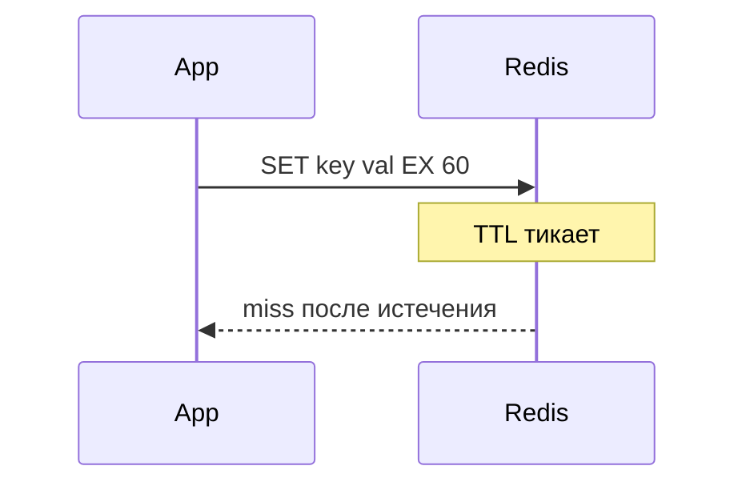

## Введение

TTL и persistence — частая пара вопросов: «протухнет ли ключ» и «что будет после рестарта».

## Раздел: TTL

`EXPIRE` / `SETEX` / TTL в командах задают время жизни ключа. По истечении ключ удаляется (лениво/активно — детали реализации). Зачем: автоинвалидация кэша, сессии, лимиты.

`TTL key` показывает оставшиеся секунды; `-1` — без TTL; `-2` — ключа нет.

## Раздел: RDB vs AOF

**RDB** — снимки на диск по расписанию: компактно, но окно потери данных между снимками.

**AOF** — журнал операций: можно настроить fsync; обычно лучше для меньшей потери, ценой объёма/IO.

На собесе: «persistence снижает риск, но не делает Redis заменой OLTP-СУБД».

## Раздел: Рестарт

Без persistence данные в RAM после kill процесса пропадут. С репликацией и sentinel/cluster картина сложнее — это middle/senior (RD07). Junior должен честно сказать: уточню конфиг `save` / `appendonly` на стенде.

## Лаба

**Цель.** Смоделировать TTL и описать риск потери при RDB-only.

**Шаги.**
1. В redis-cli (или описать): SET session:1 alice EX 60.
2. Проверьте TTL session:1.
3. Объясните, что будет через 61 секунду.
4. Сравните RDB и AOF в таблице «потеря / размер / IO».
5. Напишите фразу для собеса про рестарт без AOF.

**В группу:** партнёр выбирает RDB или AOF — вы называете главный компромисс.

**Готово, если…**
- [ ] Ставите TTL осознанно
- [ ] Отличаете RDB от AOF
- [ ] Связываете persistence с риском потери

## Схема: Жизнь ключа

## Тест

### Зачем TTL на кэше?

**Ответ:** автоматически протухать устаревшие данные

**Пояснение:** Снижает риск вечного stale без ручной очистки.

### Главный минус RDB?

**Ответ:** окно потери данных между снимками

**Пояснение:** После краша теряются изменения после последнего dump.

### AOF хранит что?

**Ответ:** журнал команд/операций

**Пояснение:** Позволяет восстановить состояние ближе к моменту сбоя.

## Шпаргалка

<h3>TTL</h3>
<pre><code>SET k v EX 60
TTL k</code></pre>
<h3>Persistence</h3>
<ul>
<li>RDB — snapshot</li>
<li>AOF — journal</li>
</ul>

## Anki

### Front: TTL -1 значит?

Back: ключ есть, срока жизни нет

### Front: RDB vs AOF

Back: снимок vs журнал операций

### Front: Почему TTL на сессии?

Back: сессия сама истечёт без ручного DELETE

## Итоги

- TTL — базовая гигиена кэша
- RDB/AOF — компромисс потери vs IO
- Persistence ≠ замена БД

## Ссылки

- [Redis persistence](https://redis.io/docs/management/persistence/)
- Learn | [Типы данных](/game/learn/rd-data-types)
- Далее: [cache-aside](/game/learn/rd-cache-aside)
