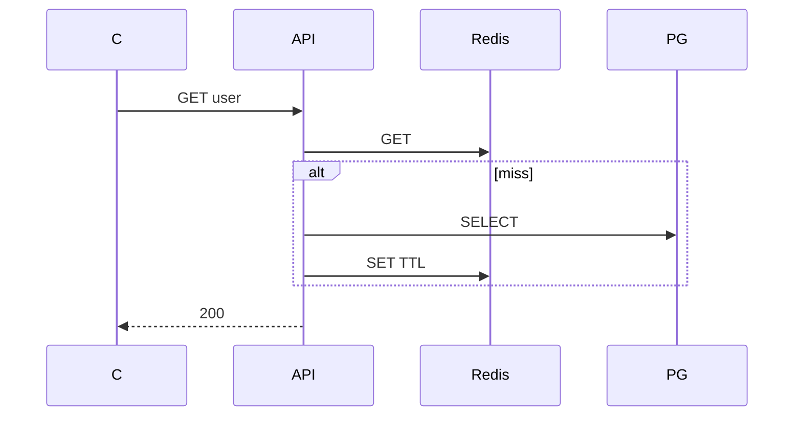

## Введение

Middle ждут не «поставим Redis», а паттерн чтения/записи и историю про устаревший кэш.

## Раздел: cache-aside

1) читаем ключ в Redis; 2) hit → отдать; 3) miss → читать БД; 4) записать в Redis с TTL; 5) отдать клиенту.

Запись в БД: обновить БД, затем удалить/обновить ключ кэша (чтобы не отдать stale).

## Раздел: Ключ

Ключ часто = сущность + id или hash параметров запроса. Стабильность ключа важнее «красоты». Версионирование ключа (`v2:`) помогает при смене формата значения.

## Раздел: Инвалидация

Сложнее записи: кто и когда сбрасывает кэш? Варианты: TTL, явный DEL при UPDATE, событие из очереди. Антипаттерн — вечный ключ без политики обновления.

См. также: [Python БД и Memcached](/game/learn/py-db-cache-memcached).

## Лаба

**Цель.** Описать cache-aside для GET /users/{id}.

**Шаги.**
1. Псевдокод hit/miss.
2. Ключ `user:{id}`.
3. Сценарий UPDATE name — что с ключом?
4. Выберите TTL (и почему не «навсегда»).
5. Назовите риск stale после записи.

**В группу:** один пишет hit-path, второй — invalidation path.

**Готово, если…**
- [ ] Рисуете hit/miss
- [ ] Связываете UPDATE с DEL
- [ ] Не путаете write-through с cache-aside

## Схема: cache-aside

## Тест

### Что делает приложение при miss?

**Ответ:** читает БД и кладёт результат в Redis

**Пояснение:** Кэш заполняется по требованию (lazy).

### Что сделать с ключом после UPDATE в БД?

**Ответ:** удалить или обновить ключ

**Пояснение:** Иначе клиент может читать stale.

### Зачем TTL при cache-aside?

**Ответ:** ограничить жизнь устаревших данных

**Пояснение:** Страховка, если забыли инвалидировать.

## Шпаргалка

<h3>cache-aside</h3>
<pre><code>get(k):
  v = redis.get(k)
  if v: return v
  v = db.get()
  redis.set(k, v, ttl)
  return v</code></pre>

## Anki

### Front: cache-aside hit

Back: значение берём из Redis без похода в БД

### Front: После UPDATE

Back: инвалидировать ключ кэша

### Front: Ключ кэша

Back: стабильный id или hash параметров

## Итоги

- Hit/miss — база middle
- Инвалидация = половина дизайна
- TTL — страховка

## Ссылки

- Learn | [PY20 кеш](/game/learn/py-db-cache-memcached)
- Learn | [TTL](/game/learn/rd-ttl-persistence)
- Далее: [Stampede и locks](/game/learn/rd-stampede-locks)
