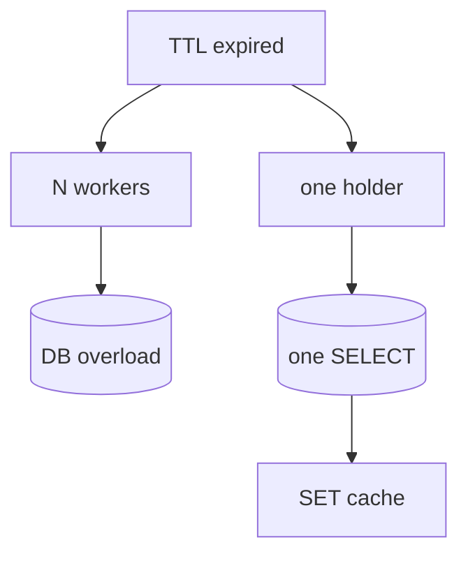

## Введение

Когда TTL истекает одновременно у многих воркеров, все бегут в БД — stampede (dogpile).

## Раздел: Проблема

Популярный ключ протух → N параллельных запросов делают один и тот же тяжёлый SELECT. БД перегружается ровно в момент «промаха».

## Раздел: Защита

**Singleflight / lock на ключ**: первый воркер берёт блокировку (SET NX EX), грузит БД, пишет кэш, отпускает; остальные ждут или отдают stale. Soft TTL / early refresh — другой приём.

## Раздел: Связь с Memcached

Та же идея в PY20 про dogpile. См. [py-db-cache-memcached](/game/learn/py-db-cache-memcached).

## Лаба

**Цель.** Смоделировать stampede на бумаге и добавить lock.

**Шаги.**
1. Нарисуйте 5 клиентов на один miss без защиты.
2. Добавьте SET key:lock NX EX 5.
3. Опишите поведение второго клиента.
4. Назовите риск долгого lock.
5. Сравните с просто увеличенным TTL.

**В группу:** кто держит lock — кто ждёт; обсудите timeout.

**Готово, если…**
- [ ] Объясняете stampede
- [ ] Знаете SET NX как lock
- [ ] Связываете с hot key

## Схема: Stampede

## Тест

### Что такое cache stampede?

**Ответ:** много одновременных загрузок одного ключа из БД после miss

**Пояснение:** Ещё называют dogpile.

### Как SET NX помогает?

**Ответ:** только один ставит lock и грузит БД

**Пояснение:** Остальные не дублируют тяжёлый запрос.

### Риск lock без TTL?

**Ответ:** вечная блокировка при падении держателя

**Пояснение:** Поэтому EX на lock обязателен.

## Шпаргалка

<h3>Lock</h3>
<pre><code>SET lock:user:1 1 NX EX 5</code></pre>
<ul><li>один грузит БД</li><li>остальные ждут / stale</li></ul>

## Anki

### Front: dogpile

Back: штампede при массовом miss одного ключа

### Front: SET NX EX

Back: взять lock с автоснятием

### Front: soft TTL

Back: обновлять кэш до жёсткого протухания

## Итоги

- Stampede = дружный miss
- Lock/singleflight лечит hot key
- TTL на lock обязателен

## Ссылки

- Learn | [cache-aside](/game/learn/rd-cache-aside)
- Learn | [PY20](/game/learn/py-db-cache-memcached)
- Далее: [pub/sub vs очередь](/game/learn/rd-pubsub-vs-queue)
