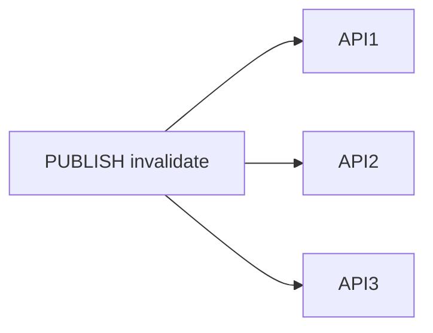

## Введение

Redis умеет PUBLISH/SUBSCRIBE, но это не замена Kafka. Middle должен провести границу.

## Раздел: Redis pub/sub

Сообщения доставляются подписчикам online. Если клиента не было — сообщение не «подождёт» в журнале (в классическом pub/sub). Подходит для сигналов, инвалидации кэша, live-уведомлений.

## Раздел: Брокер

Kafka/Rabbit хранят сообщения, дают ack, retry, DLQ, consumer groups. См. канон: [sa-sync-async-queues](/game/learn/sa-sync-async-queues).

## Раздел: Выбор

Нужен replay и гарантии доставки → брокер. Нужен лёгкий fan-out сигнала → Redis pub/sub (или Streams — отдельная тема; на junior/middle достаточно честно разделить).

## Лаба

**Цель.** Выбрать механизм для двух сценариев.

**Шаги.**
1. Инвалидация кэша на 3 инстанса API — pub/sub или Kafka?
2. Очередь писем с retry — ?
3. Обоснуйте каждый выбор в 2 предложениях.
4. Назовите риск pub/sub при рестарте подписчика.
5. Ссылку на SA10 добавьте в конспект.

**В группу:** поменяйтесь сценариями и проверьте аргументы.

**Готово, если…**
- [ ] Не путаете pub/sub с очередью
- [ ] Ссылаетесь на SA10
- [ ] Знаете про потерю offline-сообщений

## Схема: Fan-out сигнала

## Тест

### Сохраняет ли классический Redis pub/sub сообщения для offline?

**Ответ:** нет

**Пояснение:** Нужен брокер или Streams с иной семантикой.

### Когда брать Kafka вместо pub/sub?

**Ответ:** нужны replay, consumer group, долгая доставка

**Пояснение:** Событийный журнал и развязка продюсера.

### Хороший кейс pub/sub?

**Ответ:** сигнал сбросить кэш на всех нодах

**Пояснение:** Лёгкий fan-out без жёстких гарантий.

## Шпаргалка

<h3>Граница</h3>
<ul>
<li>pub/sub — сигнал online</li>
<li>брокер — хранение + retry</li>
</ul>

См. SA10 sync/async

## Anki

### Front: Redis PUBLISH

Back: отправить сообщение каналу подписчикам online

### Front: Почему не замена Kafka

Back: нет того же журнала/replay/гарантий из коробки

### Front: Кейс pub/sub

Back: invalidate cache / live signal

## Итоги

- pub/sub ≠ очередь
- Канон брокеров — SA10
- Сигналы vs бизнес-события

## Ссылки

- Learn | [SA sync/async queues](/game/learn/sa-sync-async-queues)
- Learn | [Stampede](/game/learn/rd-stampede-locks)
- Далее: [Eviction и cluster](/game/learn/rd-eviction-cluster)
