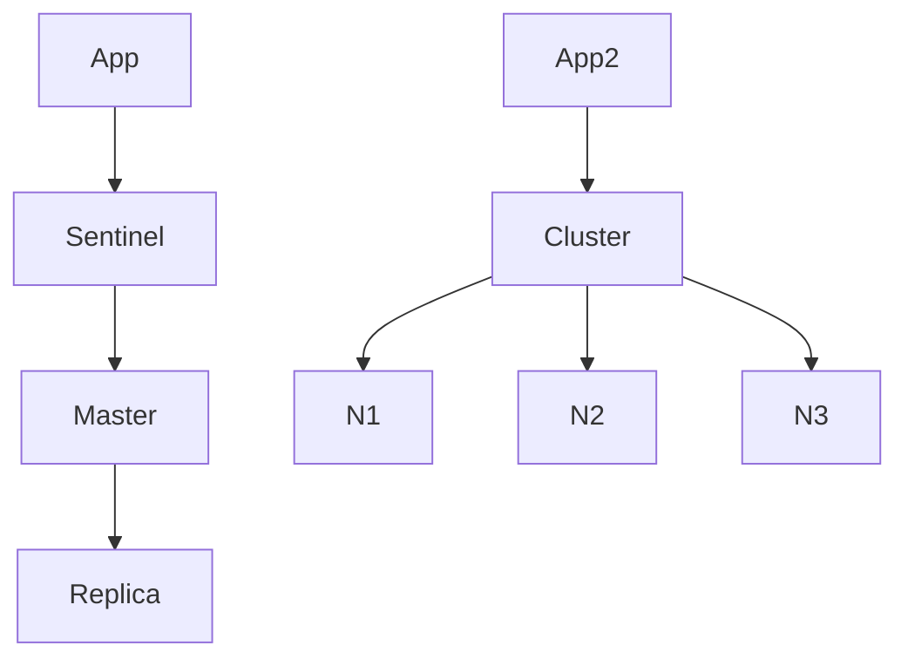

## Введение

Senior-вопросы: что будет, когда память кончилась, и чем Sentinel отличается от Cluster.

## Раздел: Eviction

При `maxmemory` Redis вытесняет ключи по политике: `noeviction` (ошибка записи), `allkeys-lru`, `volatile-lru`, `allkeys-lfu` и др. Для кэша обычно LRU/LFU; для «важных» ключей без TTL `noeviction` + мониторинг.

## Раздел: Sentinel

Мониторинг master/replica и автоматический failover. Клиенты узнают нового master. Это HA для одного логического шарда, не шардирование данных.

## Раздел: Cluster

Данные делятся по hash slots между нодами. Масштаб по данным/нагрузке. Сложность операций multi-key. На собесе: «Cluster — шарды; Sentinel — failover одного набора».

## Лаба

**Цель.** Составить таблицу выбора eviction и HA.

**Шаги.**
1. Кэш сессий — какая policy?
2. Критичный счётчик без TTL — риск allkeys-lru?
3. Нужен failover без шардов — Sentinel или Cluster?
4. Нужно 100GB данных — ?
5. Запишите один operational risk Cluster (reshard / multi-key).

**В группу:** один предлагает Cluster «на всякий случай» — второй возражает.

**Готово, если…**
- [ ] Называете 2 policy
- [ ] Отличаете Sentinel от Cluster
- [ ] Связываете eviction с типом данных

## Схема: HA варианты

## Тест

### allkeys-lru делает что?

**Ответ:** вытесняет наименее недавно использованные среди всех ключей

**Пояснение:** Когда память на пределе.

### Sentinel vs Cluster?

**Ответ:** failover репликации vs шардирование слотов

**Пояснение:** Разные задачи HA/scale.

### noeviction при полной памяти?

**Ответ:** ошибка на запись, ключи не вытесняются

**Пояснение:** Подходит не для чистого кэша.

## Шпаргалка

<h3>Eviction</h3>
<ul><li>lru/lfu — для кэша</li><li>noeviction — строгий режим</li></ul>
<h3>HA</h3>
<ul><li>Sentinel — failover</li><li>Cluster — slots</li></ul>

## Anki

### Front: maxmemory-policy

Back: что делать при нехватке RAM

### Front: Sentinel

Back: автоfailover master/replica

### Front: Cluster hash slot

Back: ключ → слот → нода

## Итоги

- Eviction — политика выживания кэша
- Sentinel ≠ Cluster
- Senior связывает конфиг с риском

## Ссылки

- [Redis Cluster spec](https://redis.io/docs/reference/cluster-spec/)
- Learn | [pub/sub](/game/learn/rd-pubsub-vs-queue)
- Далее: [Capstone Redis](/game/learn/rd-capstone)
