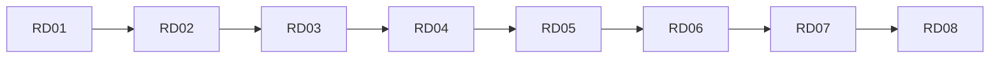

## Введение

Финальный выпуск: собрать ответы серии и проверить пробелы перед собесом.

## Раздел: Чеклист уровней

**Junior:** KV, типы, TTL/persistence, не source of truth.

**Middle:** cache-aside, stampede, pub/sub vs брокер.

**Senior:** eviction, Sentinel/Cluster обзор.

## Раздел: Redis vs PostgreSQL

PostgreSQL — схема, JOIN, транзакции, отчёты. Redis — низкая задержка, кэш, счётчики, сигналы. Гибрид нормален. См. [sql-ddl-dml-dcl](/game/learn/sql-ddl-dml-dcl).

## Раздел: Индекс slug

| Ep | slug |
|----|------|
| RD01 | rd-kv-model |
| RD02 | rd-data-types |
| RD03 | rd-ttl-persistence |
| RD04 | rd-cache-aside |
| RD05 | rd-stampede-locks |
| RD06 | rd-pubsub-vs-queue |
| RD07 | rd-eviction-cluster |
| RD08 | rd-capstone |

## Лаба

**Цель.** Пройти drill из 8 вопросов по одному на выпуск.

**Шаги.**
1. Закройте SERIES и ответьте на 8 вопросов вслух по таймеру 60с.
2. Отметьте ❌ и откройте соответствующий slug.
3. Повторите Anki слабых выпусков.
4. Сформулируйте гибрид PG+Redis для своего pet-проекта.
5. Добавьте ссылку на map-redis / PY20 в конспект.

**В группу:** парный drill: вопрос → ответ → правка.

**Готово, если…**
- [ ] Есть персональный gap-list
- [ ] Умеете сравнить Redis и PG
- [ ] Знаете индекс slug

## Схема: Трек RD

## Тест

### Когда Redis, когда PostgreSQL?

**Ответ:** кэш/lookup/сигналы vs схема/JOIN/OLTP-правда

**Пояснение:** Гибрид частый.

### Главный риск stampede?

**Ответ:**  thrashing БД на hot key miss

**Пояснение:** Лечится lock/singleflight.

### Sentinel решает какую задачу?

**Ответ:** failover репликации

**Пояснение:** Не шардирование.

## Шпаргалка

<h3>Чеклист</h3>
<ul>
<li>KV + типы + TTL</li>
<li>cache-aside + stampede</li>
<li>pub/sub ≠ Kafka</li>
<li>eviction + HA обзор</li>
</ul>

## Anki

### Front: Индекс RD01

Back: rd-kv-model

### Front: Индекс RD04

Back: rd-cache-aside

### Front: Гибрид

Back: PG пишет правду, Redis ускоряет

## Итоги

- Capstone = чеклист + drill
- Не зубрите команды — сценарии
- Связки с SQL/SA/PY обязательны

## Ссылки

- Learn | [SERIES](/game/learn)
- Learn | [SQL01](/game/learn/sql-ddl-dml-dcl)
- Learn | [PY20](/game/learn/py-db-cache-memcached)
- Learn | [SA10](/game/learn/sa-sync-async-queues)
