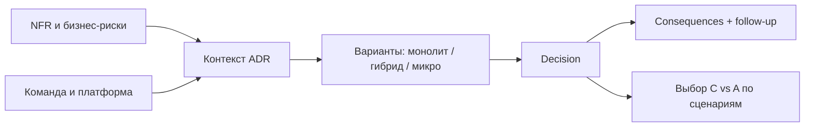

## Введение

Тема 5 на middle дала словарь: SOA, микросервисы, оркестрация, CAP, API Gateway. Senior должен **принять и зафиксировать решение**: зачем этот стиль здесь, какие жертвы, как откатить/эволюционировать. Инструмент — ADR. Ниже синтез T5 в формате собеседования.

## Раздел: ADR — зачем и как писать

**ADR (Architecture Decision Record)** — короткий документ об одном решении: контекст, варианты, выбор, последствия. Пишут не «ради бюрократии», а чтобы через полгода не гадать «почему Kafka» и не повторять спор.

Структура (достаточная на собесе и в Confluence):

1. **Title / Status:** Proposed | Accepted | Deprecated | Superseded by ADR-N.
2. **Context:** силы, ограничения, требования (NFR, команда, срок).
3. **Decision:** что решили одним абзацем.
4. **Options considered:** 2–4 альтернативы с плюсами/минусами.
5. **Consequences:** что становится легче/сложнее; риски; follow-up задачи.
6. **Links:** требования, диаграммы, тикеты.

Роль СА: часто **готовит черновик** вместе с архитектором/техлидом — формулирует контекст из бизнеса и NFR, проверяет, что варианты честные (не соломенные). Плохой ADR: «выбрали микросервисы, потому что modern». Хороший: «команда 6 человек, time-to-market 3 месяца, домен ещё плывёт → модульный монолит; границы сервисов пересмотрим при стабилизации BC».

## Раздел: Монолит vs микросервисы — критерии, не религия

**Монолит (в т.ч. модульный):** одна единица деплоя, проще транзакции и локальный рефакторинг, меньше сетевых сбоев. Риски: общая кодовая база растёт, масштабирование «всего сразу», командные конфликты в одном репо.

**Микросервисы:** независимый деплой и масштаб частей, границы команд (идеально по bounded context). Риски: распределённые транзакции, наблюдаемость, дубли данных, операционная сложность, «распределённый монолит» при неправильных границах.

**Когда монолит рационален:** ранняя стадия продукта, маленькая команда, неясные границы домена, жёсткие сроки MVP, нет зрелого DevOps/платформы.

**Когда резать сервисы:** разные циклы релизов и нагрузки, явные BC, команды могут владеть сервисом end-to-end, есть платформа (CI, трейсинг, секреты), NFR требуют независимого масштаба.

Компромисс для ответа senior: **«модульный монолит сейчас + карта будущих швов»** часто сильнее, чем преждевременное дробление. Микросервис ради резюме — антипаттерн.

Связь с интеграциями (SA19): каждый новый сервис = контракты, версии, отказные режимы. Цена разрезания — не только код.

## Раздел: CAP на прикладном примере

**CAP:** в распределённой системе при **сетевом разделении (P)** нельзя одновременно гарантировать полную **Consistency (C)** и **Availability (A)**. Выбираете сторону для конкретного сценария; «мы обеспечим CAP целиком» — красный флаг ответа.

Пример **заказ и остатки на двух складах / двух репликах:**

- Каталог читает остаток с реплики (хотим A при лаге) → возможна продажа «призрачного» stock → нужна компенсация/оверселл-политика (**упор в A + eventual C**).
- Платёж и финальное списание резерва в primary с синхронной проверкой → при падении сети к primary лучше отказать в покупке, чем продать дважды (**упор в C**, жертвуем A на запись).

Другой пример: **корзина в одном DC** vs **глобальный профиль пользователя**. Для профиля часто допустим eventual consistency между регионами; для двойного списания денег — нет.

На собесе свяжите CAP с продуктовым решением: «что хуже для бизнеса — недоступность кнопки „купить“ на 1 минуту или оверселл?» Ответ бизнеса → ваш выбор C или A в условиях P. СА фиксирует это в NFR и ADR, а не оставляет на «интуицию разработки».

## Лаба

**Цель.** Написать ADR и разобрать CAP для учебного магазина.

**Шаги.**
1. Контекст: команда 8 человек, релизы раз в 2 недели, домен заказа ещё меняется, пик Чёрной пятницы ×5 RPS.
2. Сравните 3 варианта: модульный монолит; Order+Payment сервисы; «сразу 12 микросервисов».
3. Напишите ADR-001 (Accepted): выберите вариант и 5 consequences.
4. Для чтения витрины остатков и для commit оплаты явно выберите сторону C или A при分区оне; обоснуйте бизнесом.
5. Укажите 3 метрики/сигнала, что решение пора пересматривать (например, время сборки, число конфликтов в модулях, independently scaling hotspots).
6. Свяжите follow-up: какие швы модулей станут кандидатами в сервисы.

**В группу:** защитите монолит против «микросервисы = масштабируемость» за 90 секунд.

**Готово, если…**
- [ ] ADR содержит options, decision и consequences
- [ ] CAP разобран на двух разных сценариях одного продукта
- [ ] Есть критерии пересмотра решения

## Схема: От контекста к ADR

## Тест

### Что обязательно должно быть в ADR?

**Ответ:** контекст, рассмотренные варианты, принятое решение и последствия (плюсы/минусы/риски)

**Пояснение:** без вариантов и последствий ADR превращается в приказ; без контекста — в лозунг.

### Когда модульный монолит предпочтительнее микросервисов?

**Ответ:** при небольшой команде, нестабильных границах домена и отсутствии зрелой платформы — проще поставка и транзакции

**Пояснение:** микросервисы окупаются при явных BC, независимых релизах/нагрузке и готовности к распределённой сложности.

### Как объяснить CAP на примере магазина?

**Ответ:** при сетевом сбое нельзя одновременно гарантировать строгую согласованность остатков/платежей и полную доступность записи — выбираем по бизнес-риску оверселла vs простоя

**Пояснение:** CAP — про компромисс в условиях partition; разные сценарии одного продукта могут выбрать разные стороны.

## Шпаргалка

<h3>Суть</h3>
<ul>
<li>ADR = контекст + варианты + решение + последствия</li>
<li>Монолит ≠ плохо; микросервисы ≠ всегда правильно</li>
<li>Резать по BC и командам, не по таблицам</li>
<li>CAP: при P выбираем C или A для сценария</li>
<li>Решение пересматриваем по сигналам, не по моде</li>
</ul>
<h3>Статусы ADR</h3>
<pre><code>Proposed → Accepted → Deprecated / Superseded</code></pre>

## Anki

### Front: Структура ADR?

Back: context, options, decision, consequences (+ status, links)

### Front: Главный риск преждевременных микросервисов?

Back: распределённый монолит — сетевая сложность без реальной независимости границ и команд

### Front: CAP одной фразой?

Back: при разделении сети нельзя одновременно обещать полную согласованность и полную доступность — выбираем для сценария

## Итоги

- Senior фиксирует архитектуру в ADR, а не в чате
- Монолит vs микросервисы — функция контекста команды и домена
- CAP объясняется прикладным риском, не определением из вики
- Синтез T5: стили + компромиссы + следствия для интеграций и NFR

## Ссылки

- [Топ-150 вопросов СА (Хабр)](https://habr.com/ru/articles/963708/)
- Learn | /game/learn
- Далее: [Оценка и поставка](/game/learn/sa-estimation-delivery)
