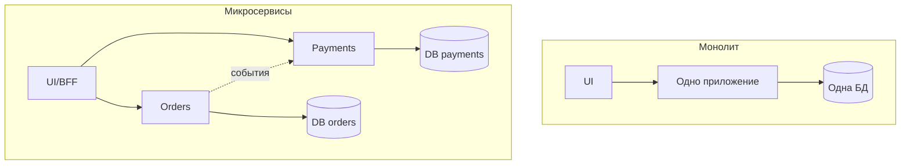

## Введение

Тема 5 на собеседовании СА начинается с картины «как устроена система». Нужно уверенно говорить про клиент-сервер, виды архитектуры, отличие SOA от микросервисов, способы нарезки сервисов и когда монолит честнее микросервисной моды. Вопросы T5.1–5.6.

## Раздел: Клиент-сервер и виды архитектуры

**Клиент-серверная архитектура** — разделение ролей: **клиент** инициирует запрос и показывает UI/результаты; **сервер** хранит данные и выполняет бизнес-логику. Пример: браузер ↔ backend API ↔ БД. Плюсы: централизация данных и правил, тонкие клиенты. Минусы: зависимость от доступности сервера, нагрузка в центре.

**Виды архитектуры (обзор для ответа «какие знаешь»):**
- монолитная;
- многослойная (layered: presentation / business / data);
- клиент-сервер / N-tier;
- SOA;
- микросервисная;
- event-driven;
- serverless / peer-to-peer (по ситуации).

На проекте отвечайте фактами: «модульный монолит на Java + отдельные worker'ы», а не идеальной схемой из учебника.

## Раздел: SOA vs микросервисы

**SOA (Service-Oriented Architecture)** — предприятие строится как набор **сервисов** с контрактами, часто вокруг **шины (ESB)** и крупных доменных сервисов, переиспользуемых многими каналами. Акцент: интеграция гетерогенного ландшафта, канонические модели, централизованное управление.

**Микросервисы** — набор **небольших** автономных сервисов, каждый со своей БД/жизненным циклом, лёгкая коммуникация (HTTP/gRPC/события), независимый деплой. Акцент: скорость команд, масштабирование частей, эволюция по доменам.

**Отличия в одной таблице:**
| | SOA | Микросервисы |
|--|-----|----------------|
| Гранулярность | чаще крупные сервисы | мельче, «одна команда — сервис» |
| Интеграция | часто ESB/тяжёлая медиация | smart endpoints, dumb pipes |
| Данные | нередко общие модели/хранилища | database per service |
| Управление | централизованные стандарты | автономные команды + платформа |

Не путать: микросервисы — *вид* сервисного подхода, но не синоним «SOA с ESB».

## Раздел: Декомпозиция и независимость микросервисов

**Способы декомпозиции:**
1. **По бизнес-возможности** (capability): «Заказы», «Биллинг», «Каталог».
2. **По subdomain / Bounded Context** (DDD): границы языка и модели.
3. **По командам (Conway)** — структура сервисов следует оргструктуре.
4. **По изменениям** — то, что меняется вместе, живёт вместе.
5. **По данным и транзакциям** — минимизация распределённых транзакций.

На практике СА участвует в workshop границ: события между контекстами, владельцы данных, анти-«Distributed Monolith».

**Независимость микросервисов** означает:
- независимый **деплой** без обязательного релиза всех сразу;
- своя **модель данных** (нет shared DB как жёсткой сцепки);
- устойчивость к недоступности соседей (таймауты, деградация);
- автономная **команда** и жизненный цикл версии API.

Независимость **не** значит «ноль взаимодействия» — значит слабая связанность через явные контракты.

## Раздел: Монолит vs микросервисы

**Монолит** — единый деплой-артефакт (часто одна БД). **Плюсы:** проще транзакции, проще локальная разработка и отладка, меньше ops-накладных. **Минусы:** сложнее масштабировать узкое место, риск большого комка связей, долгие релизы при росте команды.

**Микросервисы — плюсы:** независимое масштабирование и деплой, изоляция сбоев (при правильном дизайне), параллель команд. **Минусы:** распределённая сложность, наблюдаемость, консистентность eventual, дороже платформа.

**Когда лучше монолит:** ранняя стадия продукта, маленькая команда, домен ещё плывёт, нет сильной ops-зрелости. Модульный монолит с чёткими пакетами — частый здравый выбор перед нарезкой.

## Лаба

**Цель.** Предложить границы сервисов для «учебного маркетплейса» и аргументировать монолит vs микро.

**Шаги.**
1. Перечислите 5 capability: каталог, корзина, заказ, оплата, уведомления.
2. Для пары «заказ–оплата» опишите синхронный и событийный контракт.
3. Найдите риск distributed monolith (общий статус в одной таблице на всех).
4. Напишите 3 критерия, при которых останетесь на модульном монолите.
5. Сформулируйте «независимость» Billing: деплой, БД, деградация при падении Notify.

**В группу:** разрежьте иначе (по каналам Web/Mobile) — почему это обычно хуже, чем по домену.

**Готово, если…**
- [ ] Объясняете клиент-сервер и 4+ вида архитектуры
- [ ] Чётко отличаете SOA (ESB) от микросервисов
- [ ] Аргументируете выбор монолита без стыда

## Схема: Монолит и микросервисы

## Тест

### Чем SOA отличается от микросервисов?

**Ответ:** SOA часто крупнее сервисы и ESB-центричная интеграция; микросервисы мельче, автономный деплой и данные, лёгкие каналы связи

**Пояснение:** оба сервисные, но гранулярность, владение данными и роль шины различаются.

### В чём независимость микросервиса?

**Ответ:** может деплоиться и развиваться отдельно, со своей БД и устойчивостью к сбоям соседей через явные контракты

**Пояснение:** независимость — про слабую связанность и автономный жизненный цикл, не про изоляцию от бизнеса.

### Когда выбрать монолит?

**Ответ:** малая команда, ранний продукт, нестабильные границы домена, нет зрелой платформы эксплуатации

**Пояснение:** монолит (лучше модульный) дешевле по ops и транзакциям, пока сложность распределёнки не окупается.

## Шпаргалка

<h3>Суть</h3>
<ul>
<li>Клиент-сервер: запрос к центру логики и данных</li>
<li>SOA ≠ микросервисы (ESB и гранулярность)</li>
<li>Резать по capability / bounded context</li>
<li>Независимость = деплой + данные + деградация</li>
<li>Монолит — валидный default на старте</li>
</ul>
<h3>Антипаттерн</h3>
<pre><code>Distributed monolith:
много репозиториев + одна общая БД
+ совместный релиз всех сервисов</code></pre>

## Anki

### Front: Что такое клиент-сервер?

Back: клиент инициирует запросы; сервер обрабатывает логику и данные централизованно

### Front: Назови способы декомпозиции на микросервисы

Back: по бизнес-capability, по bounded context/DDD, по командам, по совместным изменениям, по границам данных

### Front: Плюс монолита

Back: проще транзакции, проще отладка и деплой одного артефакта; меньше распределённой сложности

## Итоги

- Виды архитектуры — словарь; ценен рассказ про *ваш* проект
- SOA и микросервисы различаются гранулярностью, данными и ролью шины
- Монолит vs микро — trade-off команды и домена, не экзамен на модность

## Ссылки

- [Топ-150 вопросов СА (Хабр)](https://habr.com/ru/articles/963708/)
- Learn | /game/learn
- Далее: [Оркестрация, CAP, Gateway](/game/learn/sa-orchestration-cap-gateway)
