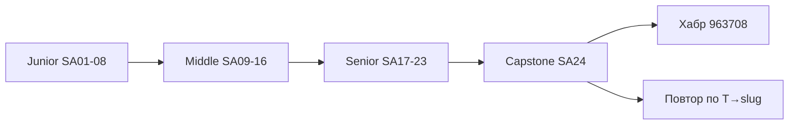

## Введение

Финальный выпуск серии System Analyst Learn: собрать траекторию Junior → Middle → Senior, пройти self-check и понять, куда возвращаться по пробелам. Полный список формулировок вопросов — в статье на Хабре; здесь — **ориентиры компетенций**, индекс выпусков и честный план до собеса.

## Раздел: Чеклисты Junior → Middle → Senior

**Как пользоваться серией.**

1. Идите по `order` 501→524 или точечно по пробелам (таблица индекса ниже).
2. Выпуск: теория → лаба → тест → Anki; лабу не пропускайте.
3. Держите открытым [Топ-150 вопросов СА](https://habr.com/ru/articles/963708/) — статьи 9to18 дают оригинальные разборы, Хабр — полноту формулировок.
4. После Middle (SA16) обязательно Senior craft → modeling → integrations → ADR (SA17–20) до drill (SA23).
5. Повторяйте Anki и свой рабочий кейс (одна система end-to-end) — сильнее зубрёжки списков.

**Чеклист Junior (SA01–SA08).**

- [ ] FR/NFR, сбор требований, базовые техники выявления
- [ ] User story, acceptance, use case на учебном уровне
- [ ] Понимает назначение ГОСТ/SRS/постановки как артефактов
- [ ] Читает и рисует простой BPMN и use case
- [ ] ER: сущности, ключи, 1:N / M:N; SQL SELECT/JOIN
- [ ] REST: методы, статусы, ресурсность на базе
- [ ] Scrum/Kanban, DoR/DoD без путаницы ролей
- [ ] Может провести мини-постановку фичи под ревью наставника

**Чеклист Middle (SA09–SA16).**

- [ ] ACID, индексы, идеи репликации/шардинга «для разговора»
- [ ] Sync/async, очереди, когда что выбирать на базовом уровне
- [ ] Идемпотентность, версии API, схемы
- [ ] SOAP/WSDL vs REST — где уместен
- [ ] ESB/webhook/gRPC/GraphQL обзорно
- [ ] Стили: монолит, SOA, микросервисы — плюсы/минусы
- [ ] CAP, gateway, оркестрация — определения с примером
- [ ] HTTP/HTTPS, authN/authZ, цепочка URL, шифрование vs хеш

**Чеклист Senior (SA17–SA23).**

- [ ] Постановка как контракт: scope, негативы, измеримые NFR, приёмка
- [ ] Traceability требование → модель → тест; стык с QA
- [ ] Воркшоп: BPMN + Sequence + ER без противоречий статусов
- [ ] Выбор интеграции под сценарий + совместимость контрактов
- [ ] ADR: монолит/микросервисы, consequences, CAP по риску бизнеса
- [ ] Декомпозиция, SP vs часы, прогноз диапазоном, поломки Scrum
- [ ] T6.2: хороший/плохой СА, junior vs senior на поведении
- [ ] Drill T1–T7: 60–90 с на ответ, сквозной кейс заказа

## Раздел: Индекс T→slug и маршрут повторения

| Тема | Фокус | Выпуски (slug) |
|------|-------|----------------|
| T1 | Требования, постановка | `sa-requirements-basics`, `sa-user-stories-use-cases`, `sa-gost-srs-artifacts`, `sa-requirements-senior-craft` |
| T2 | BPMN/UML | `sa-notations-bpmn-uml`, `sa-modeling-workshop` |
| T3 | БД и SQL | `sa-db-basics`, `sa-sql-basics`, `sa-db-advanced`, `sa-modeling-workshop` |
| T4 | Интеграции и API | `sa-rest-basics`, `sa-sync-async-queues`, `sa-rest-advanced`, `sa-soap-xml`, `sa-esb-integrations`, `sa-integration-design` |
| T5 | Архитектура | `sa-architecture-styles`, `sa-orchestration-cap-gateway`, `sa-architecture-decisions` |
| T6 | Процесс и роль | `sa-methods-scrum-kanban`, `sa-estimation-delivery`, `sa-profession-levels` |
| T7 | HTTP/security база | `sa-http-security-basics` |
| Кросс | Drill + capstone | `sa-interview-drill`, `sa-capstone-checklist` |

**Полный список вопросов:** [habr.com/ru/articles/963708/](https://habr.com/ru/articles/963708/).

**Индекс серии SA Learn (обзор).**

| Ep | slug | Фокус |
|----|------|--------|
| SA01 | sa-requirements-basics | FR/NFR, сбор |
| SA02 | sa-user-stories-use-cases | Stories, UC |
| SA03 | sa-gost-srs-artifacts | ГОСТ, SRS |
| SA04 | sa-notations-bpmn-uml | BPMN, UML |
| SA05 | sa-db-basics | БД база |
| SA06 | sa-sql-basics | SQL |
| SA07 | sa-rest-basics | REST |
| SA08 | sa-methods-scrum-kanban | Scrum/Kanban |
| SA09 | sa-db-advanced | ACID, индекс |
| SA10 | sa-sync-async-queues | Sync/async |
| SA11 | sa-rest-advanced | Идемпотентность |
| SA12 | sa-soap-xml | SOAP |
| SA13 | sa-esb-integrations | ESB и др. |
| SA14 | sa-architecture-styles | Стили |
| SA15 | sa-orchestration-cap-gateway | CAP, gateway |
| SA16 | sa-http-security-basics | HTTP, auth |
| SA17 | sa-requirements-senior-craft | Senior постановка |
| SA18 | sa-modeling-workshop | BPMN+Seq+ER |
| SA19 | sa-integration-design | Выбор интеграции |
| SA20 | sa-architecture-decisions | ADR |
| SA21 | sa-estimation-delivery | Оценка |
| SA22 | sa-profession-levels | Уровни роли |
| SA23 | sa-interview-drill | Drill T1–T7 |
| SA24 | sa-capstone-checklist | Capstone |

## Раздел: План на 4 недели до собеса

Неделя 1 — закрыть ❌ в Junior-чеклисте (T1–T3 база).  
Неделя 2 — Middle интеграции и архитектура (T4–T5, SA09–SA16).  
Неделя 3 — Senior craft + modeling + ADR (SA17–SA20) + один сквозной кейс в портфолио.  
Неделя 4 — estimation, роль, drill (SA21–SA23), ежедневные Anki, пробный собес с таймером.

Артефакт «папка доказательств»: 1 постановка, 1 тройка моделей, 1 ADR, 1 матрица трассировки, 1 разбор интеграции — даже учебные.

## Лаба

**Цель.** Личный gap-analysis и план на 4 недели.

**Шаги.**
1. Пройдите три чеклиста уровней, отметьте ❌/⚠️/✅.
2. Выберите 5 ❌ и привяжите к slug из индекса T→slug.
3. Составьте расписание: 3 выпуска/неделя или 2 лабы + Anki.
4. Напишите 60-секундный pitch: «кто я как СА и чем усиливаю команду».
5. Соберите папку доказательств (5 артефактов выше).
6. Пройдите лабу SA23 ещё раз на таймере и запишите слабые номера вопросов.

**В группу:** что важнее за месяц — закрыть все Junior-дыры или один сильный Senior-рассказ про конфликт стейкхолдеров и ADR?

**Готово, если…**
- [ ] Есть письменный gap-list и план на 4 недели
- [ ] Pitch звучит 60 секунд без шпаргалки
- [ ] Знаете slug для каждой слабой темы T1–T7

## Схема: Траектория серии СА

## Тест

### Зачем в capstone индекс T→slug?

**Ответ:** чтобы быстро вернуться к нужному выпуску Learn по пробелу в теме собеса, а не перечитывать всю серию подряд

**Пояснение:** Хабр даёт список вопросов; индекс связывает темы с конкретными материалами 9to18.

### Что должно быть в «папке доказательств» senior СА?

**Ответ:** постановка, согласованные модели, ADR, трассировка и разбор интеграции — учебные или боевые

**Пояснение:** на собесе сильнее звучит разбор артефактов, чем пересказ определений.

### Как читать серию эффективно за месяц до собеса?

**Ответ:** gap-analysis по чеклистам → приоритет ❌ → лабы и Anki → drill с таймером → повтор слабых slug

**Пояснение:** попытка «прочитать всё подряд без практики» обычно не успевает и не закрепляется.

## Шпаргалка

<h3>Суть</h3>
<ul>
<li>Junior → Middle → Senior чеклисты = self-check</li>
<li>Хабр 963708 — список вопросов; Learn — разборы</li>
<li>Индекс T→slug — навигация по пробелам</li>
<li>Папка доказательств важнее идеальной зубрёжки</li>
<li>SA23 drill — последний стресс-тест перед собесом</li>
</ul>
<h3>Маршрут</h3>
<pre><code>501-508 junior → 509-516 middle → 517-523 senior → 524 capstone</code></pre>

## Anki

### Front: Где полный список вопросов СА для серии?

Back: статья на Хабре https://habr.com/ru/articles/963708/ плюс разборы в Learn /game/learn

### Front: Что входит в senior-чеклист серии?

Back: постановка+NFR+traceability, modeling workshop, выбор интеграций, ADR/CAP, оценка/Scrum, T6.2, drill T1–T7

### Front: Как закрывать пробел по теме T4?

Back: вернуться к slug из индекса: REST/async/SOAP/ESB и sa-integration-design; сделать лабу и Anki

## Итоги

- Capstone — навигатор и честный self-check, не новый учебник
- Чеклисты уровней показывают, куда расти, индекс T→slug — куда кликать
- Связка с [Хабр 963708](https://habr.com/ru/articles/963708/) обязательна для полноты формулировок
- После gap-плана возвращайтесь к слабым выпускам и держите один сквозной кейс

## Ссылки

- [Топ-150 вопросов СА (Хабр)](https://habr.com/ru/articles/963708/)
- Learn | /game/learn
- Серия: [SERIES.md](/game/learn) · старт junior: [sa-requirements-basics](/game/learn/sa-requirements-basics)
