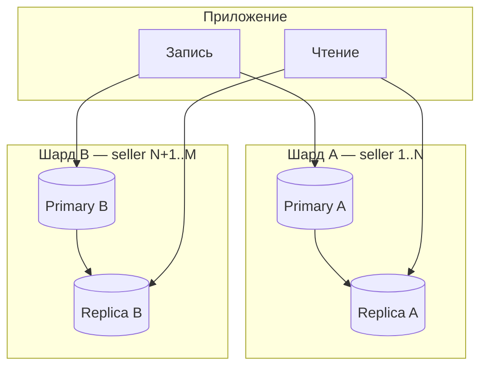

## Введение

На middle-собеседовании по БД уже недостаточно назвать 1–3 НФ. Ждут объяснения транзакций и ACID, хода проектирования схемы, приёмов оптимизации, а также когда партиции, реплики и шарды — разные инструменты, а не синонимы. Этот выпуск закрывает T3.1.13–3.1.24 оригинальными формулировками для трека аналитика.

## Раздел: Транзакция и требования ACID

**Транзакция** — логическая единица работы с данными: набор операций, который либо целиком применяется, либо целиком откатывается. Типичный пример: списание со счёта A и зачисление на счёт B — нельзя оставить систему после только первого шага.

**ACID:**
- **Atomicity (атомарность)** — «всё или ничего»: при ошибке откат всей транзакции.
- **Consistency (согласованность)** — после commit данные удовлетворяют ограничениям схемы (FK, CHECK, бизнес-инварианты, которые СУБД и приложение поддерживают).
- **Isolation (изоляция)** — параллельные транзакции не должны «ломать» друг друга сильнее, чем допускает выбранный уровень изоляции.
- **Durability (долговечность)** — зафиксированные изменения переживают сбой (WAL, флэш на диск и т.п.).

Аналитику важно: в постановке явно писать границы транзакции («в одной транзакции создать заказ и зарезервировать остаток») и допустимые аномалии чтения, если команда обсуждает уровни изоляции.

## Раздел: Процесс проектирования БД и оптимизация

**Процесс проектирования (типовой ход):**
1. Выявить сущности и связи из предметной области (требования, процессы, Use Case).
2. Построить концептуальную модель (часто ER / Class на уровне домена).
3. Логическая модель: таблицы, ключи, нормализация, ограничения.
4. Физическая модель: типы, индексы, партиции, настройки СУБД под нагрузку.
5. Проверка на сценариях: частые запросы, отчёты, рост данных, миграции.

**Способы оптимизации (что называют на собесе):**
- правильные индексы под горячие WHERE/JOIN/ORDER BY;
- нормализация vs точечная денормализация под чтение;
- партиционирование больших таблиц;
- кэш (Redis и др.) перед тяжёлыми SELECT;
- пересмотр запросов (избегать N+1, лишних JOIN);
- архивирование/TTL для «холодных» данных;
- реплики на чтение, шарды при горизонтальном росте.

Роль СА: не «тюнить PostgreSQL», а зафиксировать объёмы, SLA чтения/записи, критичные запросы и инварианты — чтобы DBA/разработка выбрали средства.

## Раздел: Партиционирование, репликация, шардирование

**Партиционирование** — разбиение одной логической таблицы на части (партиции) по правилу: диапазон дат, хэш ключа, список значений. Запросы с предикатом по ключу партиции сканируют меньше данных. Принцип: ключ партиционирования должен совпадать с типичным фильтром (часто `created_at`, `tenant_id`).

**Реплицирование** — копирование одних и тех же данных на несколько узлов. Цель: отказоустойчивость и/или масштабирование чтения. Есть синхронная и асинхронная репликация; при async возможна задержка (lag).

**Шардирование** — горизонтальное разнесение **разных** подмножеств данных по узлам (шардам) по shard key. Цель: обойти лимит одной машины по объёму и записи. Цена: кросс-шард JOIN и распределённые транзакции усложняются.

**Реплика vs шард:** реплика — копии одного набора; шард — разные куски данных. Часто комбинируют: каждый шард имеет свои реплики.

## Раздел: Маппинг, уровни абстракции, индексы

**Маппинг данных** — соответствие между представлениями: поле API ↔ колонка БД, сущность домена ↔ таблица, сообщение шины ↔ запись. В интеграциях маппинг описывают в спецификации (таблица полей, типы, обязательность, преобразования).

**Уровни абстракции данных (часто на собесе):**
- **внешний (пользовательский)** — что видит приложение/отчёт;
- **логический (концептуальный)** — сущности и связи без физического хранения;
- **внутренний (физический)** — файлы, страницы, индексы СУБД.

Отличие: при движении «вниз» растёт детализация реализации; смена физ. уровня не должна ломать логическую модель без миграции контракта.

**Индексы** — структуры для ускорения поиска по столбцам ценой места и замедления записи. На практике: уникальный индекс на email, составной на `(order_id, created_at)` под ленту событий. Аналитик фиксирует уникальность и частые фильтры в постановке — это подсказка для индексов.

## Раздел: Dirty read и когда денормализовать

**Грязное чтение (dirty read)** — транзакция A прочитала незафиксированные изменения транзакции B; если B сделает ROLLBACK, A опиралась на «несуществующие» данные. На строгих уровнях изоляции (например, Read Committed и выше в типичных СУБД) dirty read запрещён; риск проявляется при Read Uncommitted или слабых настройках.

**Денормализация** — сознательное нарушение нормальных форм (дублирование, агрегаты в строке) ради скорости чтения или упрощения запросов. **Когда уместно:** витрины и отчёты, кэш счётчиков (`likes_count`), digests для UI, digests после стабилизации OLTP-схемы. **Когда рано:** пока не ясны инварианты и частота обновлений — дубли легко рассинхронизировать. В постановке всегда пишите, кто владелец истины и как обновляется копия.

## Лаба

**Цель.** Для домена «заказы маркетплейса» спроектировать границы транзакций, ключ партиционирования и решение «реплика vs шард», плюс список индексов.

**Шаги.**
1. Опишите сценарий «оплата заказа»: какие 2–4 операции в одной транзакции, что при откате.
2. Таблица `order_events` растёт на 50M строк/год — предложите ключ партиционирования и типовой запрос, который от него выиграет.
3. Нагрузка: 90% чтение каталога, 10% запись заказов — что даст реплика, а что нет; когда подумаете о шарде по `seller_id`.
4. Найдите 3 поля для индексов и одно место, где денормализация `items_count` оправдана.
5. Сформулируйте одной фразой dirty read на примере «черновик статуса оплаты».

**В группу:** партнёр предлагает другой shard key — сравните кросс-шард сценарии «заказ покупателя по всем продавцам».

**Готово, если…**
- [ ] Объясняете ACID на примере перевода денег без шпаргалки
- [ ] Чётко отличаете реплику, шард и партицию
- [ ] Называете dirty read и уровень, где его обычно нет

## Схема: Реплика и шард рядом

## Тест

### Чем репликация отличается от шардирования?

**Ответ:** репликация копирует один и тот же набор данных; шардирование делит данные на разные узлы по ключу

**Пояснение:** реплика помогает с чтением и отказоустойчивостью; шард — с объёмом и записью, усложняя кросс-узловые запросы.

### Что такое грязное чтение?

**Ответ:** чтение незафиксированных изменений другой транзакции, которые могут откатиться

**Пояснение:** классическая аномалия слабой изоляции; на Read Committed и выше в обычных СУБД dirty read не допускается.

### Когда уместна денормализация?

**Ответ:** когда выигрыш по чтению/простоте запросов важнее стоимости синхронизации копий

**Пояснение:** типично витрины, счётчики, кэш полей UI при ясном владельце истины; не вместо проектирования OLTP.

## Шпаргалка

<h3>Суть</h3>
<ul>
<li>Транзакция = атомарная единица; ACID — свойства надёжной СУБД</li>
<li>Партиция — куски одной таблицы; реплика — копии; шард — разные данные</li>
<li>Индекс ускоряет чтение, замедляет запись</li>
<li>Dirty read — чтение незакоммиченного</li>
<li>Денормализация — осознанный дубль под нагрузку чтения</li>
</ul>
<h3>Памятка аналитику</h3>
<pre><code>В постановке: граница транзакции, объёмы, SLA,
ключ партиции/шарда, уникальность → индексы,
владелец поля при денормализации</code></pre>

## Anki

### Front: Расшифруй ACID

Back: Atomicity, Consistency, Isolation, Durability — атомарность, согласованность, изоляция, долговечность

### Front: Реплика vs шард одной фразой

Back: Реплика — копии одних данных; шард — разные подмножества на разных узлах

### Front: Что такое dirty read?

Back: Транзакция прочитала чужие незафиксированные изменения, которые потом могут исчезнуть при ROLLBACK

## Итоги

- ACID и границы транзакций — must-have для middle СА
- Партиция, реплика, шард решают разные проблемы масштаба
- Индексы, маппинг и точечная денормализация — часть постановки, не «магия DBA»

## Ссылки

- [Топ-150 вопросов СА (Хабр)](https://habr.com/ru/articles/963708/)
- Learn | /game/learn
- Далее: [Синхронность, async и очереди](/game/learn/sa-sync-async-queues)
