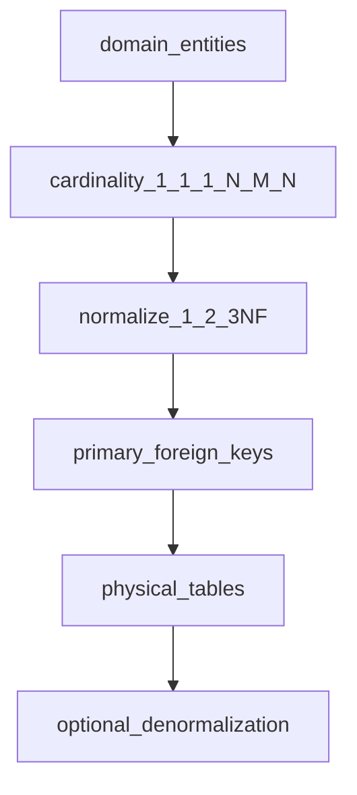

## Введение

Системного аналитика на junior-собесе проверяют на понимание данных: что такое БД, зачем нормализация и как моделировать связи. Выпуск T3.1.1–3.1.12 даёт ответы без углубления в администрирование — ровно тот уровень, который ждут от СА.

## Раздел: БД, СУБД, типы и выбор реляционной / NoSQL

**База данных (БД)** — организованное хранилище данных с правилами доступа и целостности. **СУБД** — программная система, которая управляет БД: хранение, запросы, транзакции, права, резервное копирование (PostgreSQL, MySQL, MongoDB, Redis и т.д.).

**Типы БД / моделей данных (обзор):**
- **Реляционные** — таблицы, строки, столбцы, SQL, ключи, JOIN;
- **Документные** — JSON/BSON-документы (MongoDB);
- **Ключ-значение** — быстрый доступ по ключу (Redis);
- **Колоночные** — аналитика по столбцам;
- **Графовые** — узлы и рёбра (связи «как в соцсети»);
- **Поисковые движки** — полнотекст (Elasticsearch) как отдельный класс хранилищ.

**Почему реляционные так популярны:** зрелая модель целостности (PK/FK), мощный декларативный SQL, транзакции ACID в классических СУБД, предсказуемые схемы для бизнес-учёта, отчётности и строгих инвариантов. Для СА важно: реляционка хорошо ложится на нормализованные предметные области с чёткими связями.

**Задачи, где часто смотрят NoSQL:** гибкая/меняющаяся схема документов; очень высокий write/read по ключу; графовые рекомендации; кэш и сессии; большие полуструктурированные логи. Не «NoSQL вместо SQL всегда», а под паттерн доступа и требования консистентности.

**Реляционные vs нереляционные:**
- схема: жёсткая заранее vs гибкая/неявная;
- связи: JOIN и FK vs встраивание/ссылки/отдельные коллекции;
- транзакции: сильная сторона классических RDBMS vs часто ограниченная/иная модель;
- масштабирование: вертикаль + реплики/шарды vs изначально горизонтальные паттерны у многих NoSQL;
- запросы: SQL-универсальность vs API под тип хранилища.

## Раздел: Нормализация 1–3NF и введение в денормализацию

**Нормализация** — проектирование схемы так, чтобы уменьшить избыточность и аномалии обновления.

- **1NF:** атомарные значения в ячейках, нет повторяющихся групп в виде «списка в поле»; каждая строка уникально идентифицируема.
- **2NF:** есть 1NF + нет частичной зависимости от составного ключа (неключевые атрибуты зависят от *всего* ключа).
- **3NF:** есть 2NF + нет транзитивных зависимостей (неключевой атрибут не зависит от другого неключевого). Классика: город не хранить и в заказе, и отдельно от справочника, если город определяется пунктом выдачи — выносят в справочник.

На собесе приведите пример: таблица заказов с «телефон клиента» дублируется → при смене телефона правят много строк (аномалия). Вынос клиента в отдельную сущность с PK решает это.

**Денормализация** — осознанное введение избыточности ради чтения/отчётности/производительности (кэш поля, агрегаты, материализованные витрины). Это не «ошибка junior», а trade-off: быстрее читать, сложнее согласованно обновлять. Аналитик фиксирует, *почему* избыточность нужна и кто отвечает за консистентность.

## Раздел: Типы связей, M:N и первичный ключ

**Типы связей:**
- **1:1** — паспорт ↔ человек (редко, часто для разделения чувствительных данных);
- **1:N** — клиент → заказы;
- **M:N** — заказ ↔ товары, студент ↔ курсы.

**M:N** в реляционной модели реализуют **связующей таблицей** (order_items): составной или суррогатный ключ + FK на обе стороны + атрибуты связи (количество, цена на момент покупки).

**Первичный ключ (PK)** — атрибут или набор атрибутов, уникально идентифицирующий строку, не NULL. Бывает **натуральный** (ИНН — осторожно с бизнес-сменой) и **суррогатный** (id serial/uuid). Внешний ключ (FK) ссылается на PK/unique другой таблицы и поддерживает ссылочную целостность.

Для СА: сначала сущности и связи в предметной области, потом ключи и кардинальность, затем уже физические типы столбцов.

## Лаба

**Цель.** Спроектировать мини-схему интернет-магазина до 3NF и показать одну осознанную денормализацию.

**Шаги.**
1. Выделите сущности: Customer, Order, Product, Category; проставьте связи и кардинальность.
2. Разложите M:N Order–Product через order_items с полями qty и price_at_purchase.
3. Проверьте 1–3NF: уберите телефон клиента из строки заказа в сущность клиента.
4. Добавьте денормализованное поле orders_count у клиента и запишите риск рассинхрона.

**В группу:** коллега ищет аномалии обновления в вашей «почти нормальной» схеме.

**Готово, если…**
- [ ] Объясняете БД vs СУБД и зачем реляционные модели
- [ ] Даёте определения 1NF/2NF/3NF на примере
- [ ] Показываете реализацию M:N и смысл PK

## Схема: От предметной области к таблицам

## Тест

### Чем СУБД отличается от базы данных?

**Ответ:** БД — сами данные и их организация; СУБД — ПО, которое ими управляет

**Пояснение:** файл с таблицами — ещё не вся история; PostgreSQL как СУБД даёт запросы, права, транзакции.

### Зачем связующая таблица при M:N?

**Ответ:** чтобы хранить пары связанных ключей и атрибуты связи без дублирования списков

**Пояснение:** нельзя аккуратно положить «много товаров» в строку заказа и «много заказов» в товар одновременно без отдельной сущности связи.

### Что даёт переход к 3NF?

**Ответ:** убирает транзитивные зависимости и снижает аномалии обновления

**Пояснение:** неключевые данные не должны зависеть друг от друга через «цепочку»; справочники выносят отдельно.

## Шпаргалка

<h3>Суть</h3>
<ul>
<li>БД = данные; СУБД = система управления</li>
<li>Реляционные сильны схемой, SQL, целостностью, транзакциями</li>
<li>NoSQL — под конкретный паттерн доступа и гибкость</li>
<li>1NF атомарность → 2NF полный ключ → 3NF без транзитивностей</li>
<li>M:N → link-таблица; PK уникально идентифицирует строку</li>
</ul>
<h3>Кардинальность</h3>
<pre><code>1:1  редко / разделение данных
1:N  самый частый кейс
M:N  через связующую сущность
</code></pre>

## Anki

### Front: Что такое 3NF простыми словами?

Back: Таблица в 2NF и без транзитивных зависимостей: неключевые атрибуты зависят только от ключа, не друг от друга

### Front: Как реализовать связь многие-ко-многим?

Back: Отдельная связующая таблица с внешними ключами на обе сущности и атрибутами связи

### Front: Когда оправдана денормализация?

Back: Когда осознанно жертвуем нормальной формой ради скорости чтения/отчётности и принимаем сложность обновлений

## Итоги

- СА обязан говорить на языке сущностей, ключей и кардинальности
- Нормализация уменьшает аномалии; денормализация — осознанный trade-off
- Реляционные и NoSQL выбирают по задаче, а не по моде
- M:N почти всегда = связующая таблица с атрибутами факта связи

## Ссылки

- [Топ-150 вопросов СА на Хабре](https://habr.com/ru/articles/963708/)
- Learn | /game/learn
