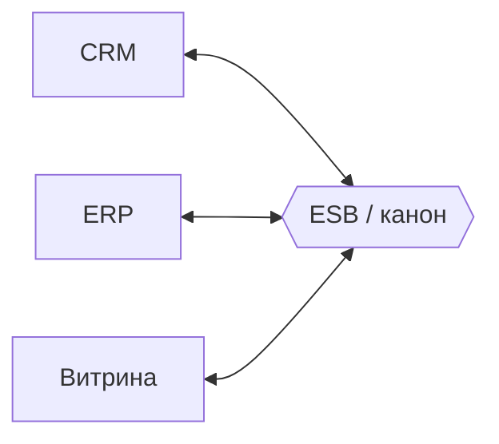

## Введение

После REST/SOAP/очередей на middle ждут «ландшафт интеграций»: что такое ESB, чем шина не очередь и не ETL, что будет, если на шине появились новые обязательные поля, и когда брать GraphQL, WebSocket, gRPC, webhook или файлы. Вопросы T4.4.6–4.4.9 и T4.5.1–4.5.8.

## Раздел: Корпоративная шина, очередь и ETL

**Корпоративная шина (ESB, Enterprise Service Bus)** — посредник между множеством систем: маршрутизация, преобразование форматов (медиация), оркестрация вызовов, единая точка политик (логирование, безопасность). Системы подключаются к шине, а не каждая к каждой («звезда» вместо полной сетки связей).

**Шина vs очередь:**
- **очередь/брокер** — транспорт сообщений (доставка, буфер, pub/sub);
- **шина** — интеграционная платформа *поверх* транспорта: маппинг, каноническая модель, правила маршрутизации, адаптеры к протоколам. Очередь может быть частью ESB, но сама по себе ESB не является.

**Шина vs ETL:**
- **ETL** (Extract–Transform–Load) — пакетная выгрузка/преобразование/загрузка данных, часто в хранилище/DWH, по расписанию или батчам;
- **ESB** — операционный обмен сообщениями/вызовами near real-time между бизнес-приложениями. ETL не заменяет онлайн-интеграцию заказа; ESB плохо заменяет тяжёлые ночные витрины.

**Новые обязательные поля в одном веб-сервисе на шине:** меняется контракт этого сервиса. На канонической модели шины нужно:
1. расширить схему (XSD/JSON) и версию контракта;
2. обновить маппинги publisher → canonical → consumer;
3. потребители, которым поля не нужны, могут игнорировать (если в каноне optional) — но **обязательность у провайдера** заставляет всех, кто зовёт этот сервис напрямую, начать передавать поля;
4. через шину часто делают **адаптер**: старые клиенты шлют старый формат, шина обогащает дефолтами/справочником или режет вызов до обновления. Без версии и переходного периода интеграция «упадёт» на валидации.

## Раздел: GraphQL и WebSocket

**GraphQL** — язык запросов к API: клиент описывает нужное дерево полей, один endpoint (часто `POST /graphql`), схема типов на сервере.

**Когда применяют:** много клиентов с разными потребностями в полях (web/mobile), проблема over/under-fetching REST, агрегация BFF. **Плюсы относительно REST:** точный набор полей, меньше round-trip для сложных экранов, строгая схема, интроспекция. Цена: сложнее кэш на HTTP-уровне, нужна защита от тяжёлых запросов (depth/complexity), другая модель авторизации полей.

**WebSocket** — двусторонний канал поверх TCP после HTTP-handshake. Когда: чаты, онлайн-статусы, котировки, совместное редактирование, push без постоянного polling. Не заменяет REST для обычного CRUD; дополняет real-time канал.

## Раздел: gRPC, webhook, файловый обмен

**gRPC** — RPC-фреймворк на HTTP/2 + Protobuf. Когда: внутренние низколатентные сервисы, стриминг, строгие контракты `.proto`, полиглотные клиенты. Меньше удобен как публичный API для браузера без gRPC-Web/прокси.

**Webhook** — «обратный» HTTP: ваша система подписывается, провайдер сам делает `POST` на ваш URL при событии (оплата прошла, статус доставки).

**Плюсы webhook:** near real-time без polling, простота для провайдера событий, слабая связанность по расписанию. **Минусы:** нужен публичный HTTPS-endpoint, ретраи и идемпотентность, проверка подписи, проблемы недоступности вашего URL, сложнее отладка, чем cron-опрос.

**Файловый обмен** — системы кладут/забирают файлы (CSV, XML, JSON) с SFTP/бакета по расписанию.

**Плюсы:** простота для легаси и бухгалтерии, крупные объёмы батчем, понятный аудит файлов. **Минусы:** задержка (не online), сложные согласования формата и кодировок, идемпотентность загрузок, мониторинг «файл не пришёл», слабая интерактивность ошибок (отложенный reject).

## Лаба

**Цель.** Выбрать стиль интеграции для трёх кейсов и описать влияние новых обязательных полей на шине.

**Шаги.**
1. Кейс A: мобильному экрану нужно 5 из 40 полей профиля + вложенные заказы — GraphQL или REST и почему.
2. Кейс B: платёжный провайдер уведомляет об успехе — webhook vs polling раз в минуту.
3. Кейс C: ночная сверка 2M проводок в DWH — файл/ETL vs ESB.
4. На шине у сервиса «Клиенты» добавили обязательные `inn` и `kpp`: напишите план версий и адаптера на 2 спринта.
5. Сформулируйте, когда возьмёте gRPC между Order и Billing внутри кластера.

**В группу:** сравните каноническую модель vs point-to-point маппинг при 6 системах.

**Готово, если…**
- [ ] Отличаете ESB от брокера и от ETL
- [ ] Объясняете последствия новых required-полей на шине
- [ ] Подбираете GraphQL/WS/gRPC/webhook/файл под задачу

## Схема: Шина между системами

## Тест

### Чем ESB отличается от очереди сообщений?

**Ответ:** очередь — транспорт доставки; ESB — интеграционная платформа с маршрутизацией, трансформацией и адаптерами

**Пояснение:** брокер может входить в состав ESB, но сам по себе не даёт каноническую модель и медиацию.

### Плюс GraphQL относительно REST?

**Ответ:** клиент запрашивает ровно нужные поля и снижает over/under-fetching

**Пояснение:** удобно для разных UI; взамен сложнее кэширование и контроль тяжёлых запросов.

### Минус webhook?

**Ответ:** нужен доступный HTTPS-endpoint, обработка ретраев/дублей и проверка подлинности вызовов

**Пояснение:** при падении вашего URL события копятся/теряются по политике провайдера — нужен мониторинг и идемпотентность.

## Шпаргалка

<h3>Суть</h3>
<ul>
<li>ESB — посредник интеграций; очередь — доставка; ETL — батч в хранилища</li>
<li>Новые required на шине = версия + маппинг + адаптер/дефолты</li>
<li>GraphQL — гибкий запрос полей; WebSocket — двусторонний real-time</li>
<li>gRPC — быстрый внутренний RPC; webhook — push-событие HTTP</li>
<li>Файлы — простые батчи, плохой online</li>
</ul>
<h3>Выбор за 10 секунд</h3>
<pre><code>Много разных UI-полей → GraphQL/BFF
Мгновенный push в UI → WebSocket
Внутренний low-latency → gRPC
Событие от вендора → webhook
Ночной объём в DWH → файл/ETL
Много систем + канон → ESB</code></pre>

## Anki

### Front: Шина vs ETL

Back: шина — операционный обмен между приложениями; ETL — пакетная выгрузка/трансформация/загрузка данных, часто в DWH

### Front: Когда WebSocket?

Back: когда нужен постоянный двусторонний канал: чат, котировки, live-статусы без частого polling

### Front: Плюсы файлового обмена

Back: просто для легаси, удобен для больших батчей и аудита файлов; минус — задержка и хрупкость форматов

## Итоги

- ESB, очередь и ETL — разные слои задач, не взаимозаменяемые ярлыки
- Смена обязательных полей на шине — это change management контракта
- GraphQL, gRPC, webhook, файлы выбирают по latency, объёму и стороне инициативы

## Ссылки

- [Топ-150 вопросов СА (Хабр)](https://habr.com/ru/articles/963708/)
- Learn | /game/learn
- Далее: [Стили архитектуры: SOA и микросервисы](/game/learn/sa-architecture-styles)
