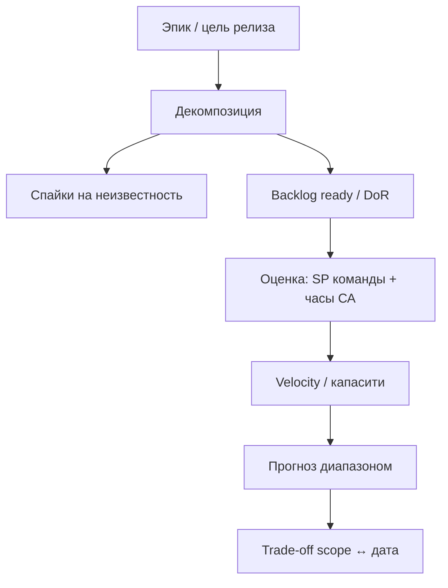

## Введение

В SA08 вы трогали методологии и DoR/DoD. Senior-вопросы T6.1.5–6.1.14 копают глубже: как резать работу, чем SP отличается от часов, как аналитик влияет на прогноз поставки и почему «у нас Scrum» часто не спасает сроки. Здесь — рабочие ответы без лозунгов.

## Раздел: Декомпозиция и оценка аналитика

**Декомпозиция** — разбиение эпика/фичи на куски, которые можно понять, оценить и поставить инкрементом. Senior режет не только «по экранам», но по **ценности и риску**: сначала тонкий сквозной путь (skeleton), потом ветки, потом полировка.

Практичный порядок:

1. Цель и границы (что *не* входит в релиз N).
2. Сквозной happy path end-to-end (заказ создаётся и оплачивается «в ноль»).
3. Критичные негативы (отказ оплаты, нет остатка).
4. Интеграции и NFR (идемпотентность, аудит, perf-smoke).
5. Отчётность/админка — часто позже, если не блокер денег.

Размер куска для команды: «можно закончить и проверить за спринт или меньше», с ясной приёмкой. Слишком крупные — скрытые зависимости; слишком мелкие — шум и потеря смысла.

**Где оценивает аналитик.** СА редко «даёт часы разработки вместо команды», но обязан:

- оценить **свою** работу (сбор, модели, согласования, правки);
- помочь команде увидеть объём через ясность scope и рисков («неизвестно поведение банка» = буфер/спайк);
- не обещать бизнесу дату в одиночку — только совместно с Dev/QA/PO после DoR;
- фиксировать допущения оценки (что считали известным).

Фраза на собесе: «Я оцениваю аналитику и качество входных данных для оценки команды; дату релиза защищаем вместе после декомпозиции и рисков».

## Раздел: Часы vs Story Points — зачем два языка

**Часы (или человеко-дни)** — абсолютная оценка трудозатрат. Удобны заказчику и для фиксированных контрактов; плохо переносят различия в скорости людей и скрытую неопределённость. Соблазн: суммировать часы в «гарантированный» дедлайн.

**Story Points (SP)** — относительная оценка сложности/объёма относительно эталона команды. Входят неопределённость, объём, риск (в здоровых командах). Нужны для **прогноза по velocity**, не для бухгалтерии. Переводить «1 SP = 4 часа» официально — уничтожить смысл SP.

Когда что использовать:

| Контекст | Инструмент | Комментарий |
|----------|------------|-------------|
| Внутренний спринт, стабильная команда | SP + velocity | Прогноз диапазоном |
| Фикс. контракт / внешний аутсорс | Часы/дни с буфером риска | Прозрачность для договора |
| Спайк/неизвестность | Time-box в часах | Исследование, не feature-оценка |
| Отчёт «сколько стоит аналитика» | Часы СА | Отдельно от SP разработки |

Senior-ошибка: обещать дату по сумме SP без velocity и без буфера на интеграции. Вторая ошибка: менять SP задачи после старта, чтобы «влезло в спринт».

## Раздел: Где ломается Scrum и что делает СА

Типичные поломки (звучат на собесе как «опыт», не нытьё):

1. **Нет DoR** — в спринт тащат сырые хотелки; аналитик не успел снять неоднозначность.
2. **Спринт = водопад двух недель** — анализ → вся разработка → тест в последний день; нет инкремента.
3. **PO отсутствует / вечный proxy** — приоритеты скачут, scope creep без trade-off.
4. **Velocity как KPI давления** — команда раздувает SP; прогноз врёт.
5. **Игнорируют зависимости** — смежные команды и вендоры вне Scrum-ритуала.
6. **Ceremony без цели** — дейли без блокеров, ретро без изменений.
7. **«Scrum», но меняют состав и процесс каждый месяц** — нет статистики для прогноза.
8. **QA вне команды** — приёмка и баги вылетают за границы спринта.

Что делает senior СА, когда Scrum «не работает»:

- вернуть DoR/DoD в явном виде и не пускать в спринт без приёмки;
- вынести discovery/спайки отдельно от commitment delivery;
- визуализировать внешние зависимости на доске;
- предложить Kanban для потока поддержки/багов рядом со Scrum feature-команды;
- говорить бизнесу языком риска: «можем дату X с scope A или дату Y с scope A+B».

Scrum — каркас инспекции и адаптации. Если нет прозрачного backlog, владельца ценности и стабильной команды, «больше митингов» не лечит.

## Лаба

**Цель.** Разложить фичу «возврат оплаты» в поставку и дать прогноз честно.

**Шаги.**
1. Разбейте на 6–8 элементов backlog (stories/tasks), отметьте зависимости.
2. Отметьте 2 пункта, которые требуют спайка (неизвестность банка/бухгалтерии).
3. Оцените работу СА в часах; разработку — в относительных SP (эталон = простой CRUD).
4. Предположите velocity 20 SP/спринт — дайте прогноз диапазоном (optimistic/likely/pessimistic) с допущениями.
5. Выпишите 3 способа, как «Scrum сломается» на этой фиче, и ваш контрмеры.
6. Сформулируйте trade-off для PO: урезанный scope к дате vs полный scope позже.

**В группу:** партнёр переводит SP в часы для отчёта директору — объясните, какой отчёт дать вместо этого.

**Готово, если…**
- [ ] Есть декомпозиция с зависимостями и спайками
- [ ] Часы и SP не смешаны в одну «магическую» дату
- [ ] Названы риски процесса и ответ аналитика

## Схема: От эпика к прогнозу

## Тест

### Чем Story Points отличаются от часов?

**Ответ:** SP — относительная оценка сложности для прогноза по velocity; часы — абсолютные трудозатраты, удобные для контрактов и учёта

**Пояснение:** жёсткий перевод SP в часы обесценивает относительность и маскирует неопределённость.

### Что оценивает системный аналитик в поставке?

**Ответ:** свою аналитическую работу и качество входных данных/рисков для оценки команды; дату релиза — только совместно

**Пояснение:** СА не подменяет собой оценку разработки, но без его декомпозиции и допущений прогноз команды слепой.

### Назовите типичный провал Scrum и ответ СА.

**Ответ:** например, нет DoR — сырые задачи в спринте; СА возвращает критерии готовности и не пропускает неоднозначность в commitment

**Пояснение:** ритуалы без прозрачного backlog и владельца ценности не создают предсказуемость.

## Шпаргалка

<h3>Суть</h3>
<ul>
<li>Резать по ценности и риску, не только по экранам</li>
<li>Сначала skeleton E2E, потом ветки и отчёты</li>
<li>SP для velocity; часы для контракта и работы СА</li>
<li>Не обещать дату в одиночку</li>
<li>Сломанный Scrum лечат DoR, зависимости, trade-off scope</li>
</ul>
<h3>Формула честного ответа бизнесу</h3>
<pre><code>Дата X + scope A  |  Дата Y + scope A+B
Допущения: …  Риски: …</code></pre>

## Anki

### Front: Порядок декомпозиции фичи?

Back: границы → E2E happy path → критичные негативы → интеграции/NFR → вторичные части (отчёты и т.п.)

### Front: Можно ли официально считать 1 SP = N часов?

Back: нет — это ломает смысл относительной оценки; для часов ведите отдельный учёт/контракт

### Front: Что делать, если Scrum формальный?

Back: вернуть DoR/DoD, вынести discovery, показать внешние зависимости, говорить trade-off scope↔дата

## Итоги

- Оценка начинается с декомпозиции и явных допущений
- Часы и SP решают разные задачи — не смешивать
- Аналитик влияет на прогноз через ясность и риски, не через «магическую дату»
- Scrum ломается на сыром backlog, давлении velocity и игноре зависимостей — это зона влияния senior СА (T6.1)

## Ссылки

- [Топ-150 вопросов СА (Хабр)](https://habr.com/ru/articles/963708/)
- Learn | /game/learn
- Далее: [Уровни профессии СА](/game/learn/sa-profession-levels)
