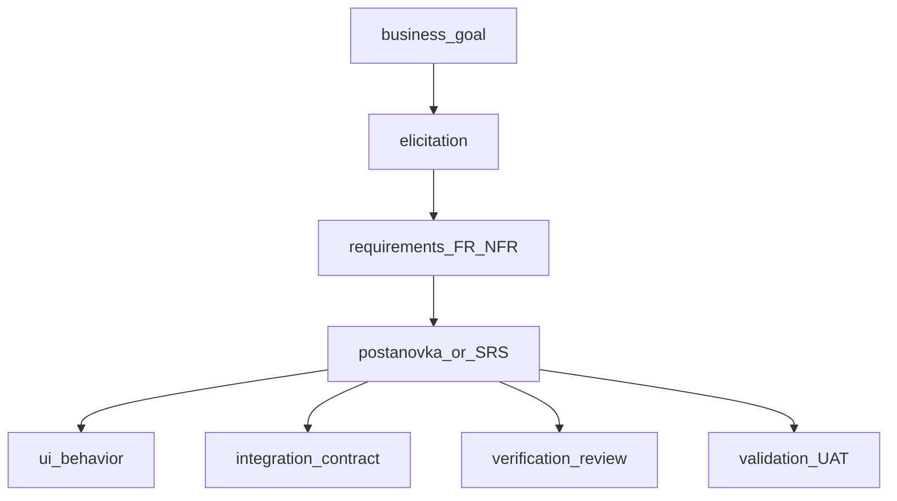

## Введение

В корпоративных и госпроектах junior СА спрашивают про ГОСТ, структуру постановки и SRS, а также чем verification отличается от validation. Выпуск T1.13–1.22 даёт рабочие ответы: что писать, для кого и как проверить качество требований.

## Раздел: ГОСТ 19 vs 34 и критерии хороших требований

**ГОСТ 19** (ЕСПД) — стандарты на **программную документацию**: спецификации программ, описания применения, ведомости и т.п. Исторически сильнее про оформление документов на ПО.

**ГОСТ 34** — комплекс стандартов на **автоматизированные системы** (АС): стадии создания, ТЗ на АС (34.602), виды обеспечения, испытания. В РФ часто именно 34-й ряд ждут в тендерах и на собесе для «классической» постановки.

Коротко для ответа: 19 — про документы на программы; 34 — про создание автоматизированной системы и комплект документов вокруг неё (включая ТЗ). На практике команды берут структуру разделов как каркас и адаптируют под Agile, не копируя бюрократию слепо.

**Критерии хороших требований** (удобный список):
- **Полнота** — нет дыр по сценариям и исключениям в заявленном scope;
- **Непротиворечивость** — требования не конфликтуют друг с другом;
- **Однозначность** — одна трактовка у аналитика, разработки и QA;
- **Проверяемость** — можно придумать тест/метрику;
- **Трассируемость** — связь с целью, story, тестом, изменением;
- **Атомарность** — одно требование ≈ одно утверждение;
- **Необходимость** — без «золочения» вне цели;
- **Выполнимость** — реально при ограничениях срока/бюджета/технологий.

Плохие формулировки: «быстро», «удобно», «как в Excel», «и т.д.» без расшифровки.

## Раздел: Артефакты аналитика, постановка, UI и интеграции, SRS

**Типовые артефакты СА и потребители:**
- видение/цели, CJM — бизнес и PO;
- требования (FR/NFR), постановка, SRS — разработка, QA, архитектура;
- BPMN/UML, ER, контракты API — разработка и интеграции;
- матрица трассировки — QA и управление изменениями;
- протоколы встреч, ADR (по желанию) — команда и стейкхолдеры.

**Шаблон постановки задачи** (минимум junior-уровня):
1. Контекст и цель (зачем бизнесу).
2. Роли и права.
3. Пользовательские сценарии / stories + AC.
4. Бизнес-правила и статусы сущностей.
5. Данные: поля, валидации, источники.
6. UI: экраны/состояния (или ссылка на макеты) — поля, кнопки, пустые/ошибочные состояния.
7. Интеграции: системы, метод обмена, частота, ответственность за ошибку, идемпотентность на уровне «ожидание».
8. NFR: безопасность, производительность, аудит.
9. Ограничения, out of scope, критерии приёмки релиза.
10. Вопросы и открытые риски.

**Описание UI:** не «нарисовать пиксель», а поведение — навигация, обязательность полей, маски, сообщения, доступность ролей, адаптив при необходимости.

**Описание интеграции:** кто инициатор, синхрон/асинхрон, формат, код ошибок, повторные запросы, мониторинг, что видит пользователь при сбое внешней системы.

**SRS (Software Requirements Specification)** — сводная спецификация требований к ПО: введение, общее описание, детальные FR/NFR, интерфейсы, данные, ограничения, приложения. SRS может жить как документ или как структурированный набор артефактов в Confluence/Jira; важно содержание и согласованность, а не «файл ради файла».

## Раздел: Verification vs validation для аналитика

**Verification** — «делаем ли продукт правильно?»: требования полны и согласованы, дизайн соответствует требованиям, реализация соответствует спецификации (ревью, трассировка, статические проверки).

**Validation** — «делаем ли правильный продукт?»: решение закрывает потребность стейкхолдера (демо, UAT, проверка ценности на реальных сценариях).

Аналитик участвует в обоих: verification — качество формулировок и трассировка; validation — уточнение целей, UAT-сценарии, обратная связь после демо. Можно идеально «провести verification» по неверной постановке и провалить validation.

## Лаба

**Цель.** Собрать каркас постановки и проверить требования по критериям качества.

**Шаги.**
1. Возьмите фичу «уведомление о статусе заказа» и заполните шаблон постановки (10 пунктов выше) тезисами.
2. Выпишите 5 требований и оцените каждое: однозначность, проверяемость, трассируемость.
3. Добавьте блок интеграции с email/SMS-шлюзом: ошибка доставки, ретраи, что видит пользователь.
4. Сформулируйте по одному примеру verification и validation для этой фичи.

**В группу:** сосед ищет противоречия и «дырявые» формулировки в вашей постановке за 5 минут.

**Готово, если…**
- [ ] Объясняете отличие ГОСТ 19 и 34 без шпаргалки
- [ ] Перечисляете критерии хороших требований и потребителей артефактов
- [ ] Различаете verification и validation на своём примере

## Схема: От цели к SRS и проверкам

## Тест

### Чем ГОСТ 34 ближе к работе СА, чем ГОСТ 19?

**Ответ:** 34 описывает создание автоматизированных систем и ТЗ на АС; 19 — в большей степени программную документацию

**Пояснение:** на собесе достаточно связать 34 с стадиями/ТЗ АС, а 19 — с комплектом документов на ПО.

### Какой критерий ломается у требования «система должна быть удобной»?

**Ответ:** однозначность и проверяемость

**Пояснение:** без метрик и сценариев разные люди по-разному поймут «удобно»; нужно конкретизировать.

### Verification или validation: UAT с реальными пользователями?

**Ответ:** validation

**Пояснение:** UAT проверяет, что продукт решает задачу пользователя; verification больше про соответствие спецификации и артефактам.

## Шпаргалка

<h3>Суть</h3>
<ul>
<li>ГОСТ 19 — программная документация; ГОСТ 34 — АС и ТЗ на систему</li>
<li>Хорошее требование: ясное, полное, согласованное, проверяемое, трассируемое</li>
<li>Постановка = цель, сценарии, правила, данные, UI, интеграции, NFR, scope</li>
<li>SRS = структурированный свод требований</li>
<li>Verification = правильно ли сделано; Validation = то ли сделано</li>
</ul>
<h3>Мини-чеклист постановки</h3>
<pre><code>цель → роли → сценарии/AC → правила → данные
→ UI-поведение → интеграции → NFR → out of scope
</code></pre>

## Anki

### Front: ГОСТ 19 vs ГОСТ 34 — в одном предложении?

Back: 19 — про документы на ПО; 34 — про автоматизированные системы и их создание/ТЗ

### Front: Назовите 5 критериев хороших требований

Back: полнота, непротиворечивость, однозначность, проверяемость, трассируемость (также атомарность, выполнимость)

### Front: Чем verification отличается от validation?

Back: verification — соответствие спецификации/артефактам; validation — ценность и правильность продукта для стейкхолдера

## Итоги

- ГОСТ даёт каркас документов; смысл важнее слепого копирования разделов
- Качество требований проверяется критериями, а не объёмом текста
- Постановка должна закрывать UI-поведение и интеграции, иначе разработка додумает
- Verification и validation — разные вопросы; аналитику нужны оба

## Ссылки

- [Топ-150 вопросов СА на Хабре](https://habr.com/ru/articles/963708/)
- Learn | /game/learn
