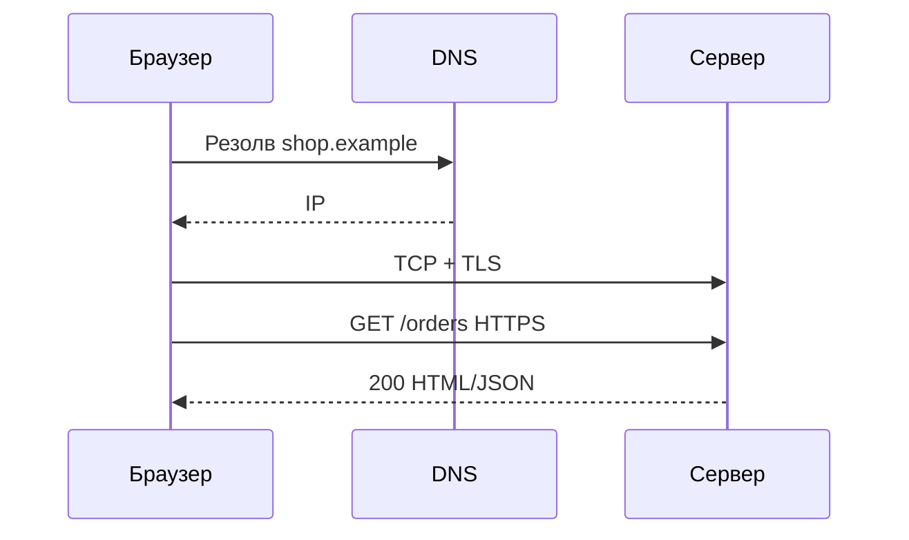

## Введение

Тема 7 — «дополнительное», но на middle без неё редко обходятся: что такое протокол, чем HTTP отличается от HTTPS, в чём разница аутентификации и авторизации, что происходит при открытии URL и что значит шифрование. Вопросы T7.1–7.5 — короткие, но провальные при путанице терминов.

## Раздел: Протоколы и HTTP vs HTTPS

**Протокол** — набор правил обмена данными: формат сообщений, порядок шагов, коды ошибок, адресация. Примеры: HTTP/HTTPS, TCP, IP, SMTP, FTP/SFTP, WebSocket, gRPC (поверх HTTP/2), DNS.

**HTTP** — протокол прикладного уровня для передачи гипертекста/API: методы, заголовки, статусы, тело. Работает поверх TCP (или QUIC в HTTP/3). Сообщения по умолчанию **не шифруются**: посредник на пути может читать и подменять трафик.

**HTTPS** — HTTP поверх **TLS** (раньше говорили SSL): канал шифруется, проверяется сертификат сервера (и опционально клиента). Даёт конфиденциальность и целостность на транспорте, помогает аутентифицировать сервер по PKI. Для СА: в постановках интеграций требовать HTTPS, pin/политики сертификатов для внешних webhook, не тащить секреты в query string.

## Раздел: Аутентификация и авторизация

**Аутентификация (Authentication, authN)** — *кто ты?* Проверка личности: пароль, OTP, сертификат, SSO, биометрия. Результат — установленная идентичность (subject).

**Авторизация (Authorization, authZ)** — *что тебе можно?* Проверка прав уже известного субъекта: роли, политики, ACL, scopes OAuth. Пример: пользователь аутентифицирован как `ivan`, но не авторизован удалять чужие заказы.

Частая ошибка на собесе — перепутать слова. Запомните: **сначала authN, потом authZ**. В API: `401 Unauthorized` исторически про отсутствие/провал аутентификации; `403 Forbidden` — аутентифицирован, но нет прав (уточняйте конвенцию проекта).

## Раздел: Что происходит, когда переходишь по URL

Упрощённая цепочка для ответа «расскажи по шагам»:
1. Пользователь вводит URL или кликает ссылку (`https://shop.example/orders`).
2. Браузер разбирает схему, хост, путь, query.
3. **DNS** резолвит имя хоста в IP (с кэшем ОС/браузера).
4. Устанавливается TCP (и **TLS handshake** для HTTPS) с сервером/CDN.
5. Уходит **HTTP-запрос** (GET, заголовки Cookie/Authorization и т.д.).
6. Сервер (или цепочка LB → Gateway → app) формирует **ответ**: HTML/JSON, редирект 302, ошибка 4xx/5xx.
7. Браузер рендерит страницу, тянет статику (CSS/JS/картинки) — новые запросы по той же схеме; JS может дальше ходить в API (AJAX/fetch).

Аналитику полезно помнить про редиректы http→https, HSTS, cookie flags (`Secure`, `HttpOnly`, `SameSite`) как часть NFR безопасности.

## Раздел: Шифрование данных

**Шифрование** — преобразование данных так, чтобы без ключа их нельзя прочитать. Цели: конфиденциальность при хранении (data at rest) и при передаче (data in transit).

Виды (уровень ответа middle):
- **симметричное** — один общий ключ (AES): быстро, проблема доставки ключа;
- **асимметричное** — пара public/private (RSA, EC): удобно для обмена ключами и подписи;
- на практике TLS использует гибрид: асимметрия для handshake, симметрия для потока.

Отличить от **хеширования** (односторонние отпечатки паролей) и **подписи** (целостность + авторство). В постановке: что шифруем (PII, платежные токены), где ключи (KMS/HSM), кто имеет доступ.

## Лаба

**Цель.** Описать security-требования для публичного API заказов и цепочку открытия URL личного кабинета.

**Шаги.**
1. Напишите 5 протоколов в вашем учебном контуре (DNS, TCP, TLS, HTTPS, SMTP…).
2. Сформулируйте пару требований: «все внешние API только HTTPS» и «секреты не в query».
3. Разведите на примере входа: шаг authN (логин) и шаг authZ (роль `manager` видит отчёты).
4. Расскажите вслух 7 шагов «клик по URL ЛК» до JSON `/api/me`.
5. Укажите: пароль в БД — хеш; номер карты в transit — TLS; бэкап диска — encryption at rest.

**В группу:** партнёр путает 401 и 403 — поправьте примерами.

**Готово, если…**
- [ ] Даёте определение протокола и 5 примеров
- [ ] Без запинки отличаете authN от authZ
- [ ] Объясняете HTTPS как HTTP+TLS и смысл шифрования

## Схема: От URL до ответа

## Тест

### Чем HTTP отличается от HTTPS?

**Ответ:** HTTPS — это HTTP поверх TLS: трафик шифруется и сервер подтверждается сертификатом

**Пояснение:** HTTP передаёт данные открытым текстом на прикладном уровне; HTTPS защищает канал от перехвата и подмены на пути.

### Чем аутентификация отличается от авторизации?

**Ответ:** аутентификация проверяет личность; авторизация — права уже известного субъекта

**Пояснение:** «вошёл в систему» ≠ «можно удалить платежи».

### Что такое шифрование данных?

**Ответ:** преобразование информации с помощью ключа так, чтобы без ключа нельзя прочитать исходное содержимое

**Пояснение:** применяют in transit (TLS) и at rest; не путать с хешированием паролей.

## Шпаргалка

<h3>Суть</h3>
<ul>
<li>Протокол — правила обмена</li>
<li>HTTPS = HTTP + TLS</li>
<li>authN = кто; authZ = можно ли</li>
<li>URL → DNS → TCP/TLS → HTTP → ответ → рендер</li>
<li>Шифрование: симметрия/асимметрия; отдельно хеш и подпись</li>
</ul>
<h3>Коды-памятка</h3>
<pre><code>401 — не аутентифицирован / плохой токен
403 — аутентифицирован, но запрещено
302/301 — редирект (часто на HTTPS/логин)</code></pre>

## Anki

### Front: Что такое протокол?

Back: согласованный набор правил формата и порядка обмена данными между участниками

### Front: authN vs authZ

Back: Authentication — проверка кто ты; Authorization — проверка что тебе разрешено

### Front: Что происходит при переходе по HTTPS URL? (кратко)

Back: DNS → TCP+TLS → HTTP-запрос → ответ сервера → отрисовка и доп. запросы ресурсов/API

## Итоги

- Термины T7 короткие: протокол, HTTPS, authN/authZ, цепочка URL, шифрование
- Путаница authN/authZ и HTTP/HTTPS — частый стоп-фактор на middle
- В постановках фиксируйте HTTPS, коды 401/403 и требования к секретам

## Ссылки

- [Топ-150 вопросов СА (Хабр)](https://habr.com/ru/articles/963708/)
- Learn | /game/learn
- Далее: [Senior craft постановки](/game/learn/sa-requirements-senior-craft)
