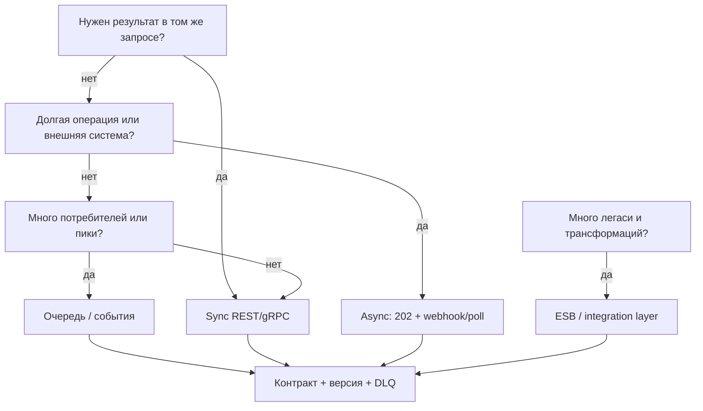

## Введение

Тема 4 на junior/middle разбирала REST, SOAP, очереди, ESB по отдельности. Senior должен **выбрать** механизм под сценарий и обосновать: latency, надёжность, связность, команда сопровождения. Второй столп — **обратная совместимость** контрактов при эволюции API. Это синтез T4.

## Раздел: Матрица выбора sync / async / очередь / ESB

Коротко определения для ответа на собесе:

- **Sync (обычно REST/gRPC):** запрос → ждём ответ в том же соединении. Нужен, когда без результата нельзя продолжить UI/следующий шаг.
- **Async (callback, webhook, «принял в работу»):** сразу 202/ack, результат позже. Нужен при долгих операциях и внешних системах.
- **Очередь/брокер (Kafka, RabbitMQ и т.п.):** буфер, развязка производителя и потребителя, ретраи, пики нагрузки, fan-out.
- **ESB / интеграционная шина:** централизованная оркестрация/трансформация множества легаси-систем; плюс — единая точка; минус — риск «божественного» узла и стоимости изменений.

**Эвристики выбора:**

| Сценарий | Предпочтительный стиль | Почему |
|----------|------------------------|--------|
| Экран «статус заказа сейчас» | Sync GET | Пользователь ждёт актуальный ответ |
| Списание оплаты у банка 5–30 с | Async + статус/webhook | Не держать HTTP минутами |
| Рассылка «заказ оплачен» в 5 сервисов | Событие в очередь | Слабая связность, пики |
| Ночной обмен с 1С/легаси XML | ESB или batch-файл/шина | Трансформации, мониторинг потоков |
| Высокий RPS телеметрии | Очередь/стрим | Буфер, не блокировать источник |
| Жёсткая согласованность «деньги↔остаток» в одном UC | Sync + сага/транзакционный контур | Нужен явный протокол компенсации |

Senior-формулировка: «Выбираю не технологию из резюме, а **свойства**: нужен ли ответ сейчас, допустима ли потеря/дубль (at least once), кто владеет ретраями, что при недоступности зависимости».

Антипаттерн: всё через ESB «на всякий случай»; всё через Kafka, когда хватило бы sync CRUD внутри одного BC.

## Раздел: Контракты и обратная совместимость

**Контракт** — соглашение о формате и семантике: поля, типы, обязательность, коды ошибок, идемпотентность, версии. Для REST — OpenAPI; для событий — схема (JSON Schema/Avro) + имя топика + ключ партиции; для SOAP — WSDL.

**Обратно совместимое изменение (consumers не ломаются):**

- Добавить опциональное поле.
- Добавить новое значение enum, если клиенты игнорируют неизвестное (договориться!).
- Добавить новый endpoint / новый event type.
- Ослабить ограничение (было max 10, стало 20) — осторожно по бизнес-смыслу.

**Ломающее изменение:**

- Удалить/переименовать поле; сделать опциональное обязательным.
- Изменить тип или семантику (сумма в рублях → копейки без нового поля).
- Ужесточить валидацию так, что старые валидные запросы стали 400.
- Сменить коды ошибок, на которых завязана логика клиента.

**Стратегии версий:** URI (`/v1/`, `/v2/`), заголовок версии, параллельные схемы событий (`order.paid.v2`). Правило поддержки: N предыдущих минорных/мажорных — как зафиксировано в ADR. Deprecation: дата, метрики старых клиентов, канал связи.

Роль СА: в постановке явно писать *breaking / non-breaking*, кто потребитель, план миграции, что в changelog. Не оставлять «чуть поменяем JSON» без анализа клиентов.

## Раздел: Склейка сценариев — от выбора к постановке

Для каждой интеграции в артефактах senior фиксирует:

1. Стиль (sync/async/queue/ESB) и **почему**.
2. Контракт (ссылка на OpenAPI/схему) и версия.
3. Таймауты, ретраи, идемпотентность, DLQ.
4. Безопасность: mTLS/OAuth, подпись webhook.
5. Наблюдаемость: correlation-id сквозь вызовы и события.
6. Совместимость: политика версий и deprecation.

Пример пакета для магазина: Storefront↔Order — sync; Order→Payment — sync create + async webhook результата; Order→уведомления — событие `order.paid`; обмен с ERP остатков — ночной batch через шину/файл. Один «правильный» стек на всё — редкость.

## Лаба

**Цель.** Спроектировать интеграции для «заказ → оплата → уведомление → выгрузка в ERP».

**Шаги.**
1. Разбейте на 4 взаимодействия и выберите стиль для каждого с одной фразой обоснования.
2. Для платежного webhook опишите: код ack, ретраи со стороны банка, проверку подписи, идемпотентность по `event_id`.
3. Предложите изменение контракта Payment: добавить `bonusAmount` — classified as non-breaking; план для старых клиентов.
4. Предложите ломающее изменение (переименовать `amount` → `amountMinor`) и план `/v2` + срок поддержки `/v1`.
5. Нарисуйте таблицу: интеграция | стиль | контракт | failure mode.
6. Укажите, где нужен DLQ и кто его разгребает (роль).

**В группу:** партнёр предлагает «всё через ESB» — контраргументы по latency UI и стоимости изменений.

**Готово, если…**
- [ ] У каждого взаимодействия есть обоснованный стиль, не «модно»
- [ ] Есть пример non-breaking и breaking с миграцией
- [ ] Описаны ретраи/идемпотентность для async-оплаты

## Схема: Выбор стиля интеграции

## Тест

### Когда предпочесть очередь синхронному REST?

**Ответ:** при развязке систем, пиках нагрузки, нескольких потребителях одного факта или когда продюсеру не нужен мгновенный результат обработки

**Пояснение:** очередь даёт буфер и слабую связность; для «пользователь ждёт ответ на экране» обычно нужен sync или sync+poll статуса.

### Что считается обратно совместимым изменением API?

**Ответ:** такое, при котором существующие клиенты продолжают работать без доработки — например добавление опционального поля

**Пояснение:** удаление, переименование, смена семантики и ужесточение обязательности — как правило breaking.

### Зачем ESB, если уже есть REST и Kafka?

**Ответ:** когда много разнородных легаси-систем требуют централизованной трансформации, маршрутизации и контроля потоков

**Пояснение:** ESB — не серебряная пуля; для новых greenfield часто достаточно API+событий без тяжёлой шины.

## Шпаргалка

<h3>Суть</h3>
<ul>
<li>Сначала свойства сценария, потом технология</li>
<li>Sync — нужен ответ сейчас; async — результат позже</li>
<li>Очередь — буфер, fan-out, пики</li>
<li>ESB — легаси и центральные трансформации</li>
<li>Non-breaking vs breaking + план версий</li>
</ul>
<h3>Чеклист интеграции</h3>
<pre><code>стиль | контракт | таймаут/ретраи | идемпотентность
безопасность | correlation-id | версия/deprecation</code></pre>

## Anki

### Front: Эвристика sync vs async?

Back: sync — без ответа нельзя продолжить шаг пользователя/транзакции; async — долгая или внешняя операция с поздним результатом

### Front: Пример non-breaking изменения контракта?

Back: добавить опциональное поле или новый endpoint, не меняя семантику существующих полей

### Front: Что фиксировать в постановке интеграции?

Back: стиль, контракт/версия, ретраи и идемпотентность, security, наблюдаемость, политика совместимости

## Итоги

- Выбор интеграции — аргументация под сценарий, не любимый брокер
- Очередь, sync и ESB решают разные классы задач
- Совместимость контрактов — часть работы СА, не «дело разработки потом»
- Синтез T4: стили + контракты + отказные режимы в одном пакете

## Ссылки

- [Топ-150 вопросов СА (Хабр)](https://habr.com/ru/articles/963708/)
- Learn | /game/learn
- Далее: [Архитектурные решения ADR](/game/learn/sa-architecture-decisions)
