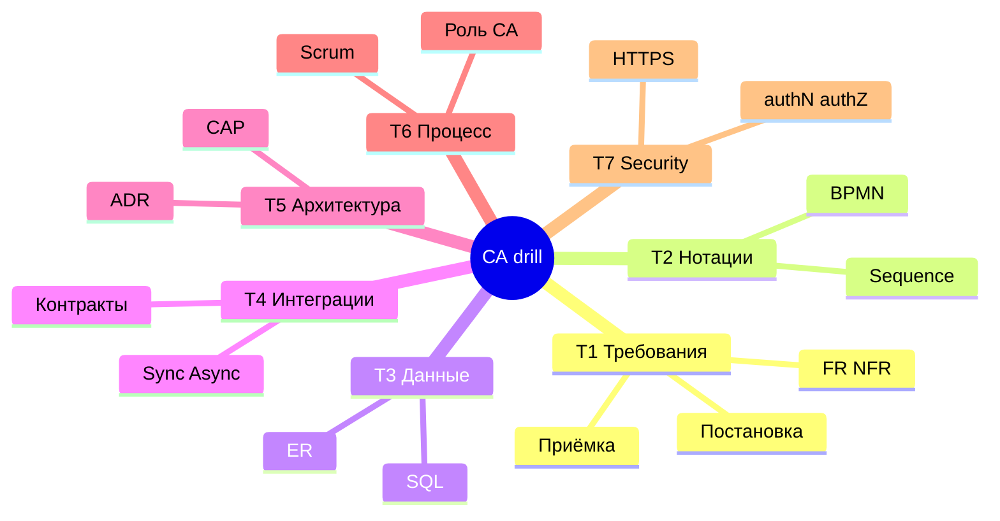

## Введение

Финальная тренировка перед capstone: не новая теория, а **скорость и связность** ответов по всем семи темам Хабра-списка. Ниже — квиз-блоки T1–T7 и лаба «10 быстрых ответов». Говорите вслух; Ideal — 60–90 секунд на пункт без воды.

## Раздел: Drill T1–T3 — требования, нотации, данные

**T1 · Требования.** Держите каркас: stakeholder → потребность → FR/NFR → приёмка. Отличия user story vs use case; зачем DoR; как выглядит измеримый NFR; что такое traceability. Ловушка: путать wish и требование («чтобы было удобно»).

Мини-ответы для тренировки:

- FR — *что* система делает; NFR — *как/с какими ограничениями* (число!).
- Хорошая постановка снимает неоднозначность до контракта для Dev/QA.
- С QA (T6.1.4): критерии приёмки и зоны риска, не 200 кейсов за них.

**T2 · Нотации.** BPMN — процесс и шлюзы; UML Use Case — актёры и цели; Sequence — вызовы во времени; Activity — похож на поток работ. Выбор нотации = аудитория + вопрос. Ловушка: рисовать микросервисы на BPMN вместо бизнеса.

**T3 · Данные.** Нормализация до 3NF как идея устранения аномалий; PK/FK; 1:1, 1:N, M:N; SQL JOIN vs WHERE; зачем индекс; ACID коротко. Senior добавка: согласованность статусов процесса с ER (урок SA18).

Связка на собесе: «покажу заказ в BPMN, затем sequence оплаты, затем ER Order–Payment» — это уже уровень выше зубрёжки определений.

## Раздел: Drill T4–T5 — интеграции и архитектура

**T4 · Интеграции.** REST принципы и идемпотентность; когда 201/202/204; sync vs async; очередь зачем; SOAP/WSDL где жив; ESB не по умолчанию; webhook + подпись; совместимость контрактов (добавить optional ≠ удалить поле).

Каркас ответа «как интегрировать A и B»:

1. Нужен ли ответ сейчас?
2. Кто ретраит и что при дублях?
3. Контракт и версия.
4. Security и корреляция.
5. Наблюдаемость отказа.

**T5 · Архитектура.** Монолит vs микросервисы — контекст команды и BC; API Gateway; оркестрация vs хореография; CAP на примере (оверселл vs простой кнопки); ADR как фиксация. Ловушка: «микросервисы масштабируют всё» без цены распределённости.

Связка T4+T5: каждый новый сервис умножает контракты — поэтому преждевременное дробление бьёт аналитика первым.

## Раздел: Drill T6–T7 — процесс, роль, безопасность

**T6 · Процесс и профессия.** Scrum vs Kanban в двух фразах; DoR/DoD; SP vs часы; где Scrum ломается; хороший/плохой аналитик; junior vs senior на примерах поведения; граница с PO/QA/архитектором. Ловушка: обещать дату в одиночку.

**T7 · Безопасность-база.** Протокол; HTTP vs HTTPS (TLS); authN vs authZ; цепочка URL (DNS→TCP/TLS→HTTP→ответ); шифрование vs хеш. Ловушка: 401/403 перепутаны; «HTTPS шифрует БД».

Режим drill: партнер/таймер задаёт номер темы — вы отвечаете структурой **определение → пример → типичная ошибка**. Так звучит senior, а не шпаргалка.

## Лаба

**Цель.** Дать 10 быстрых устных ответов (по ~60–90 секунд) без конспекта.

**Шаги.** Закройте статью и ответьте по порядку; затем сверьтесь с подсказками ниже.

1. FR vs NFR + пример измеримого NFR.
2. User story vs use case — когда что.
3. Зачем BPMN и Sequence на одном процессе оплаты.
4. 1:N и M:N — пример из заказа.
5. Идемпотентность POST платежа — как обеспечить.
6. Когда очередь лучше sync REST.
7. Монолит vs микросервисы — 3 критерия выбора.
8. CAP на примере остатков/оплаты.
9. Чем senior СА отличается от junior (поведение).
10. authN vs authZ + зачем HTTPS.

**Подсказки для самопроверки (не читайте до ответа):**
1. NFR с метрикой и условием нагрузки.
2. Story — инкремент ценности; UC — полное поведение с ветками.
3. Бизнес-ветки vs вызовы систем; статусы согласованы.
4. Order–Items = 1:N; Order–Product через OrderItem = M:N.
5. Idempotency-Key / unique constraint / тот же результат при повторе.
6. Пики, fan-out, продюсеру не нужен мгновенный результат обработки.
7. Команда, ясность BC, платформа/Ops, независимый масштаб.
8. При partition выбрать C или A по риску бизнеса.
9. Энтропия/end-to-end vs шаблон в узком контуре.
10. Кто ты vs что можно; HTTPS = HTTP+TLS на канале.

**В группу:** 10 вопросов с таймером; штрафуйте «воду» дольше 2 минут.

**Готово, если…**
- [ ] 8/10 ответов структурны без подглядывания
- [ ] В каждом есть пример, не только определение
- [ ] Можете связать T1→T4→T5 на кейсе заказа за 2 минуты

## Схема: Карта тем drill

## Тест

### Какой каркас ответа использовать на любом вопросе собеса?

**Ответ:** короткое определение → прикладной пример → типичная ошибка или компромисс

**Пояснение:** так ответ звучит как опыт; одно определение без примера легко забывается и не отличает уровни.

### Как связать несколько тем на кейсе заказа?

**Ответ:** требование и приёмка (T1) → BPMN/Sequence/ER (T2–T3) → стиль интеграции оплаты (T4) → решение по границам сервисов и CAP (T5)

**Пояснение:** сквозной кейс показывает senior-мышление лучше, чем изолированные термины.

### Что проверить в drill перед собесом кроме знаний?

**Ответ:** время ответа, отсутствие воды, умение признать допущение и эскалировать неизвестность

**Пояснение:** «не знаю, вот как выясню» на senior ценится выше выдуманной formal-точности.

## Шпаргалка

<h3>Суть</h3>
<ul>
<li>T1–T7 закрывать каркасом: определение → пример → ошибка</li>
<li>Сквозной кейс заказа связывает темы</li>
<li>60–90 секунд на типовой вопрос</li>
<li>Интеграции: нужен ли ответ сейчас + ретраи + контракт</li>
<li>Роль: ясность и trade-off, не одинокая дата релиза</li>
</ul>
<h3>10 пуль для лабы</h3>
<pre><code>1 NFR  2 Story/UC  3 BPMN+Seq  4 кардинальность  5 идемпотентность
6 очередь  7 монолит/микро  8 CAP  9 junior/senior  10 authN/Z+HTTPS</code></pre>

## Anki

### Front: Каркас устного ответа на собесе СА?

Back: определение → пример из системы → типичная ошибка или компромисс

### Front: Мини-маршрут сквозного кейса по темам?

Back: T1 требования → T2/T3 модели → T4 интеграция оплаты → T5 границы и CAP

### Front: Три пункта про интеграцию A↔B?

Back: нужен ли sync-ответ; ретраи/идемпотентность; контракт/версия/security

## Итоги

- Drill тренирует скорость и связность, не новые определения
- Лучший senior-сигнал — сквозной кейс через T1–T5 плюс зрелый T6
- T7 короткий, но провальный при путанице терминов — держите в разминке
- После стабильных 8/10 из лабы переходите к capstone-чеклисту SA24

## Ссылки

- [Топ-150 вопросов СА (Хабр)](https://habr.com/ru/articles/963708/)
- Learn | /game/learn
- Далее: [Capstone чеклист](/game/learn/sa-capstone-checklist)
